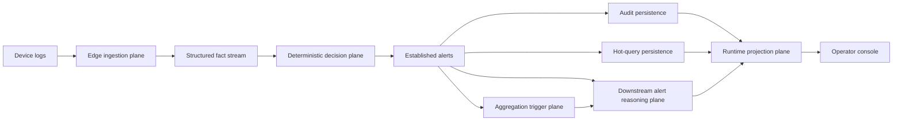

## NetOps Causality Remediation
[](./README.md) [](./README_CN.md)

This repository implements a NetOps primary pipeline that is anchored in deterministic alert adjudication and strengthened by downstream reasoning. Rule-backed alert confirmation remains the first decision point at all times; reasoning is introduced only after an alert has already been established. The project has moved beyond conceptual design and is now at a stage where the local structured pipeline is largely closed, with production-grade remote model execution as the main remaining gap.

## System Architecture

The current system is best understood as six structural planes:

- Edge ingestion plane: receives real device logs and normalizes raw input into a stable stream of facts.
- Deterministic decision plane: collapses that fact stream into established alerts, preserving a non-model first judgment.
- Dual persistence plane: maintains both audit-grade storage and hot query history for compliance and retrieval use cases.
- Aggregation trigger plane: turns repeated patterns under the same key into cluster-level triggers.
- Downstream alert reasoning plane: assembles evidence, structured hypotheses, structured review, structured runbook drafts, and stage request contracts.
- Runtime projection plane: renders runtime artifacts into frontend snapshots, timelines, compare views, and operator-readable surfaces.

A future controlled execution plane is intentionally reserved in the design, but it currently exists only as an approval boundary, rollback boundary, and interface placeholder rather than a delivered capability.

## Main Flow

The primary workflow can be summarized as the following chain:



The same architecture is also illustrated in the repository documentation:


In object-chain terms, the alert path is:

`alert -> evidence bundle -> reasoning runtime seed -> Evidence Pack V2 -> HypothesisSet -> ReviewVerdict -> RunbookDraft -> ReasoningStageRequests -> runtime projection`

In cluster terms, the only difference is the entry point: repeated patterns under the same key replace a single alert as the trigger. The downstream object layer, stage matrix, and frontend projection surface remain shared rather than splitting into two independent systems.

## Current Delivery Status

The repository already contains stable implementations of the following core structures:

- `reasoning_runtime_seed`
- `candidate_event_graph`
- `investigation_session`
- `reasoning_trace_seed`
- `runbook_plan_outline`
- `Evidence Pack V2`
- `HypothesisSet`
- `ReviewVerdict`
- `RunbookDraft`
- `ReasoningStageRequests`

These structures show that the current focus is no longer whether a model can be connected at all, but whether evidence, hypothesis, review, planning, and stage contracts have been turned into stable typed objects first. The frontend already reflects that direction: the main operator view, convergence field, node inspector, and compare workbench all treat structured objects as the primary product, rather than relying on free-form natural-language summaries as the only source of meaning.

The current frontend runtime surfaces are documented below:


## Feature Count Reference

The tables below consolidate the current `edge -> core` feature-count contract in one place. The counts are based on object shapes actually produced by the codebase rather than concept-only wording. Any mounted runtime artifact that still follows an older schema is called out explicitly.

### Edge Plane

| Plane | Stage / Object | Top-level feature count | Key nested or supporting notes | Remarks |
| --- | --- | ---: | --- | --- |
| edge | raw vendor log input | `47` | `4` syslog header fields + `43` FortiGate KV fields | Vendor-log contract before parser normalization |
| edge | ingest structured event | `66` | `source=3`, `device_profile<=9`, `kv_subset<=56` | Parsed JSONL emitted by `fortigate-ingest` |
| edge | forwarder -> Kafka fact | `66` | top-level unchanged | `edge_forwarder` filters and forwards without rewriting the payload schema |

### Core Plane

| Plane | Stage / Object | Top-level feature count | Key nested or supporting notes | Remarks |
| --- | --- | ---: | --- | --- |
| core | correlator input fact | `66` | Same structured fact shape forwarded from edge Kafka input | Input contract of the deterministic plane |
| core | deterministic alert | `12` | `dimensions=1`, `metrics=3`, `event_excerpt=31`, `topology_context=13`, `device_profile=12`, `change_context=6` | Current alert JSONL matches the code path |
| core | alerts sink JSONL | `12` | Same shape as deterministic alert | Audit persistence only; no schema rewrite |
| core | ClickHouse alert row | `17` columns | Includes `metrics_json`, `dimensions_json`, `event_excerpt_json`, `topology_context_json`, `device_profile_json`, `change_context_json` | Storage-row contract rather than payload contract |
| core | cluster trigger | `6` | `ClusterKey=4` | Exists only when repeated-pattern aggregation is hit |
| core | evidence bundle | `16` | `alert_ref=3`, `historical_context=9`, `rule_context=5`, `path_context=6`, `policy_context=3`, `sample_context=1`, `window_context=3`, `topology_context=14`, `device_context=12`, `change_context=6` | Shared object layer for alert-scope and cluster-scope |
| core | reasoning runtime seed | `6` | `candidate_event_graph=9`, `investigation_session=9`, `reasoning_trace_seed=6`, `runbook_plan_outline=10` | Alert-scope version |
| core | cluster reasoning runtime seed | `7` | Adds `cluster_context=6` on top of the alert-scope seed | Cluster-scope version |
| core | candidate event graph | `9` | `node item=5`, `edge item=7` | Internal runtime-seed object |
| core | investigation session | `9` | `working_memory_seed=5` | Internal runtime-seed object |
| core | reasoning trace seed | `6` | No additional fixed nested object | Internal runtime-seed object |
| core | runbook plan outline | `10` | `applicability=3`, `approval_boundary=3` | Internal runtime-seed object |
| core | Evidence Pack V2 | `14` | `alert_ref=3`, `freshness=2`, `source_reliability=1`, `summary=4`, `evidence entry item=9` | Typed evidence input used by hypothesis, review, and runbook stages |
| core | inference request | `12` | `expected_response_schema=6` | Strongly typed pre-provider request object |
| core | inference result | `12` | No additional fixed nested object | Normalized provider result |
| core | HypothesisSet | `6` | `hypothesis item=10` | Structured hypothesis object |
| core | ReviewVerdict | `9` | `checks=6`, single check=`2` | Structured review object |
| core | RunbookDraft | `15` | `applicability=3`, `approval_boundary=3`, `change_summary=2` | Structured runbook draft |
| core | reasoning stage requests | `2` stages | Each stage request=`10`, `input_contract=3`, `routing_hint=12` | Currently fixed to `hypothesis_critique` and `runbook_draft` |
| core | suggestion payload (final emitted schema) | `24` | `context=17`, `inference=12`, `reasoning_stage_requests=2` | Final persisted payload = structured suggestion plus stage requests |
| core | suggestion JSONL (latest runtime artifact) | `24` | `context=17`, `evidence_bundle=16`, `reasoning_runtime_seed=6` | The latest mounted runtime file is aligned to the new schema; older historical files can be backfilled with the migration utility |

## Operating Boundaries

The project currently maintains six explicit boundaries:

- Alert-establishment boundary: the model must not decide whether an alert is valid in the first place.
- Execution boundary: suggestions are not written back to devices automatically.
- Approval boundary: any action beyond read-only diagnosis must stop before human approval.
- Rollback boundary: a plan without rollback preparation cannot be elevated into an execution output.
- Transport boundary: the edge ingestion plane does not participate in model reasoning or stage orchestration.
- Data-contract boundary: future remote models may consume only explicit stage requests, not arbitrary runtime files or full repository context.

## Current Runtime Facts

The currently mounted runtime surface shows the following:

- The alert artifact set contains `691` hourly files and `201003` total records, covering `2026-03-04T15:09:11+00:00` through `2026-04-02T16:23:04+00:00`.
- The suggestion artifact set contains `603` hourly files and `222023` total records, covering `2026-03-09T05:08:56.549849+00:00` through `2026-04-05T18:03:18.303384+00:00`.
- The latest 24 alert buckets are still dominated by `deny_burst_v1|warning`.
- The latest 24 suggestion buckets remain primarily `alert` scope, while `cluster` scope represents a smaller share.

This distribution indicates a low-QPS, tightly constrained, strongly fallback-oriented downstream reasoning workload. It is sufficient for structured evidence, structured hypotheses, structured review, structured runbook drafting, and replay-based evaluation, but it is not an appropriate shape for permanently colocating a large model on the existing core nodes.

## Resource Planning Conclusions

The current resource-planning conclusion is straightforward:

- The edge ingestion plane should remain focused on log intake and fact normalization.
- Core nodes should remain focused on alert confirmation, evidence assembly, structured object generation, and stage request assembly.
- Model execution should live in an external GPU service or a controlled API provider.
- The `template` path must remain a permanent fallback.
- The first priority is to complete remote reasoning connectivity, response validation, timeout fallback, trace capture, and replay/eval.
- Only after that should limited domain adaptation become a priority.
- There is no current need to train a foundation model from scratch.

## Next Step

The clearly defined stopping point at this stage is that the local structured pipeline is already closed, while real remote model execution is not yet connected. The next milestone is therefore not to keep expanding local schemas or to keep broadening documentation, but to close the following loop:

- real provider execution
- response validation
- timeout / fallback
- trace capture
- replay / eval

Once that loop is complete, the system will move from "structured reasoning objects are in place" to the next stage: "real remote critique and planning are wired into production flow."

## LCORE-D Data Adaptation

The benchmark data path is now prepared for `LCORE-D: A Benchmark Dataset for Core Network Analysis` (`https://data.mendeley.com/datasets/77sztrg5ks/2`). This source is more suitable than the office-only FortiGate trace for topology-aware and fault-localization work because it provides 407 hours of ISP monitoring data with ten benchmark fault labels: single link failure, multiple link failure, misconfiguration, routing misconfiguration, line card failure, ICMP blocked by firewall, node failure, multiple nodes failures, single node failure, and SNMP agent failure.

The adapter entry point is:

```bash
python3 -m core.benchmark.lcore_adaptive_prepare \
  --input /data/lcore-d \
  --output-jsonl /data/netops-runtime/lcore/events.jsonl \
  --plan-json /data/netops-runtime/lcore/feature-plan.json
```

It automatically discovers time, label, entity, topology, metric, and categorical fields, then emits canonical fact JSONL for the existing core pipeline. The correlator also includes `annotated_fault_v1`, a benchmark-safe rule that preserves those ten scenarios and triggers on fault annotation transitions without changing the non-model alert-establishment boundary.
