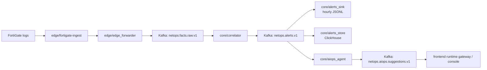
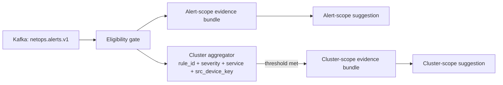
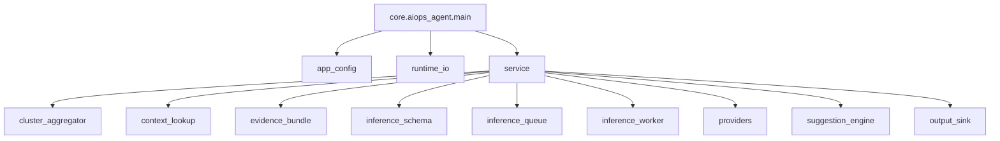

## Towards NetOps: Hybrid AIOps Platform for Network Awareness and Automated Remediation
[](./README.md) [](./README_CN.md)

> Deterministic network data plane first. Bounded AIOps augmentation second.

#### Project Overview

Towards NetOps is built around a straightforward operating rule:

- raw device traffic stays on a deterministic streaming path
- model-driven analysis starts only after an alert exists and enough evidence has been assembled
- every output that matters is written back as structured data, not as an opaque side effect

The repository already contains a runnable path from **FortiGate log -> structured fact -> deterministic alert -> persisted context -> operator-facing suggestion**. The current focus is not "LLM over every log line". The current focus is to keep the data plane stable, make the evidence path explainable, and add bounded AIOps value where it changes an operator decision.

## Design Boundary

> [!WARNING]
> This project is not designed around per-event LLM inference on the full raw stream.
> Real-time detection stays on deterministic modules. AIOps runs on top of the alert contract.

## System Design In One Page

```text
FortiGate / network device logs
  -> edge/fortigate-ingest
       parse, normalize, checkpoint, replay
  -> edge/edge_forwarder
       suppress edge noise, preserve field semantics
  -> Kafka topic: netops.facts.raw.v1
  -> core/correlator
       quality gate, rules, window logic, alert emission
  -> Kafka topic: netops.alerts.v1
       -> core/alerts_sink      hourly JSONL audit trail
       -> core/alerts_store     ClickHouse hot query surface
       -> core/aiops_agent      evidence assembly + bounded augmentation
            -> alert-scope suggestion path
            -> cluster-scope suggestion path
  -> Kafka topic: netops.aiops.suggestions.v1
  -> frontend runtime gateway / operator console
```

### Top-Down Runtime Flow



### Why The Module Split Is Reasonable

- **Edge parsing stays near the source.** `edge/fortigate-ingest` handles file rotation, checkpointing, replay, and normalization where the logs arrive. That keeps WAN hops and central services away from raw text handling.
- **The core only sees structured facts.** `core/correlator` does not need vendor-specific parsing logic. It consumes a stable fact contract and can focus on gates, rules, and windows.
- **Alert persistence is split on purpose.** JSONL gives an audit and replay trail. ClickHouse gives low-latency query, recent-history lookup, and context enrichment. Both are needed.
- **AIOps is downstream of alerting, not upstream of it.** That keeps the real-time path predictable and gives the slow path a bounded, evidence-rich input.
- **The suggestion layer has two scopes.** One path answers "what should I do about this alert right now?" The other answers "is this repeated pattern meaningful at cluster scale?"
- **The operator console remains read-only.** Observation, explanation, and control boundaries are visible, but execution is not hidden inside the UI.

## Current Runtime Snapshot

The repository state on `main` is best described as:

- edge ingest is running and replay-safe
- deterministic core correlation is in place
- alert persistence is in place
- minimal AIOps suggestion emission is in place
- frontend runtime console is in place
- remediation execution is still a reserved boundary, not a live write-back path

### Implemented Modules

| Layer | Module | Responsibility | Why it exists |
| --- | --- | --- | --- |
| Edge ingest | `edge/fortigate-ingest` | Parse FortiGate logs, normalize events, manage checkpoints, produce replayable JSONL facts | Raw log handling is messy and stateful; it should stay close to the log source |
| Edge forward | `edge/edge_forwarder` | Read parsed facts, suppress edge-side noise, forward to core raw topic | Keeps transport and light filtering separate from parsing |
| Core correlation | `core/correlator` | Apply quality gates, rules, and sliding windows; emit alerts | This is the deterministic decision point of the system |
| Alert audit sink | `core/alerts_sink` | Persist alert stream to hourly JSONL | Needed for replay, audit, and low-friction inspection |
| Hot alert store | `core/alerts_store` | Store alerts in ClickHouse | Needed for recent history, analytics, and AIOps context lookup |
| AIOps augmentation | `core/aiops_agent` | Build evidence, query context, run bounded inference/template logic, emit suggestions | Keeps the slow path explicit and downstream of alerts |
| Frontend console | `frontend` + gateway | Show the live path `raw -> alert -> suggestion -> boundary` in an operator-readable form | Makes runtime state visible without mixing it into backend services |
| Validation tooling | `core/benchmark/*` | Replay, timing audit, live runtime validation | Lets the system be checked against real traffic instead of hand-wavy assumptions |

## Dual-Path AIOps

The AIOps layer has two outputs on purpose.

### 1. Alert-scope path

This path runs for each eligible alert. It gives the operator an immediate explanation and next-step suggestion even if the event never forms a cluster.

### 2. Cluster-scope path

This path runs when repeated alerts hit a same-key threshold within a time window. It captures pattern-level meaning that a single alert cannot carry on its own.

### Why both paths are needed

- If the system emits only cluster-scope suggestions, it stays silent on isolated but still actionable alerts.
- If the system emits only alert-scope suggestions, it misses repeated-pattern context and overstates single events.
- Keeping both paths behind the same alert contract preserves one deterministic main path while still allowing two different operator views of the same problem.

### Dual-Path Diagram



### Internal Shape Of `core/aiops_agent`



`core/aiops_agent` is split this way for practical reasons:

- `app_config` keeps runtime policy in one place
- `runtime_io` owns Kafka and ClickHouse client setup
- `cluster_aggregator` isolates windowing and threshold logic
- `context_lookup` isolates recent-history reads from ClickHouse
- `evidence_bundle` keeps prompt/context assembly explicit and testable
- `inference_schema` makes provider input/output contracts stable
- `inference_queue` and `inference_worker` keep the slow path visible even when concurrency is low
- `providers` separates template mode from future remote or local model backends
- `suggestion_engine` converts provider output into the repository's stable suggestion schema
- `output_sink` persists suggestion audit files for replay and inspection

## Live Demo Packet / 现场演示包

For temporary demos, recordings, or quick walkthroughs, use the prepared incident packet instead of depending on whatever the live stream happens to show at that moment.

临时演示、录屏或现场讲解时，建议优先使用预制 incident packet，而不是依赖实时流此刻恰好出现什么事件。

- [Fault Injection -> Automatic Localization demo script / 故障注入到自动定位演示脚本](./documentation/LIVE_DEMO_FAULT_INJECTION_AUTO_LOCALIZATION.md)
- [Companion demo fixture / 配套前端演示数据](./frontend/fixtures/demo/fault-injection-auto-localization.json)

The current packet is built from real runtime history around `deny_burst_v1` on `udp/3702`, localized to a `Dahua / IP Camera` path. It is meant to answer one question clearly: how a single injected fault becomes an operator-readable incident with device, service, path, change signal, and next-step guidance.

当前演示包来自真实运行历史，围绕 `deny_burst_v1` 与 `udp/3702` 构建，并定位到一条 `Dahua / IP Camera` 设备路径。它想清楚回答一个问题：一次单点故障是如何被系统还原成“设备 + 服务 + 路径 + 变更信号 + 下一步建议”的可读 incident。

## Frontend Console / 前端运行台

The frontend is not the architectural center of the repository, so the root README keeps it short.

前端不是这个仓库的架构中心，因此根 README 只保留高层说明。

- It is a read-only operator console for the path `raw -> alert -> suggestion -> remediation boundary`
- It consumes `GET /api/runtime/snapshot` and `GET /api/runtime/stream`
- It is process-first, not dashboard-first
- It keeps remediation visible as a control boundary instead of pretending execution already exists

Frontend details, deployment notes, and review workflow now live under [frontend/README.md](./frontend/README.md) and [frontend/documentation](./frontend/documentation).

更完整的前端说明、部署细节和评审流程请看 [frontend/README.md](./frontend/README.md) 与 [frontend/documentation](./frontend/documentation)。

## Safety Boundary / 安全边界

- Current runtime UI and runtime gateway are observation-only
- They do not write back to devices, core configuration, Kubernetes, or remediation channels
- Any future approval or execution path must remain explicitly separated from the current read surface

当前运行台和 runtime gateway 目前都只负责观察，不会回写设备、核心配置、Kubernetes 或任何 remediation 通道。后续如果加入审批或执行，也必须和现有只读界面明确隔离。

## Resource Boundary And Next Step / 资源边界与下一步

The current bottleneck is not the deterministic data plane. The near-term bottleneck is the future inference plane.

- Kafka, ClickHouse, correlator, and alert persistence already fit the current two-node layout
- The slow path still defaults to the built-in provider, so the main path does not depend on a GPU
- The next hardware step is a resident inference plane behind the provider abstraction, not a redesign of the deterministic core

## Baseline Verification

```bash
python3 -m pytest -q tests/core
python3 -m compileall -q core
bash -n core/automatic_scripts/release_core_app.sh
```

Core-side tests currently cover `rules`, `quality_gate`, `alerts_sink`, `alerts_store`, and `aiops_agent`, including alert-scope and cluster-scope suggestion paths.

### Realtime Validation After The Dual-Path AIOps Update (2026-03-22)

The current core runtime was updated to:

- `netops-core-app:v20260322-aiopsdualfix-3a76ec4`

This release added:

- alert-scope suggestion emission for every eligible alert
- the existing cluster-scope path as an additional output when aggregation triggers
- hardened ClickHouse `recent_similar_count()` handling for dict-like `first_item` values

Realtime validation used real FortiGate traffic and a short controlled threshold window on `core-correlator`:

- temporary validation window:
  - `RULE_DENY_THRESHOLD=5`
  - `RULE_ALERT_COOLDOWN_SEC=60`
- restored after validation:
  - `RULE_DENY_THRESHOLD=200`
  - `RULE_ALERT_COOLDOWN_SEC=300`

Observed facts:

- `raw` remained realtime during validation (`latest_raw_payload_age_sec=4` in the final live check).
- `alerts` remained in the current time window (`latest_alert_event_age_sec=35` in the final live check).
- `suggestions` caught up to current time and were no longer stuck in the historical 19:39 UTC window.
- the latest realtime suggestions carried `suggestion_scope="alert"` with current alert references, for example:
  - `2026-03-22T21:55:17.943944+00:00`, service=`Dahua SDK`, src_device_key=`d4:43:0e:1a:c5:88`
  - `2026-03-22T21:55:28.139648+00:00`, service=`udp/48689`, src_device_key=`78:66:9d:a3:4f:51`
- `kubectl logs -n netops-core deploy/core-aiops-agent --since=3m` showed current suggestion emission without the old ClickHouse `TypeError`.

Honest runtime note:

- `cluster` suggestions were preserved in code/tests and historical replay behavior, but were not naturally re-observed in this short realtime validation window because the live alert stream did not form a same-key `min=3 within 600s` cluster during the test period.

### Replay Validation On Real Alert History (2026-03-22)

The AIOps slow path was replay-validated against the real alert history already present on the core node:

- input: `/data/netops-runtime/alerts/*.jsonl`
- span: `337` hourly files, `44,733` alerts, from `2026-03-04T15:09:11+00:00` to `2026-03-18T22:59:52+00:00`
- tool: `python3 -m core.benchmark.aiops_replay_validation`

Key findings:

- With the old default `AIOPS_CLUSTER_WINDOW_SEC=300`, replay produced `0` cluster triggers. This proved the previous default did not match the real alert cadence.
- Gap analysis on the same alert history showed a per-key inter-alert median around `300-303s`, so the cluster window default was raised to `600s` in the repository and deployment manifest.
- Replaying with `600s / min_alerts=3 / cooldown=300s` produced `12,751` AIOps pipeline outputs from the same `44,733` alerts.
- Template provider stability rate was `1.0` on replay (no semantic drift across repeated inference on the same request).
- Evidence presence was strong for fields already carried by the alert stream: `service=1.0`, `src_device_key=1.0`, `srcip=1.0`, `dstip=1.0`, `recent_similar_nonzero=1.0`.
- Evidence presence was `0.0` for `site`, `device_profile`, and `change_context` in that historical replay corpus. This reflects the fact that the replayed alerts were generated before the later edge/core enrichment changes landed, so it should be read as a historical baseline rather than the current live-pipeline state.
- Confidence output was stable but not yet discriminative: replay outputs were all `medium`, so current confidence should be treated as a stable heuristic rather than calibrated RCA confidence.
- No external HTTP provider was counted in this validation because no real endpoint was configured; no mock-based claim is recorded.

### Core Investigation Note (2026-03-22)

Core-side investigation showed that the apparent mismatch between:
- `alerts/*.jsonl` stopping at filenames such as `alerts-20260318-*`
- `aiops/*.jsonl` continuing with filenames such as `suggestions-20260322-*`

does not by itself indicate an `alerts-sink` failure.

Observed facts:
- `core-correlator`, `core-alerts-sink`, `core-alerts-store`, and `core-aiops-agent` pods were all running on `r450`.
- Kafka lag for `core-alerts-sink-v1`, `core-aiops-agent-v1`, `core-alerts-store-v1`, and `core-correlator-v2` was `0` during investigation.
- `core-alerts-sink` continues writing successfully, but buckets files by `alert.alert_ts`.
- `core-aiops-agent` buckets suggestion files by current processing time.

Interpretation:
- The current core path is consistent with replay/backfill semantics.
- If current processing time is March 22 but the alert payload timestamp is still March 18, then `alerts-sink` will keep appending to `alerts-20260318-*` while `aiops-agent` writes to `suggestions-20260322-*`.
- The remaining upstream question is therefore not “did alerts-sink stop?” but “why is the source stream still carrying March 18-era event timestamps on March 22?”

## Project Positioning and Current Architecture Boundary
The current project architecture is centered around **r230 (edge collection) → r450 (core data plane and analytics processing)**, i.e., near-source collection and factization on the edge side, and subsequent streaming processing, correlation analysis, evidence-chain attribution, and automated remediation capability implementation on the core side. This means the project has completed the most critical input-plane landing work in platform construction and has entered the architecture advancement stage oriented toward core capability expansion.

The project is currently at the stage where the **Edge Fact Ingestion Layer has been deployed and is running stably**, while the **Core Analytics / Causality / Remediation layer is under continuous development**. The system runs on a **k3s** cluster; the `fortigate-ingest` component on the `edge` side has been containerized, deployed, and is continuously running, undertaking edge-side ingestion and factization of FortiGate logs. The current node role split is: **netops-node2 (r230) for edge ingestion**, and **netops-node1 (r450) as the hosting node for the core data plane and analytics side**. The platform has entered the cluster runtime stage for foundational AIOps components.

> [!IMPORTANT]
> The current architecture focus is to extend toward the core-side data plane and analytics capabilities based on the already-running edge ingestion component.

Node role allocation is as follows:
- **netops-node2 (r230)**: Edge ingestion side (Edge Ingestion; Ingest Pod development and deployment completed, running stably)
- **netops-node1 (r450)**: Core side (Data Plane / Core Analytics; under continuous development)

## Currently Implemented Components and Collaboration
The repository has moved beyond a single ingest prototype. At the current stage, the implemented chain already covers the following end-to-end capabilities:

- Edge-side FortiGate syslog ingestion, replay control, structured fact generation, and audit persistence
- Lossless edge forwarding from parsed JSONL into the core raw topic
- Core-side deterministic analytics (`quality_gate + rules + window correlation`) from raw facts to alerts
- Dual persistence of the alert stream through hourly JSONL and ClickHouse hot storage
- Minimal AIOps augmentation on top of the alert contract, including alert-scope suggestions, cluster-scope suggestions, evidence construction, and suggestion audit output

In other words, the project already has a runnable path from **device log -> structured fact -> deterministic alert -> persisted context -> operator-facing suggestion**, which is the most important technical boundary for the current phase.

### Dataflow and Module Collaboration

The current repository is no longer just a collection of independent components. It already forms a clearly layered NSM/AIOps pipeline that follows the direction of the real data flow:

1. **Source acquisition**
   - FortiGate emits syslog to the edge node.
2. **Edge factization**
   - `edge/fortigate-ingest` converts raw text logs into replayable structured JSONL facts, normalizes time and device identity, and preserves audit metadata.
3. **Edge transport**
   - `edge/edge_forwarder` consumes parsed JSONL and forwards raw facts to `netops.facts.raw.v1` without changing field semantics.
4. **Core deterministic analytics**
   - `core/correlator` consumes the raw topic, runs quality gates and sliding-window rules, and emits structured alerts to `netops.alerts.v1`.
5. **Persistence and observability**
   - `core/alerts_sink` provides JSONL audit/replay files.
   - `core/alerts_store` provides ClickHouse-based hot query and recent-history lookup.
6. **AIOps slow path**
   - `core/aiops_agent` consumes alerts, builds evidence, queries recent history, and emits structured suggestions to `netops.aiops.suggestions.v1`.

Current technical highlights already visible in the implemented path:

- **Replayable edge ingest**: checkpoint + inode/offset + completed-ledger design supports restart recovery and precise backlog control.
- **Deterministic core first**: quality gates, rule windows, and manual offset commits keep the main path explainable and controllable.
- **Dual persistence surface**: JSONL preserves an audit/replay trail, while ClickHouse supports hot analytics and AIOps context lookup.
- **Enriched alert contract**: `topology_context`, `device_profile`, and `change_context` now flow from edge-derived facts into current alerts.
- **Dual-path AIOps output**: the AIOps layer now emits both alert-scope suggestions and cluster-scope suggestions, instead of depending only on cluster formation.

---
### Edge Components
#### Ingest Component
This section describes the current FortiGate edge-ingest contract from raw syslog input to parsed JSONL output, including file organization, line structure, field semantics, and the operational guarantees already implemented on the edge side.

##### Raw FortiGate Log Format (Input)
The input of `edge/fortigate-ingest` is not a single file, but **a set of FortiGate log files in the same directory**: the continuously appended active file `fortigate.log`, plus historical files generated by an external rotation mechanism, `fortigate.log-YYYYMMDD-HHMMSS` and `fortigate.log-YYYYMMDD-HHMMSS.gz`. On startup and in the main loop, ingest first scans and processes all rotated files matching the naming rule in filename timestamp order (for historical log backfill), and then performs incremental tailing on `fortigate.log` using `active.inode + active.offset` recorded in the checkpoint (for near-real-time ingestion of new logs). Rotated files are read as whole files (`.gz` is read line by line after gzip decompression with `source.offset=null`; non-`.gz` rotated files record per-line offsets), while the active file is continuously tailed by byte offset; during runtime, the main loop periodically rescans the rotated list and uses the `completed(path|inode|size|mtime)` dedup ledger to avoid duplicate backfill, while handling active-file rotation switch and truncation recovery through `inode` changes and file size/offset state. The responsibility boundary of this processing model is: **ingest identifies and consumes the active/rotated input set, while an external component is responsible for generating rotated log files**.

- **Active log**
  - `/data/fortigate-runtime/input/fortigate.log`
- **Rotated logs**
  - `/data/fortigate-runtime/input/fortigate.log-YYYYMMDD-HHMMSS`
  - `/data/fortigate-runtime/input/fortigate.log-YYYYMMDD-HHMMSS.gz`

##### Line Format

Each log line consists of two parts. The raw sample demonstrates that the source log already carries directly usable network semantics and asset-profile semantics, including interface, policy, action, vendor, device type, OS, and MAC identity:

1. **Syslog header** - 4-token dimension
2. **FortiGate key-value payload** - 43-token dimension

##### Input Raw Log Field List (43 FortiGate KV Fields + 4 Syslog Header Subfields)

**Example (real sample):**
```text
Feb 21 15:45:27 _gateway date=2026-02-21 time=15:45:26 devname="DAHUA_FORTIGATE" devid="FG100ETK20014183" logid="0001000014" type="traffic" subtype="local" level="notice" vd="root" eventtime=1771685127249713472 tz="+0100" srcip=192.168.16.41 srcname="es-73847E56DA65" srcport=48689 srcintf="LACP" srcintfrole="lan" dstip=255.255.255.255 dstport=48689 dstintf="unknown0" dstintfrole="undefined" sessionid=1211202700 proto=17 action="deny" policyid=0 policytype="local-in-policy" service="udp/48689" dstcountry="Reserved" srccountry="Reserved" trandisp="noop" app="udp/48689" duration=0 sentbyte=0 rcvdbyte=0 sentpkt=0 appcat="unscanned" srchwvendor="Samsung" devtype="Phone" srcfamily="Galaxy" osname="Android" srcswversion="16" mastersrcmac="78:66:9d:a3:4f:51" srcmac="78:66:9d:a3:4f:51" srcserver=0
```

The full schema reference has been moved out of the root README so this page stays readable.

- [Open input field analysis](./documentation/FORTIGATE_INGEST_FIELD_REFERENCE.md#input-field-analysis)
- [Open output field analysis](./documentation/FORTIGATE_INGEST_FIELD_REFERENCE.md#output-field-analysis)

At a glance, the ingest input already carries three classes of meaning that the rest of the system depends on:

- **time and source semantics** from the syslog header and native FortiGate timestamps
- **network path semantics** such as `srcip`, `dstip`, `service`, `action`, `policytype`, and interfaces
- **asset profile semantics** such as vendor, device type, OS family, and MAC identity

##### Ingest Pod Processing Pipeline (`edge/fortigate-ingest`)

The responsibility of `edge/fortigate-ingest` is not “simple log forwarding,” but to convert FortiGate raw syslog text (`/data/fortigate-runtime/input/fortigate.log` and rotated files `fortigate.log-YYYYMMDD-HHMMSS[.gz]`) into a structured fact event stream (JSONL) that is auditable, replayable, and directly usable for aggregation analytics. The main loop processing order is fixed as **rotated first (historical backfill) → active next (near-real-time tailing)**: rotated files are sorted by filename timestamp and scanned sequentially to avoid missing historical logs after startup/restart; the active file is continuously tailed based on byte offset to balance real-time ingestion and recoverability. Outputs are written as hourly partitioned files `events-YYYYMMDD-HH.jsonl` (with separate DLQ/metrics JSONL files), facilitating unified downstream batch/stream consumption.

When processing a single log line, the pipeline first splits the **syslog header** and the **FortiGate `key=value` payload**, then performs field parsing and type normalization (numeric fields converted to `int`, missing fields retained as `null`), and generates a structured event including: normalized `event_ts` (prefer `date+time+tz`), preserved raw time-semantic fields (such as `eventtime`/`tz`), derived statistics (such as `bytes_total` / `pkts_total`), a normalized device key (`src_device_key`, for asset-level aggregation/anomaly correlation), and `kv_subset` for trace-back and schema extension. Successfully parsed events are written to `events-*.jsonl`; failed lines are written to DLQ (with `reason/raw/source`), ensuring that the conversion chain from “raw text → structured event” has fault tolerance and troubleshooting capability.

The key reliability design of this component is the **checkpoint + inode/offset + completed deduplication mechanism**. `checkpoint.json` stores three categories of state: `active` (the current active file `path/inode/offset/last_event_ts_seen`), `completed` (records of fully processed rotated files, using `path|inode|size|mtime` as a unique key to prevent duplicate historical backfill), and `counters` (cumulative counters such as `lines/bytes/events/dlq/parse_fail/write_fail/checkpoint_fail`). After a rotated file is completed, `mark_completed()` is called to persist the ledger entry; when tailing the active file, ingest resumes from the checkpoint `inode+offset`, and resets/re-scans offsets when detecting **inode change (rotation switch)** or **file truncation (`size < offset`)**, preventing out-of-range reads, duplicates, and misses. The checkpoint is persisted atomically via temporary file write + `fsync` + `os.replace`; each event is enriched with `ingest_ts` (UTC) and `source.path/inode/offset` (`offset=null` for `.gz` in most cases), enabling precise audit, replay localization, and idempotent reprocessing.

##### Output Sample (Parsed JSONL) Field List (62 top-level fields + 3 `source` subfields)
**Output sample (parsed)**: demonstrates that ingest has stably converted text logs into an analyzable schema (time normalization, derived fields, device key, source audit metadata)

```text
{"schema_version":1,"event_id":"d811b6b7c362dd6367f3736a19bc9ade","host":"_gateway","event_ts":"2026-01-15T16:49:21+01:00","type":"traffic","subtype":"forward","level":"notice","devname":"DAHUA_FORTIGATE","devid":"FG100ETK20014183","vd":"root","action":"deny","policyid":0,"policytype":"policy","sessionid":1066028432,"proto":17,"service":"udp/3702","srcip":"192.168.1.133","srcport":3702,"srcintf":"fortilink","srcintfrole":"lan","dstip":"192.168.2.108","dstport":3702,"dstintf":"LAN2","dstintfrole":"lan","sentbyte":0,"rcvdbyte":0,"sentpkt":0,"rcvdpkt":null,"bytes_total":0,"pkts_total":0,"parse_status":"ok","logid":"0000000013","eventtime":"1768492161732986577","tz":"+0100","logdesc":null,"user":null,"ui":null,"method":null,"status":null,"reason":null,"msg":null,"trandisp":"noop","app":null,"appcat":"unscanned","duration":0,"srcname":null,"srccountry":"Reserved","dstcountry":"Reserved","osname":null,"srcswversion":null,"srcmac":"b4:4c:3b:c1:29:c1","mastersrcmac":"b4:4c:3b:c1:29:c1","srcserver":0,"srchwvendor":"Dahua","devtype":"IP Camera","srcfamily":"IP Camera","srchwversion":"DHI-VTO4202FB-P","srchwmodel":null,"src_device_key":"b4:4c:3b:c1:29:c1","kv_subset":{"date":"2026-01-15","time":"16:49:21","tz":"+0100","eventtime":"1768492161732986577","logid":"0000000013","type":"traffic","subtype":"forward","level":"notice","vd":"root","action":"deny","policyid":"0","policytype":"policy","devname":"DAHUA_FORTIGATE","devid":"FG100ETK20014183","sessionid":"1066028432","proto":"17","service":"udp/3702","srcip":"192.168.1.133","srcport":"3702","srcintf":"fortilink","srcintfrole":"lan","dstip":"192.168.2.108","dstport":"3702","dstintf":"LAN2","dstintfrole":"lan","trandisp":"noop","duration":"0","sentbyte":"0","rcvdbyte":"0","sentpkt":"0","appcat":"unscanned","dstcountry":"Reserved","srccountry":"Reserved","srcmac":"b4:4c:3b:c1:29:c1","mastersrcmac":"b4:4c:3b:c1:29:c1","srcserver":"0","srchwvendor":"Dahua","devtype":"IP Camera","srcfamily":"IP Camera","srchwversion":"DHI-VTO4202FB-P"},"ingest_ts":"2026-02-16T19:59:59.808411+00:00","source":{"path":"/data/fortigate-runtime/input/fortigate.log-20260130-000004.gz","inode":6160578,"offset":null}}
```

The parsed schema keeps the fields that matter for downstream windows, replay, and device-level localization:

- **normalized runtime fields** such as `event_ts`, `bytes_total`, and `pkts_total`
- **preserved audit fields** such as `source.path`, `source.inode`, and `kv_subset`
- **device-level aggregation fields** such as `src_device_key`, vendor/profile data, and service/path context

For the full field list, use the reference page instead of the root README:

- [Open parsed output field analysis](./documentation/FORTIGATE_INGEST_FIELD_REFERENCE.md#output-field-analysis)

##### Throughput Snapshot (March 3, 2026)

The following baseline was sampled on **March 3, 2026 (CET)** for current topic/partition capacity planning.

- Sampling window (edge local sample script): `60s`
- Sampling window (Kafka end-offset delta): `15s`
- Data path: `fortigate.log` write -> edge node input
- Data path: `edge-forwarder` -> `netops.facts.raw.v1`
- Data path: `core-correlator` -> `netops.alerts.v1`

| Metric | Value | Notes |
| --- | ---: | --- |
| FortiGate active log write rate | `4,621.58 B/s` | 60s sample (`277,312 bytes / 60s`) |
| Parsed JSONL output write rate | `37,421.04 B/s` | 60s sample (`2,245,401 bytes / 60s`) |
| Kafka raw ingest rate (`netops.facts.raw.v1`) | `3,116.33 events/s` | 15s partition end-offset delta (`46,745 / 15s`) |
| Kafka alerts output rate (`netops.alerts.v1`) | `155.27 alerts/s` | 15s partition end-offset delta (`2,329 / 15s`) |
| Correlator consumer lag (`core-correlator-v1`) | `12,361` | Snapshot sum of 6 raw-topic partitions |

> [!NOTE]
> For partition planning, use repeated runs and keep at least P95 headroom (for example, target <60% sustained partition utilization during peak windows).

### Core Components (Current Scope and Implemented Boundary)

The core side (`netops-node1 / r450`) is positioned as the **Data Plane + Core Analytics** hosting node. It is responsible for receiving the structured fact event stream produced by the edge-side `edge/fortigate-ingest`, and for completing event decoupling, basic aggregation, correlation analysis, alert cluster generation, and the execution entry for subsequent intelligent augmented inference (LLM/Agent). The current architectural objective is to first establish a **stable, observable, and extensible** minimal closed loop: `ingest output -> broker/queue -> consumer/correlator -> alert context -> (optional) LLM inference queue`.

Viewed along the real execution path, the core modules already cooperate around one shared alert contract rather than loosely coupled ad hoc integrations: `core/correlator` turns raw facts into deterministic alerts, `core/alerts_sink` and `core/alerts_store` preserve that same alert stream for audit and hot analytics, and `core/aiops_agent` consumes the alert contract again to build evidence, query recent history, and emit operator-facing suggestions. This separation keeps detection, persistence, and augmentation independently evolvable while preserving a single observable dataflow.

#### Core-Side Objectives at the Current Stage
- **Data plane ingress**: receive the fact event stream output from `r230` and establish a stable transport/consumption entry point (decoupling edge production from core consumption).
- **Minimal streaming consumption pipeline**: implement a basic consumer/correlator for window aggregation, rule triggering, and alert context construction.
- **Minimal AIOps augmentation already landed**: alert-scope suggestion generation, cluster-scope suggestion generation, evidence bundle construction, recent-similar context lookup, and suggestion-topic / JSONL output are already connected on top of the alert stream.
- **Reserved intelligent augmentation entry**: keep an `LLM inference queue` and rate-limiting mechanism on the core side for future richer alert-level inference (explanation / root-cause assistance / Runbook draft generation), without blocking the main pipeline.
- **Clear layering boundary**: real-time detection and basic correlation are handled by deterministic streaming modules; LLM/Agent only processes eligible alerts and repeated clusters, and does not participate in per-event full-stream classification.

#### Evaluated but Not Adopted at This Stage (Flink Direction)
A **ByteDance-related Flink solution** was evaluated during the early stage of the project (validation already performed). However, under the current environment constraints (`k3s`, single core node `r450`, limited memory, no GPU, and priority on fast closed-loop delivery with low operational overhead), the conclusion is: **it is not suitable as the main core-side path at this stage**. The primary reason is its relatively high runtime resource requirements, component orchestration complexity, and operational cost, which do not match the current objective of “first establishing the data plane and the minimal analytics closed loop.” Flink-class frameworks may be re-evaluated later if event scale, stateful computation complexity, and throughput requirements increase significantly.

#### Core Technology Stack and Deployment Plan (Current Mainline)
The core side (`netops-node1 / r450`) adopts **Kafka (KRaft, single-node) + Python Consumer/Correlator + (optional) LLM inference service**, running on `k3s`. The current objective is to prioritize the `r230 -> r450` data plane and the minimal correlation-analysis closed loop, while keeping deployment complexity controllable, the pipeline observable, and the future expansion path clear under constrained resources.

**Technology Stack (Current Stage)**
- **Core Broker**: `Apache Kafka (KRaft mode, single-node)` (event ingress, producer-consumer decoupling, Topic/Consumer Group extensibility)
- **Core Consumer / Correlator**: `Python 3.11 + Kafka Client + window aggregation / rule-correlation modules` (event consumption, aggregation, anomaly cluster construction, alert context generation)
- **Minimal AIOps Loop (implemented)**: `Alert/cluster evidence bundle + provider request/result schema + suggestion topic/jsonl sink` (deterministic, low-cost augmentation for eligible alerts and repeated clusters)
- **Inference Entry (next stage)**: `Inference Queue + resident inference service (rate-limited)` (for explanation / root-cause assistance / Runbook draft generation on enriched alert evidence)

#### Phase-2 / Minimal AIOps Current Implementation (Repository State)

Phase-2 minimal pipeline and the first AIOps augmentation hook have been implemented with clear module boundaries:

- `edge/edge_forwarder`: edge-side producer (`events-*.jsonl` -> Kafka raw topic)
- `common/infra`: shared edge/core infra utilities (`env` config, logging, checkpoint I/O)
- `core/correlator`: core-side consumer/correlator (raw topic -> alert topic)
- `core/alerts_sink`: alert sink (`netops.alerts.v1` -> hourly JSONL under `/data/netops-runtime/alerts`)
- `core/alerts_store`: alert hot store (`netops.alerts.v1` -> ClickHouse structured records)
- `core/aiops_agent`: minimal AIOps loop (`netops.alerts.v1` -> alert-scope suggestion + optional cluster-scope suggestion -> `netops.aiops.suggestions.v1` + hourly JSONL)
- `core/benchmark`: load-test, lag probe, alert quality observation, and long-run pipeline watch utilities
- `core/deployments`: k3s manifests (`namespace`, `kafka`, `topic-init`, `correlator`, `alerts_sink`, `clickhouse`, `alerts_store`, `aiops_agent`)
- `core/docker`: core app image build entry
- `edge/edge_forwarder/deployments`: edge-forwarder deployment manifest
- `edge/edge_forwarder/docker`: edge-forwarder image build entry

Current dataflow:

`fortigate-ingest (/data/fortigate-runtime/output/parsed/events-*.jsonl)`
`-> edge-forwarder (r230)`
`-> netops.facts.raw.v1`
`-> core-correlator (r450)`
`-> netops.alerts.v1`
`-> core-alerts-sink (r450, /data/netops-runtime/alerts/*.jsonl)`
`-> core-alerts-store (r450, ClickHouse netops.alerts)`
`-> core-aiops-agent (r450)`
`-> netops.aiops.suggestions.v1`
`-> /data/netops-runtime/aiops/*.jsonl`

DLQ channel `netops.dlq.v1` is already wired for malformed or replay-failed records in the correlator / sink path.

From a collaboration standpoint, the core-side components are intentionally split into three cooperative planes:

- **Decision plane**: `core/correlator` turns raw facts into deterministic alerts.
- **Persistence plane**: `core/alerts_sink` and `core/alerts_store` preserve the same alert stream in file and analytic forms.
- **Augmentation plane**: `core/aiops_agent` consumes the alert contract, reuses ClickHouse history, and emits operator-facing suggestions without taking over the real-time detection responsibility.

#### Phase-2 Deployment Procedure (k3s)

```bash
kubectl apply -f core/deployments/00-namespace.yaml
kubectl apply -f core/deployments/10-kafka-kraft.yaml
kubectl delete job -n netops-core netops-kafka-topic-init --ignore-not-found
kubectl apply -f core/deployments/20-topic-init-job.yaml
kubectl apply -f core/deployments/40-core-correlator.yaml
kubectl apply -f core/deployments/50-core-alerts-sink.yaml
kubectl apply -f core/deployments/60-clickhouse.yaml
kubectl apply -f core/deployments/70-core-alerts-store.yaml
kubectl apply -f core/deployments/80-core-aiops-agent.yaml
kubectl apply -f edge/deployments/00-edge-namespace.yaml
kubectl apply -f edge/edge_forwarder/deployments/30-edge-forwarder.yaml
```

Recommended operation model: use one terminal/session on core node for `core/*`,
and a separate terminal/session on edge node for `edge/*` release tasks.

Edge-side one-shot release entries:

```bash
./edge/fortigate-ingest/scripts/deploy_ingest.sh
./edge/edge_forwarder/scripts/deploy_edge_forwarder.sh
```

Performance probes, load generators, and longer operational command lists are intentionally kept out of the root README. When needed, use `core/benchmark/*` and the deployment manifests directly instead of treating the README as an operations notebook.

## X.0 Potential Required Resources and Support
This section describes the resources and support required to advance the project from the current stage (`r230 -> r450` data plane and core analytics capability construction) to **core streaming analytics + alert-level LLM-augmented inference (CPU/GPU)**. Resource request priorities are focused on **GPU-backed inference access first**, and on **local memory expansion only when on-box serving becomes feasible**,

if such support can be obtained. Mais je ne retiens pas mon souffle XD

### X.1 Current Hardware Baseline (Already Available)

- **netops-node2 / r230 (Edge Side)**
  - CPU: `Intel Xeon E3-1220 v5` (4C/4T)
  - Memory: `~8 GB`
  - Role: `Edge Ingestion` (with `edge/fortigate-ingest` already deployed and running)
  - Disk: `1TB SSD` (sufficient for current ingest input/output and replay file storage)

- **netops-node1 / r450 (Core Side)**
  - CPU: `Intel Xeon Silver 4310` (12C/24T)
  - Memory: `~16 GB` (`HMA82GR7DJR8N-XN | DDR4 ECC RDIMM`)
  - GPU: None (only Matrox management display controller, not for AI inference)
  - Role: `Core Data Plane / Core Analytics` (future host for broker, correlator, and alert-level LLM-augmented inference)
  - Disk: `2TB SSD` (sufficient for broker data, event cache, and analytics artifact storage)

> The current deterministic data plane is already adequately provisioned. The next-stage bottleneck is not CPU saturation, but the lack of a resident inference-capable GPU path and the limited memory headroom for on-box model serving on `r450`.

### X.2 P0 (Highest Priority) Resource Request: GPU-Backed Inference Access

The practical near-term requirement is **access to one inference-capable GPU endpoint** so the project can move from the current minimal suggestion loop to a resident `LLM / Multiple Agent` augmentation plane without destabilizing the local core node. Because a local `r450` memory upgrade may not be available in the short term, the preferred path is to keep `broker + correlator + ClickHouse + alert persistence` on `r450` and connect a remote inference service through the existing provider boundary.

GPU estimate:

- Minimum viable: **`1 x 16GB`** (`A2 16GB`-class) for one quantized `7B/8B` model in low-concurrency queue mode.
- Recommended: **`1 x 24GB`** (`L4 24GB`-class or equivalent) for one resident model with structured-output, limited tool-calling, and modest multi-agent headroom.
- Not a default ask yet: **`48GB+` or multi-GPU**, only if later validation proves that multiple resident models, `13B+` targets, or significantly higher agent concurrency are worth the operational cost.

### X.2a Near-Term Practical Deployment Path: Remote GPU Service

If the additional GPU capacity is provided externally rather than installed on `r450`, the preferred integration path is:

- keep `r230` as edge ingestion and `r450` as local core data plane / control plane
- deploy a GPU-adjacent inference gateway close to the external compute resource
- switch `core-aiops-agent` to the provider-backed inference path
- send only compact evidence bundles and retrieval summaries over the WAN
- keep timeout, retry, audit, and fallback control on the local core side

This path is especially suitable when the operator environment and the inference environment are in different regions, because it preserves the deterministic main path locally while treating remote inference as a bounded augmentation plane.

### X.3 P1 Resource Request: Edge-Side `r230` Memory Expansion (Stability)

`r230` (`netops-node2`) currently has ~8GB memory, which is sufficient for the current `fortigate-ingest`; however, if additional device log sources, increased historical backfill volume, and pre-forwarding components are introduced later, memory expansion is recommended to improve edge-side stability and buffering headroom. The memory specification for this node should be **DDR4 ECC UDIMM (compatible with R230 / Xeon E3-1220 v5)**, with a recommended configuration of **2×16GB (32GB)** and at least **2×8GB (16GB)**.

> [!IMPORTANT]
> Its memory specification is not compatible with the **DDR4 ECC RDIMM** used by `r450` and cannot be mixed.

### X.4 P1 Resource Request: Local Core Memory Expansion (Only If On-Box Serving Becomes Feasible)

If `r450` later needs to host a resident local model directly, then memory expansion remains recommended. In that case, increasing `r450` from `~16GB` toward **`48GB` total** is the preferred target so the node can keep enough headroom for `Kafka + ClickHouse + correlator + queue + inference service` together. Until on-box serving becomes realistic, this should be treated as a secondary request rather than the immediate blocker.

### X.5 P1 Resource Request: R&D and Training Support (AI / Agent / AIOps)

In addition to hardware, school-side R&D / faculty support is recommended to support implementation of the `Core Analytics + Multiple Agent + LLM` stage, including: **local LLM inference and deployment (CPU/GPU, quantized models, rate-limited queues)**, **LLM application engineering (Prompting, structured output, Tool Calling, RAG)**, **Multiple Agent orchestration and boundary design (responsibility split, fallback handling, observability)**, and **AIOps analytics methods and evaluation (evidence chains, alert consolidation, Runbook quality evaluation)**. Stage-based access to campus GPU servers or private model platforms is also recommended.
