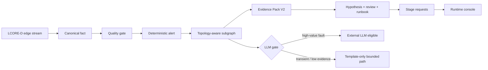
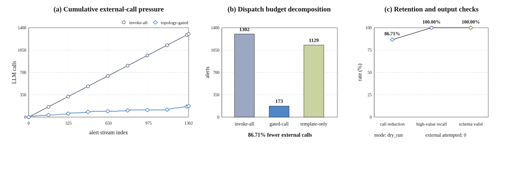

## NetOps Causality Remediation
 

This branch implements a topology-aware NetOps reasoning pipeline for LCORE-D style core-network telemetry. The system keeps deterministic alert establishment separate from model-assisted analysis: the model is not allowed to decide whether an alert exists, and it only receives bounded evidence after the rule path has confirmed an alert.

The current research focus is no longer office FortiGate traffic. Office runtime is treated as a legacy engineering trace. The active scenario is LCORE-D fault localization, where the system must use topology structure to reduce noisy evidence, distinguish root-candidate and symptom nodes, and avoid unnecessary LLM calls for low-value or self-healing slices.

## System Definition

The system is defined by five planes:

- Edge fact plane: converts LCORE-D rows into stable canonical facts with device identity, fault labels, and topology context.
- Deterministic alert plane: applies quality gates and rule-backed alert confirmation before any model sees the incident.
- Topology evidence plane: extracts a local subgraph around the confirmed alert and assigns root-candidate, symptom, and noise roles.
- Bounded reasoning plane: builds structured evidence packs, hypotheses, review verdicts, runbook drafts, and stage requests.
- Runtime projection plane: exposes alerts, suggestions, topology gates, and evaluation artifacts to the operator UI.

A controlled execution plane is intentionally out of scope for this branch. Remediation remains human-gated guidance with explicit approval and rollback boundaries.

The main object chain is:

`canonical fact -> deterministic alert -> evidence bundle -> topology_subgraph -> Evidence Pack V2 -> HypothesisSet -> ReviewVerdict -> RunbookDraft -> ReasoningStageRequests -> runtime projection`

## LCORE Runtime Contract

The edge side owns fact identity and topology normalization. The core side owns alerting, evidence assembly, and reasoning. The contract currently expected by core is:

| Field | Expected meaning |
| --- | --- |
| `src_device_key` | Stable LCORE device identity such as `CORE-R1` to `CORE-R7` |
| `device_profile.device_name` | Same stable device identity as `src_device_key` |
| `fault_context.scenario` | Normalized scenario such as `healthy`, `induced_fault`, or `transient_fault` |
| `topology_context.path_signature` | Stable topology signature without local file paths |
| `topology_context.hop_to_core` | Distance-like topology feature toward the core side |
| `topology_context.hop_to_server` | Distance-like topology feature toward the server side |
| `topology_context.downstream_dependents` | Local downstream dependency count when available |
| `topology_context.path_up` | Path-state feature from the LCORE source |
| `topology_context.interface_type` | Numeric interface-type feature when present |
| `topology_context.srcintf` | Reserved for real interface names; numeric feature values should not be placed here |

This division is important: core has defensive guards for malformed facts, but the correct fix for identity and topology errors belongs to the edge canonicalization layer.

## Topology-Aware Subgraph Extraction

The topology-aware layer adapts the failure-localization idea from LLM-based production-network diagnosis to this project’s bounded NetOps setting. Instead of sending every alert and every neighboring fact to an LLM, the system builds a minimal local subgraph for each confirmed alert:

- Root-candidate nodes are nodes with direct fault evidence, critical scenarios, or high recurrence.
- Symptom nodes are nearby or historically related nodes that may reflect propagation.
- Noise nodes are weakly related nodes kept outside the selected reasoning core.
- The LLM gate uses scenario severity, topology evidence, recurrence, and self-healing likelihood to decide whether an external LLM call is justified.

This gives the branch a clearer research contribution than a generic post-alert summarizer: topology is not only displayed as context, but used to choose evidence and reduce reasoning diffusion.

## Implementation Summary

The implemented core structures include:

- `topology_subgraph`
- `llm_invocation_gate`
- `candidate_event_graph`
- `reasoning_runtime_seed`
- `Evidence Pack V2`
- `HypothesisSet`
- `ReviewVerdict`
- `RunbookDraft`
- `ReasoningStageRequests`

The main implementation files are:

| Area | Path |
| --- | --- |
| Topology subgraph extraction | `core/aiops_agent/alert_reasoning_runtime/topology_subgraph.py` |
| Alert/cluster seed adapter | `core/aiops_agent/alert_reasoning_runtime/rule_based_seed_adapter.py` |
| Evidence bundle projection | `core/aiops_agent/evidence_bundle.py` |
| Evidence Pack V2 integration | `core/aiops_agent/evidence_pack_v2.py` |
| Provider routing hint | `core/aiops_agent/provider_routing.py` |
| Review verdict checks | `core/aiops_agent/review_verdict.py` |
| LCORE adaptive fact conversion | `common/data_features/adaptive.py` |
| Ablation benchmark | `core/benchmark/topology_subgraph_ablation.py` |
| Frontend runtime projection | `frontend/gateway/app/runtime_reader.py` |

## Evaluation Snapshot

The current ablation compares an invoke-all baseline against topology-aware selective invocation. The baseline assumes every confirmed alert is sent to an external LLM. The topology-aware path invokes the external LLM only when the subgraph gate marks the alert as high-value.

| Dataset slice | Alerts scanned | Invoke-all LLM calls | Topology-gated LLM calls | Call reduction | High-value alerts | High-value recall |
| --- | ---: | ---: | ---: | ---: | ---: | ---: |
| Office legacy trace | `886` | `886` | `0` | `100.00%` | `0` | `0.00%` |
| LCORE-D 50k replay sample | `1302` | `1302` | `173` | `86.71%` | `173` | `100.00%` |

The office trace is useful as a legacy engineering sanity check, but it has no high-value LCORE fault-localization labels in the evaluated window. The LCORE-D replay is the relevant research slice.

Figure: one-shot ablation summary. Panel A compares invoke-all and topology-gated LLM request volume. Panel B shows the efficiency-quality frontier: the LCORE topology gate moves from 0% call reduction at the invoke-all baseline to 86.71% call reduction while retaining 100% high-value recall. The dashed evidence-size curve shows that the selected LLM evidence slice remains compact as the gate becomes stricter.

The measured result is not yet final root-cause top-1 accuracy. It is a first-stage systems result: the topology gate reduces LLM calls by `86.71%` on the LCORE-D replay while preserving `100%` of high-value alert eligibility. The next evaluation step is to attach incident-window root labels and report root-candidate, symptom, and noise classification accuracy.

## GPU Provider Replay

The external-provider path now has a hard topology gate. If `llm_invocation_gate.should_invoke_llm=false`, the `gpu_http` provider returns the local template fallback and records `external_provider_skipped=true`; it does not call the GPU endpoint. If the gate is true, the request can be routed through the Waseda GPU tunnel to the NetOps LLM gateway.

The dry-run replay validates the dispatch policy and response contract before the live GPU endpoint is attached:

The current dry-run replay scanned `1302` LCORE-D alerts, planned `173` topology-gated external calls, skipped `1129` template-only alerts, preserved `100%` high-value recall, and produced `100%` schema-valid fallback responses. Live GPU latency and model-quality numbers must be regenerated after the Waseda endpoint is running.

Operational details are documented in [`documentation/WASEDA_GPU_LLM_PROVIDER.md`](documentation/WASEDA_GPU_LLM_PROVIDER.md).

## Model Execution Plan

The current system should not colocate a large model inside the core pipeline. The core node should stay focused on deterministic alerting, evidence assembly, and runtime projection. Model execution should be attached as a provider behind an explicit stage request interface.

Recommended provider order:

- Short term: keep the template path as the always-available fallback.
- Near term: expose an OpenAI-compatible endpoint from the Waseda GPU cluster and route only topology-gated high-value alerts to it.
- Experiment tier: evaluate GLM-4.5-Air or another reasoning/coding model through vLLM or SGLang.
- Control tier: keep hosted API models available for comparison, regression checks, and cases where local models fail.

The reason to use the GPU cluster is not training from scratch. It is controlled inference and possible lightweight LoRA/SFT experiments on incident-local prompts. CPU-only or memory-only inference can be useful for small models, but this project emphasizes reasoning depth and long structured context; the GPU cluster is the more realistic path for paper-grade evaluation.

## Operating Boundaries

- Alert establishment is deterministic and rule-backed.
- LLM reasoning is post-alert and evidence-bounded.
- Topology selection happens before external model invocation.
- Low-value transient slices may remain template-only.
- Suggestions are not automatically written back to devices.
- Any future execution path must stop at approval and rollback boundaries.

## Current Status

This branch has completed the local structured path for topology-aware post-alert reasoning. It has also moved the active runtime scenario from office traffic to LCORE-D telemetry.

Completed:

- LCORE canonical fact adaptation
- deterministic `annotated_fault_v1` alerting
- topology-aware subgraph extraction
- LLM invocation gating
- evidence pack and stage request integration
- frontend runtime projection for LCORE/topology semantics
- ablation benchmark for LLM-call reduction

Remaining:

- root-cause label alignment for paper-grade localization accuracy
- provider execution wiring to a real local or remote LLM endpoint
- response validation and timeout fallback
- trace capture for replayable model evaluations
- comparison against rule-only and invoke-all baselines over full LCORE-D incident windows

## Replay Identity and Looping

LCORE-D replay now has an explicit `run_id`. The edge streamer writes it into `dataset_context.run_id`, stores it in the streamer checkpoint, and includes it in the canonical `event_id` hash. This means a later replay of the same LCORE row can be treated as a new experiment run instead of being dropped by the core duplicate gate as the same historical fact.

Looped sending is feasible for system health checks, but it should be treated as synthetic replay traffic. It is useful for verifying the end-to-end path after the LLM provider is attached, especially Kafka transport, core ingest, alerting, evidence assembly, and UI freshness. It should not be mixed into paper-grade dataset statistics unless each loop is tagged as a separate run and excluded or grouped deliberately during evaluation.

Operational boundary:

- One-shot replay remains the default and stops at EOF.
- The edge forwarder loops as a file scanner, but only sends newly appended JSONL lines after its byte checkpoint.
- The core consumer loops on Kafka, but does not replay historical offsets unless the consumer group is reset.
- If LCORE streamer loop mode is enabled, each loop must use a distinct `run_id`; otherwise duplicate `event_id` values are expected to be dropped.

## Runtime Feature and Throughput Record

This table records the r230 edge to r450 core LCORE-D replay throughput observed during the active replay window.

| Stage | Runtime object | Feature count observed | Runtime volume | Throughput observed | Notes |
| --- | --- | ---: | ---: | ---: | --- |
| LCORE-D raw CSV | Source rows | `32-51` columns per file, `234` union columns across 7 files | `169,712` rows, `26,670,593` bytes | offline source | Per-router files: R1/R5/R7 `42`, R2 `32`, R3/R6 `51`, R4 `47` columns |
| Adaptive feature plan | `feature-plan.json` | `43` sampled columns, `1` label field, `4` entity fields, `7` topology fields, `3` metric fields | plan built from `5,000` sampled rows | one plan per replay | Active label field is `class`; active topology fields include `Hop_to_core`, `Hop_to_server`, and `path_up` |
| Edge canonical fact JSONL | `events-lcore-d.jsonl` | `23` top-level fields; nested: topology `19`, device profile `12`, fault context `5`, dataset context `12` in the recorded run | `169,761` lines, `326,025,599` bytes | latest completed streamer segment `17.12 EPS` | New replays add `dataset_context.run_id`, so dataset context becomes `13` fields while top-level count stays `23` |
| Edge forwarder to Kafka | Kafka topic `netops.facts.raw.v1` | Same canonical fact payload: `23` top-level fields | cumulative `169,886` sent, `326,276,448` bytes, `0` dropped | active window `17.06 EPS`, about `0.268 Mbps` | Cumulative count includes earlier smoke/replay sends |
| Core correlator ingest | Quality-gated facts | Canonical fact consumed from Kafka: `23` top-level fields | log counter `ingested=135,881`, `accepted=135,832`, `drop_duplicate_event_id=49` | stable window `17.30 accepted facts/s` | Other drops were `0`: missing fields, parse status, JSON errors, DLQ |
| Deterministic alert | `annotated_fault_v1` alert | `12` top-level fields; nested: dimensions `2`, metrics `3`, event excerpt `31`, topology `19`, device profile `12`, change context `6` | log counter `alerts_emitted=3,416` | stable window `0.0396 alerts/s` | Alerting is post-quality-gate and deterministic; LLM is not in this path |
| Runtime suggestion tail | `netops.aiops.suggestions.v1` | `24` top-level fields; nested: context `17`, evidence bundle `17`, inference `12`, runtime seed `7`, hypothesis set `6`, review verdict `9`, runbook draft `15`, stage requests `2` | topic latest offsets sum to `293,458` messages across mixed history | downstream AI rate depends on alert emission and LLM gate policy | Latest tail sample confirms the current 24-field suggestion schema |
