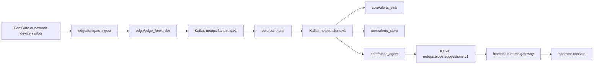
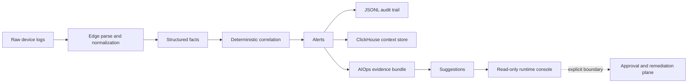

# Towards NetOps

## Project Positioning

This repository is a working NetOps / AIOps stack, not a presentation shell.
Its main engineering claim is narrow and deliberate: keep the network data plane deterministic, turn raw device text into structured and replayable facts, and introduce AIOps only after an alert contract already exists.

The current system is built around three practical constraints.
First, the raw stream comes from real device logs and must remain traceable to source files, timestamps, and parser decisions. Second, the realtime decision point cannot depend on model latency or prompt behavior. Third, the operator surface must show the path from raw event to alert to suggestion without pretending that closed-loop remediation is already safe to expose.

That stance is why the repository is split the way it is: edge-side parsing and replay semantics stay close to the source, core-side correlation stays deterministic, persistence is separated into audit and query surfaces, and AIOps runs as alert-downstream augmentation rather than as the primary detector.

## System Mainline



The edge side exists to absorb source-specific mess before it reaches the shared stream.
`edge/fortigate-ingest` owns file discovery, checkpoint movement, replay safety, syslog parsing, and JSONL emission. It turns rotated files and raw text lines into structured facts with stable identifiers, normalized timestamps, device keys, and source metadata.

`edge/edge_forwarder` draws a hard line between parsing and transport.
The core does not need to understand FortiGate text or file rotation semantics; it receives structured fact events on `netops.facts.raw.v1`.

`core/correlator` is the realtime decision point.
It consumes structured facts, applies quality gates, rule profiles, and window logic, and emits `netops.alerts.v1`. At that stage the system has already crossed from raw evidence into a typed incident object that can be audited, replayed, and enriched.

The alert contract fans out to two persistence surfaces and one augmentation surface.
`core/alerts_sink` writes hourly JSONL for audit and replay. `core/alerts_store` writes alert records into ClickHouse for recent-history lookup and context queries. `core/aiops_agent` consumes the same alert contract and produces bounded suggestions instead of participating in first-pass detection.

The frontend does not sit on the hot path.
`frontend/gateway/app/runtime_reader.py` projects alerts, suggestions, and deployment controls into a read model that the operator console can render. The console is meant to explain system state and control boundaries, not to hide execution inside a dashboard.

## Parsing And Processing Chain

### 1. Raw syslog to structured edge facts

The first transformation happens in `edge/fortigate-ingest`.
Its parser pipeline is split across `bin/source_file.py`, `bin/parser_fgt_v1.py`, `bin/sink_jsonl.py`, and `bin/checkpoint.py`. That split matters because raw FortiGate ingestion is not just text parsing. The edge runtime must also preserve which file a record came from, where replay should resume, and how rotated files are marked as completed.

The output of this stage is not "parsed text"; it is a reusable fact contract.
Typical fields such as `event_id`, `event_ts`, `src_device_key`, `service`, `action`, `kv_subset`, `source.path`, and `source.inode` turn a log line into an object that can survive transport, backfill, replay, and later investigation without losing its origin.

Field-level details live in [documentation/FORTIGATE_INGEST_FIELD_REFERENCE_EN.md](./documentation/FORTIGATE_INGEST_FIELD_REFERENCE_EN.md).

### 2. Structured facts to shared transport

`edge/edge_forwarder` moves parsed JSONL facts into `netops.facts.raw.v1`.
This is where the repository stops treating events as edge-local files and starts treating them as shared runtime objects. The core receives a normalized fact stream instead of vendor-specific raw text, which keeps parser complexity and core analytics from collapsing into the same process.

### 3. Shared transport to deterministic alerts

`core/correlator` consumes `netops.facts.raw.v1` and produces `netops.alerts.v1`.
Its job is intentionally narrow: quality filtering, rule evaluation, window aggregation, and alert emission. The decisive point here is that the first system-level judgment remains deterministic. Rule profiles can evolve and enrichment can improve, but the hot path still resolves into a traceable threshold or rule decision rather than a model-generated opinion.

### 4. Alerts to audit and query surfaces

The alert stream is persisted twice because the two use cases are different.
`core/alerts_sink` writes hourly JSONL under the runtime volume so that an operator or replay tool can inspect exactly what was emitted. `core/alerts_store` writes to ClickHouse so that the system can answer questions about recent similar alerts, history windows, and context lookup without scanning raw files every time.

JSONL and ClickHouse are therefore not duplicate storage by accident.
One preserves evidence and replay semantics. The other supports hot retrieval and downstream context assembly.

### 5. Alerts to bounded AIOps suggestions

`core/aiops_agent` starts from `netops.alerts.v1`, not from the raw stream.
It builds evidence bundles from the alert payload plus recent context, then emits suggestions to `netops.aiops.suggestions.v1`. This keeps inference bounded in two ways: the input set is smaller because only alerts are eligible, and the payload is richer because the alert contract already carries normalized structure and recent context.

The repository currently supports both alert-scope and cluster-scope suggestion paths.
That is still augmentation, not replacement. Detection stays in the correlator; AIOps attaches interpretation and next-step guidance after the system has already decided that an alert exists.

### 6. Runtime projection to the operator console

The frontend gateway reads runtime JSONL, recent suggestion outputs, and deployment controls, then assembles a `RuntimeSnapshot` for the UI.
This is a projection layer, not the source of truth. It exists so the operator console can explain freshness, event flow, evidence, and control boundaries in one place without coupling React components directly to raw runtime files.

The console is process-oriented on purpose.
It shows `raw -> alert -> suggestion -> remediation boundary` as a chain of state transitions instead of pretending that a generic dashboard is enough for incident reasoning.

## Architecture Boundaries And Trade-Offs



Detection stays deterministic because the repository still has to earn trust on the raw-to-alert path.
The current environment is resource-constrained, the traffic is real, and replay correctness matters. Pushing model inference into the first decision point would make throughput, reproducibility, and failure analysis harder at exactly the stage where the data plane still needs the most discipline.

AIOps starts after alerts because the alert contract is the first place where cost, context, and semantics line up.
At that point the system already has normalized device fields, rule outcomes, alert timestamps, and a stable identifier for persistence and history lookup. That is a better input for bounded inference than an unfiltered raw log stream.

The console stays read-only because execution is a different risk class from explanation.
The current gateway reads runtime artifacts and deployment controls; it does not write to devices, Kubernetes workloads, or remediation channels. That separation is not cosmetic. It is what keeps the current UI honest about the difference between observing a system and controlling it.

Automatic approval and remediation remain explicitly outside the delivered path.
The repository can already explain incidents better than a raw log browser, but it does not yet claim a safe closed loop. Leaving remediation behind an explicit boundary is the correct choice until approval flow, rollback, write-path auditing, and failure handling are engineered as first-class components rather than implied by a button.

## Repository Layout

| Area | Key paths | Responsibility | What stays outside |
| --- | --- | --- | --- |
| Edge ingest | `edge/fortigate-ingest`, `edge/edge_forwarder` | Parse raw device logs, preserve checkpoint and replay semantics, emit structured facts, forward them into Kafka | Core analytics, operator presentation, remediation logic |
| Core stream processing | `core/correlator`, `core/alerts_sink`, `core/alerts_store`, `core/aiops_agent` | Turn facts into alerts, persist alerts, enrich alert context, emit bounded suggestions | Source-specific raw parsing, UI rendering |
| Operator surface | `frontend`, `frontend/gateway/app` | Project runtime state into a console that exposes freshness, evidence, and control boundaries | Direct device mutation or automated remediation execution |
| Verification | `tests`, `core/benchmark` | Replay validation, runtime checks, throughput probes, timestamp audits | Production control logic |
| Project records | `documentation` | Architecture notes, field references, runtime state capture, validation history | Live runtime source of truth |

## Current Scope And Undelivered Boundary

Operational in the repository today:

- FortiGate-oriented edge ingest with checkpointed JSONL output
- structured fact forwarding into `netops.facts.raw.v1`
- deterministic correlation and alert emission on `netops.alerts.v1`
- hourly JSONL alert audit plus ClickHouse alert storage
- alert-scope and cluster-scope suggestion emission on `netops.aiops.suggestions.v1`
- read-only runtime gateway and operator console

Not yet delivered as production capability:

- device write-back and closed-loop remediation
- approval workflows that mutate live state
- automatic execution against remediation channels
- a fully operationalized inference plane beyond the current bounded suggestion path
- any claim that the current UI is an execution console

## Deployment And Verification Entry Points

Use the root README to understand the system boundary. Use module-level documents for deployment specifics.

Repository-level checks:

```bash
python3 -m pytest -q tests/core
python3 -m compileall -q core edge
cd frontend && npm run build
python3 -m core.benchmark.live_runtime_check
```

Deployment and release details live in the module documents linked below.

## Documentation

- [Current project state](./documentation/PROJECT_STATE_EN.md)
- [FortiGate ingest field reference](./documentation/FORTIGATE_INGEST_FIELD_REFERENCE_EN.md)
- [Frontend runtime architecture](./documentation/FRONTEND_RUNTIME_ARCHITECTURE_20260328_EN.md)
- [Edge module README](./edge/README.md)
- [Core module README](./core/README.md)
- [Frontend module README](./frontend/README.md)
