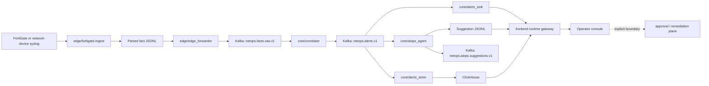

## Towards NetOps: Hybrid AIOps Platform for Network Awareness and Operator-Guided Remediation
[](./README.md) [](./README_CN.md)

> Hybrid AIOps Platform: Deterministic Streaming Core + CPU Local LLM (On-Demand) + Multi-Agent Orchestration

This repository implements a full NetOps / AIOps mainline. Real network-device syslog is first normalized into structured facts at the edge, then turned into deterministic alerts, persisted into audit and query surfaces, enriched into bounded AIOps suggestions, and finally projected into a read-only runtime console. The system design follows a fixed engineering order: raw logs become replayable system objects first, the first system-level judgment remains deterministic, persistence is split by operational purpose, model-driven reasoning starts from alert contracts, and the frontend renders evidence, context, and control boundaries within a read-only runtime surface.

## System Overview



The mainline starts with `edge/fortigate-ingest`, which handles file discovery, checkpoint movement, replay recovery, syslog parsing, and JSONL fact emission. At that point each event already has a stable `event_id`, normalized `event_ts`, a device-level grouping key, and file-level provenance. `edge/edge_forwarder` publishes those facts into `netops.facts.raw.v1`, which decouples edge-local file semantics from shared transport and core analytics. `core/correlator` consumes the normalized fact stream, applies quality gates, deterministic rules, and sliding windows, and emits `netops.alerts.v1` as the first system-level incident contract.

The alert stream fans out into three downstream paths. `core/alerts_sink` writes hourly JSONL and preserves exact emitted runtime records for audit and replay. `core/alerts_store` writes the same alerts into ClickHouse and supports recent-history lookup, similar-alert counting, and context retrieval. `core/aiops_agent` starts from alerts, assembles evidence bundles from alert payload, topology, device, and history context, and emits alert-scope or cluster-scope suggestions. `frontend/gateway` reads those runtime artifacts together with deployment controls, assembles a unified `RuntimeSnapshot`, and streams the projected state to the operator console via `SSE`.

## System Design

### Design objectives and constraints

The system is designed to solve a specific problem: convert real runtime network telemetry into a stable operational data plane that supports alert explanation, context retrieval, and bounded guidance. That problem imposes four constraints. Raw inputs come from real FortiGate runtime logs and must remain traceable to source files and parser decisions. The first system-level decision must stay deterministic so that thresholds, windows, and rule hits remain replayable and auditable. Persistence must serve both evidence retention and hot retrieval, which requires separate audit and query surfaces. The operator UI must show the evidence chain and the execution boundary clearly and consistently.

### End-to-end object progression

| Stage | Runtime object | Producer | Operational role |
| --- | --- | --- | --- |
| Source | raw syslog line | device / gateway | original runtime evidence in vendor text form |
| Edge fact | structured JSONL fact | `edge/fortigate-ingest` | normalized time, identity, provenance, replay semantics |
| Shared fact | Kafka fact record | `edge/edge_forwarder` | shared transport object for core consumers |
| Alert | deterministic alert contract | `core/correlator` | first system-level incident judgment |
| Persistence | JSONL alert record + ClickHouse row | `core/alerts_sink`, `core/alerts_store` | audit retention, replay support, hot retrieval |
| Suggestion | structured suggestion record | `core/aiops_agent` | bounded operator guidance tied to alerts or alert clusters |
| Runtime view | `RuntimeSnapshot` | `frontend/gateway` | unified operator-facing state projection |

Field-level references and large samples remain in:
[FortiGate input field analysis](./documentation/FORTIGATE_INPUT_FIELD_ANALYSIS.md),
[FortiGate parsed JSONL output sample](./documentation/FORTIGATE_PARSED_OUTPUT_SAMPLE.md).

### Edge ingestion and normalization

`edge/fortigate-ingest` is the first hard system boundary. Its job covers field extraction, rotated-file handling, checkpoint progression, failure recovery, and replay semantics while producing a stable fact schema. The output facts carry normalized time, device identity, compact original key-value context, and file provenance so that every downstream module can recover where an event came from, when it happened, and how it should be replayed.

### Shared transport and deterministic correlation

`edge/edge_forwarder` moves parsed facts into `netops.facts.raw.v1`, after which the repository treats events as shared runtime objects. `core/correlator` consumes that stream and performs the first system-level judgment through quality gates, deterministic rule evaluation, and sliding-window aggregation. This choice preserves replayability and auditability under real traffic and keeps the hot path explainable in terms of thresholds and rule profiles.

### Persistence and context retrieval

`core/alerts_sink` and `core/alerts_store` form the persistence layer but serve different jobs. The sink preserves emitted runtime records as hourly JSONL, which makes audit, replay, and evidence inspection possible. The store writes the same alerts into ClickHouse, which supports recent-similar lookup, history-window queries, and context assembly for downstream consumers. This dual-surface design keeps evidence preservation and retrieval optimization from interfering with each other.

### Bounded AIOps suggestion layer

`core/aiops_agent` starts from alerts. It builds evidence bundles from alert payload, topology context, device profile, recent history, and cluster context, then emits structured suggestions. This placement constrains the model input to already-qualified incidents, gives inference a denser and better-aligned contract, and keeps realtime detection independent from model latency and prompt variance. The current implementation supports both alert-scope and cluster-scope suggestions and persists them to Kafka and JSONL.

### Runtime projection and operator console

The runtime gateway reads alert JSONL, suggestion JSONL, and deployment controls, then assembles a unified `RuntimeSnapshot`. The frontend consumes that snapshot and stream deltas directly. This projection allows the console to render freshness, incident volume, evidence coverage, lifecycle telemetry, and control boundaries in one process-oriented view. The UI presents how incidents are discovered, persisted, explained, and bounded within one surface.

## Component Inputs, Outputs, And Responsibilities

| Component | Main inputs | Main outputs | Core responsibility |
| --- | --- | --- | --- |
| `edge/fortigate-ingest` | FortiGate syslog, rotated files, checkpoints | parsed fact JSONL | parse logs, preserve replay semantics, retain provenance |
| `edge/edge_forwarder` | parsed fact JSONL | `netops.facts.raw.v1` | move edge facts into shared transport |
| `core/correlator` | `netops.facts.raw.v1` | `netops.alerts.v1` | run quality gates, deterministic rules, windowed alert generation |
| `core/alerts_sink` | `netops.alerts.v1` | hourly alert JSONL | preserve emitted runtime records for audit and replay |
| `core/alerts_store` | `netops.alerts.v1` | ClickHouse alert rows | support history lookup and context retrieval |
| `core/aiops_agent` | alerts, history, topology, device context | `netops.aiops.suggestions.v1`, suggestion JSONL | assemble evidence bundles and emit bounded structured guidance |
| `frontend/gateway` | alerts, suggestions, deployment controls | `RuntimeSnapshot`, SSE stream | project runtime artifacts into a frontend state model |
| `frontend` | snapshot, stream deltas | runtime console | render incident flow, evidence, lifecycle, and control boundaries |

## Representative Runtime Records

A mounted-runtime alert sample currently looks like this:

```json
{
  "alert_id": "2081f46a5146d642d4110253926698c1b8b6fced",
  "alert_ts": "2026-03-26T18:56:04+00:00",
  "rule_id": "deny_burst_v1",
  "severity": "warning",
  "metrics": {
    "deny_count": 321,
    "window_sec": 60,
    "threshold": 200
  },
  "event_excerpt": {
    "action": "deny",
    "srcip": "5.188.206.46",
    "dstip": "77.236.99.125",
    "service": "tcp/3472"
  },
  "topology_context": {
    "service": "tcp/3472",
    "srcintf": "wan1",
    "dstintf": "unknown0",
    "zone": "wan"
  }
}
```

This alert already carries threshold conditions, local incident shape, and network placement. A mounted-runtime suggestion sample currently looks like this:

```json
{
  "suggestion_id": "598b2edba0f164f9a0048e8d6021974123d1927c",
  "suggestion_ts": "2026-03-31T15:35:49.119215+00:00",
  "suggestion_scope": "alert",
  "alert_id": "2081f46a5146d642d4110253926698c1b8b6fced",
  "rule_id": "deny_burst_v1",
  "priority": "P2",
  "summary": "deny_burst_v1 triggered for service=tcp/3472 device=5.188.206.46",
  "context": {
    "service": "tcp/3472",
    "src_device_key": "5.188.206.46",
    "recent_similar_1h": 0,
    "provider": "template"
  }
}
```

The suggestion remains tied to the alert and preserves scope, priority, summary, and compact context. The console consumes structured guidance with explicit source and scope.

## Deployment Planes And Explicit Boundaries

The current system naturally separates into three runtime planes. The edge ingestion plane handles near-source parsing, checkpoints, and fact generation. The core streaming plane handles Kafka facts, deterministic correlation, audit persistence, ClickHouse retrieval, and AIOps suggestion generation. The runtime projection plane assembles mounted artifacts and deployment controls into a console-facing state model. This separation supports both distributed deployment and single-host demo operation while preserving one stable set of data contracts.

The first decision point remains deterministic because the current phase still depends on a stable raw-to-alert path under real traffic, replay validation, and rule tuning. The AIOps layer sits downstream of alerts because device fields, timestamps, rule outcomes, and recent history are already aligned there in a compact contract. The frontend stays read-only because observation, explanation, and execution belong to different risk classes. Current delivery covers investigation support, incident explanation, context retrieval, and structured guidance. Approval-driven execution, rollback-aware write paths, device mutation, and remediation automation remain outside the delivered boundary.

## Current Progress

The currently mounted workspace exposes `/data/netops-runtime` alert and suggestion artifacts together with the current repository codebase. In this mounted dataset, the alert sink covers `554` hourly files with `152,481` alert records from `2026-03-04T15:09:11+00:00` to `2026-03-27T23:00:17+00:00`. The suggestion sink covers `480` hourly files from `2026-03-09T05:08:56.549849+00:00` to `2026-03-31T15:36:55.895982+00:00`. The last 24 mounted alert partitions contain `2067` `deny_burst_v1` warnings and `2` `bytes_spike_v1` critical alerts. The last 24 mounted suggestion partitions contain `9058` alert-scope suggestions and `1353` cluster-scope suggestions, all from the current `template` provider. A live `/data/fortigate-runtime` volume is unavailable in this mount, so raw-edge freshness and full cross-layer time alignment are not directly measurable from mounted artifacts alone. The current verification baseline is `33` collected tests across `tests/core` and the two frontend runtime snapshot and stream tests.

## Evaluation Surfaces

The repository already exposes several concrete measurement surfaces for later paper evaluation. The edge layer can be evaluated on field coverage, parse success rate, checkpoint correctness, and replay correctness. The deterministic alert layer can be evaluated on end-to-end alert latency, rule-hit distribution, window aggregation correctness, and freshness. The persistence layer can be evaluated on emitted-record retention, query latency, and recent-similar lookup effectiveness. The suggestion layer can be evaluated on suggestion latency, scope distribution, provider stability, and context completeness. The runtime console can be evaluated on snapshot completeness, SSE freshness, timeline coverage, and operator-visible lifecycle consistency.

## Verification

```bash
python3 -m pytest -q tests/core
pytest -q tests/frontend/test_runtime_reader_snapshot.py tests/frontend/test_runtime_stream_delta.py
python3 -m compileall -q core edge frontend/gateway
python3 -m core.benchmark.live_runtime_check
cd frontend && npm run build
```
