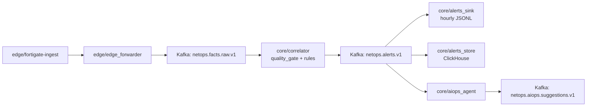
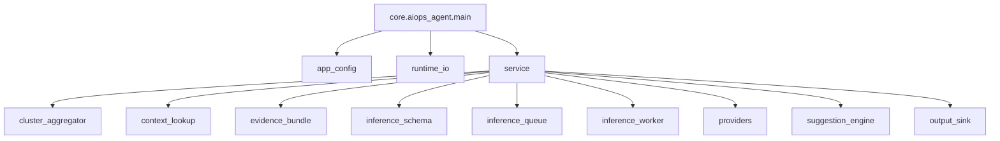

## Towards NetOps: Hybrid AIOps Platform for Network Awareness and Automated Remediation
[](./README.md) [](./README_CN.md)

> Hybrid AIOps Platform: Deterministic Streaming Core + CPU Local LLM (On-Demand) + Multi-Agent Orchestration

#### Project Overview

This project aims to build a **distributed AIOps platform (Towards NetOps)** for complex network operations scenarios, following the main line of **Edge Fact Ingestion → Core Streaming Analytics → LLM-Augmented Reasoning → Remediation Loop**, and progressively implementing an engineering capability evolution from anomaly detection and evidence-chain attribution to remediation recommendation and execution control. The platform does not target “real-time LLM inference on full-volume logs”; instead, it is built on a stable data plane and explainable evidence flow, and performs on-demand intelligent augmented analysis for eligible alerts and repeated anomaly clusters on the core side, in order to achieve a deployable balance among cost, real-time performance, and operability.

#### Architecture Paradigm

The system adopts a layered architecture of **Edge Ingestion + Core Analytics**. The edge side is responsible for near-source log collection, structured fact eventization, audit trail retention, and replayable persistence, converting raw device logs into a sustainably consumable fact event stream; the core side is responsible for streaming data plane hosting, event aggregation and correlation analysis, and evidence-chain construction, and on this basis introduces an **LLM-augmented analytics layer** for alert explanation, situation summarization, attribution assistance, and Runbook draft generation. This augmentation layer adopts a **resident service + rate-limited queue** operating mode: rule-based/streaming modules perform real-time detection and high-value anomaly filtering, while the LLM performs low-concurrency, on-demand inference only on alert-level context, avoiding contention with the real-time performance and system resources of the main path.

> [!IMPORTANT]
> The platform target is not “real-time LLM inference on full-volume logs,” but on-demand intelligent augmented analysis of eligible alerts and repeated alert clusters based on a stable data plane and explainable evidence flow.

- Current Technical Route Under Resource Constraints

Under current resource constraints (no GPU on the core side, CPU-only inference), the technical route of this project is explicitly **“deterministic streaming analytics as the primary path + on-demand LLM augmentation”**: real-time detection, basic aggregation, and correlation computation are handled by rule-based/stream processing modules; the LLM is responsible for explanation and planning generation over compressed high-value evidence context. This design enables the platform, without relying on local training or continuous high-cost API calls, to still progressively evolve toward Multiple Agent + LLM collaborative analysis and automated remediation closed-loop capability.

> [!NOTE]
> At the current stage, the priorities are: stable data plane, explainable evidence flow, and runnable core pipeline; the LLM is connected on demand as an alert-level augmentation module.

The project construction sequence is expected to proceed in the following stages:

1. **Phase 1: Engineering implementation of the edge fact ingestion layer**  
   Complete ingestion of FortiGate logs (and potentially additional network device logs in the future), ensuring the input is auditable, recoverable, and replayable.

2. **Phase 2: Core-side data plane and minimal streaming consumption pipeline**  
   Establish the data plane on the core side, and complete event transport decoupling and basic aggregation analytics.

3. **Phase 3: Introduction of AIOps augmented analytics capabilities**  
   Based on AIOps principles, progressively introduce Multiple Agent + LLM capabilities for correlation analysis, network situational awareness, evidence-chain attribution, and automated self-healing Runbook generation.

4. **Phase 4: Remediation loop extension**  
   Under explainability and verifiability constraints, extend to remediation recommendations, human approval execution, and low-perception automated self-healing.

## Design Boundary

> [!WARNING]
> At the current stage, this project does not take “per-event LLM judgment over the full event stream” as an architectural target.  
> The main path is handled by deterministic streaming modules for real-time detection and basic correlation; LLM/Agent components are used for on-demand augmented analysis of eligible alerts, repeated clusters, and remediation recommendation generation.

## Current Progress Snapshot (2026-03-22)

> [!TIP]
> Runtime ownership is now explicit: `edge/*` only for edge node components, `core/*` only for core node components.

### Implemented Runtime Flow



### Implemented Modules and Stack

| Layer | Module | Responsibility | Tech |
| --- | --- | --- | --- |
| Edge ingest | `edge/fortigate-ingest` | Parse FortiGate logs, checkpoint replay, DLQ/metrics output | Python, JSONL |
| Edge filter/forward | `edge/edge_forwarder` | Noise suppression + forward to core topic | Python, Kafka |
| Core correlator | `core/correlator` | Quality gate, rule matching, alert emit, manual offset commit | Python, Kafka |
| Alert persistence | `core/alerts_sink` | Persist alerts to hourly JSONL | Python |
| Hot analytics store | `core/alerts_store` | Consume alerts and store structured records | ClickHouse, `clickhouse-connect` |
| AIOps assistant (minimal) | `core/aiops_agent` | Build alert-scope and cluster-scope evidence/request pipelines, emit structured suggestions, and persist audit JSONL | Python, Kafka, ClickHouse |
| Ops tooling | `core/benchmark/*` | Runtime watch and warning-noise observation | Python, `kubectl` |

> [!NOTE]
> The current repository state is best described as: **Phase-2 core data plane closed loop is in place, and a minimal AIOps alert + cluster suggestion loop has landed on top of it**.  
> Deterministic streaming detection and alert persistence are already implemented; true LLM inference, causal evidence-chain reasoning, and remediation execution control remain the next-stage work.

### Frontend Module

- Scope
  - Process-centric operator console for the live chain `raw -> alert -> suggestion -> remediation boundary`; not a generic admin dashboard.
- Core stack
  - `React 19 + Vite + TypeScript`
  - State: local React state plus a custom `useRuntimeSnapshot` hook; no external store yet because the UI graph is still shallow and event ownership is singular.
  - Routing: no dedicated router yet; the current surface is two primary views switched in-app (`Live Flow Console`, `Pipeline Topology`).
  - UI: custom CSS system with dense, square, non-template layout; no off-the-shelf admin kit.
  - Realtime: `FastAPI` gateway + `SSE`; initial HTTP snapshot followed by stream updates.
  - Visualization: `React Flow` for pipeline topology, `ECharts` for cadence and evidence-density views.
  - Build / deploy: `Vite` for dev/build, same-origin `FastAPI` static serving for deployable mode, optional `Docker + k3s Deployment`.
- Module responsibilities
  - Convert runtime files and deployment controls into an operator-readable process console.
  - Expose freshness, backlog, cluster watch, evidence thickness, and suggestion detail without flattening the pipeline into unrelated metric cards.
  - Keep remediation explicit as a control boundary rather than pretending execution is already part of the live runtime.
- Backend integration
  - `GET /api/runtime/snapshot` hydrates the initial view.
  - `GET /api/runtime/stream` pushes live `RuntimeSnapshot` updates over SSE.
  - The gateway derives state from `/data/netops-runtime` JSONL sinks plus deployment env values in `core/` and `edge/`.
  - Local dev uses Vite proxying `/api` to `:8026`; deployed mode is same-origin, so CORS is not part of the default path.
- Key interaction chain
  - Live runtime snapshot -> operator selects a suggestion slice -> center views keep the pipeline legible -> right drawer pivots to evidence, hypotheses, actions, and control points -> cluster pre-trigger watch makes policy tuning visible before a cluster-scope hit is emitted.
- Core surfaces
  - `Live Flow Console`: runtime overview, current-day cadence, chain timeline, live feed, and pre-trigger watch.
  - `Pipeline Topology`: module / topic / control graph for backend tuning and runtime legibility.
  - `Evidence Drawer`: selected suggestion context, evidence bundle, confidence, recommended actions, and strategy controls.
- Design value
  - The backend semantics are event-lifecycle-driven, so the frontend is process-first rather than panel-first.
  - Same-origin deployment keeps the console operationally light and avoids unnecessary cross-origin plumbing.
  - Avoiding external store/router complexity at this stage keeps iteration fast while the product surface is still a focused console rather than a multi-product shell.

### Current Resource Boundary and Next-Stage Plan

- Observed node utilization (`2026-03-24` sample)
  - `r230`: about `2%` CPU and `36%` memory (`kubectl top node`)
  - `r450`: about `3%` CPU and `61%` memory (`kubectl top node`)
- Resource interpretation
  - The current `edge -> core -> suggestion` deterministic pipeline is adequately provisioned on the existing two-node layout.
  - The near-term limitation is not data-plane CPU, but the absence of a resident inference plane for the next-stage `LLM / Multiple Agent` work.
  - The repository still runs the minimal built-in provider by default, so **current production runtime does not require a GPU to keep the main path alive**.
- Current flow-intensity indicators
  - More reliable live-path baseline from the formal observability window (`2026-03-22 18:54:10 UTC` -> `2026-03-23 08:34:08 UTC`, `13.67h`): `raw ≈ 7.48 events/s`, `alerts ≈ 21.5/hour`, `suggestions ≈ 20.8/hour`.
  - Current local sink cadence (`2026-03-24 12:10 UTC` sample): `suggestions = 83 / 10m` (`≈0.14/s`), `406 / 60m` (`≈0.11/s`), `4055 / 6h`; `alerts = 0 / 60m`.
  - Latest local timestamps at the same sample point: `latest_alert_ts = 2026-03-23T20:53:49+00:00`, `latest_suggestion_ts = 2026-03-24T12:10:13.943421+00:00`.
  - Interpretation: the current suggestion cadence should not be read as fresh live alert ingress. It is consistent with processing-time suggestion emission over older alert context / replay-like semantics, and should be used as an upper operational load indicator rather than as the true live alert rate.
  - Practical sizing implication: even the elevated current suggestion cadence is still well below `1 inference request/sec`, which means latency budget and queue design matter more than raw multi-GPU scale at this stage.
- Current practical boundary
  - `r450` memory expansion remains desirable for on-box model serving, but should not be treated as a short-term assumption.
  - The practical next step is therefore to keep Kafka / ClickHouse / correlator local on `r450`, and attach GPU-backed inference through the existing provider boundary.
- GPU sizing estimate for the next stage
  - Minimum viable: `1 x 16GB VRAM` plus entry-level inference compute (`A2 16GB`-class) for one quantized `7B/8B`-class resident model in low-concurrency, rate-limited alert/cluster inference mode.
  - Recommended: `1 x 24GB VRAM` plus stronger inference compute (`L4 / A10 / 4090`-class) for one resident model with structured-output, tool-calling, and limited multi-agent orchestration headroom.
  - Stretch only if justified by measured load: `48GB+ VRAM` or multi-GPU (`A40 / A6000`-class or beyond), only when `13B+` local models, multiple resident models, or materially higher agent concurrency become real requirements.
  - Note: VRAM is the hard fit constraint; compute class determines latency. Exact tokens/sec and p95 response time depend on the serving stack (`vLLM` / `TGI` / `llama.cpp`), quantization level, prompt size, output length, and tool-calling round trips, so they must be benchmarked on the chosen model/service combination rather than inferred from VRAM alone.
- Optimization priority for the inference plane
  - First: async queueing, retries, backpressure, prompt/prefix caching, evidence compression, and model routing (`template -> remote LLM -> fallback`).
  - Later: continuous batching and speculative decoding / draft-model acceleration, only after the model service itself becomes the dominant bottleneck.
  - Rationale: the target workload is still low-concurrency and tool/evidence-heavy, so early wins come from orchestration and queue design more than token-level decode tricks.

### Landed vs Next Modules

- Landed in the repository/runtime
  - `edge/fortigate-ingest`
  - `edge/edge_forwarder`
  - `core/correlator`
  - `core/alerts_sink`
  - `core/alerts_store`
  - `core/aiops_agent` (alert-scope + cluster-scope minimal loop)
  - `core/benchmark/*`
  - `frontend` operator console + runtime gateway
- Next-stage modules to build
  - Remote/local resident inference service behind the provider boundary
  - Evidence retrieval/cache layer for compact, repeatable model input
  - Model router / policy gate (`template`, remote LLM, fallback)
  - Multiple-agent orchestration for triage, RCA, and runbook drafting
  - Remediation planning / approval / feedback control surface
  - Evaluation harness for latency, cost, RCA quality, and runbook usefulness

### Remote GPU Integration Path (External Research GPU Provider)

- Expected external resource
  - The additional inference GPU resource is expected to come from an **external research GPU provider** rather than from an immediate on-box upgrade on `r450`.
- Recommended system split
  - Keep `r230` and `r450` as the current data plane and operator plane in the existing environment.
  - Deploy a GPU-adjacent inference gateway close to the external compute resource.
  - Use the existing provider abstraction so `core-aiops-agent` can switch from the built-in provider to an HTTP-backed inference service without changing the main deterministic chain.
- Recommended cross-region data contract
  - Keep raw logs, Kafka state, ClickHouse, and operational control local.
  - Send only compressed alert/cluster evidence bundles, retrieval summaries, and bounded structured prompts across the WAN.
  - Persist final suggestions, confidence, and audit metadata back on the local core side.
- Operational assumptions
  - France-side operator access and China-side GPU inference should be treated as an **asynchronous augmentation plane**, not a blocking dependency for real-time detection.
  - The remote path should include strict timeout policy, request IDs, retry budgets, API-key/TLS protection, and fallback to the local template provider.
  - If cross-border policy requirements apply in your environment, review what evidence fields are allowed to leave the local core side before enabling the remote path.

### AIOps Agent Module Diagram



- `app_config`: normalize env config and enforce severity gate policy.
- `runtime_io`: initialize Kafka/ClickHouse clients in one place.
- `cluster_aggregator`: aggregate alerts by `rule_id + severity + service + src_device_key` in a sliding window.
- `evidence_bundle`: assemble alert-scope and cluster-scope evidence bundles from alert, rule, history, change, and topology context.
- `inference_schema`: define provider-facing request/result schema for both `alert_triage` and `cluster_triage`.
- `inference_queue` / `inference_worker`: keep the slow path explicit even when currently running synchronously.
- `providers`: abstract built-in template inference from future external/local model providers.
- `service`: consume alerts, emit one alert-scope suggestion for each eligible alert, emit an extra cluster-scope suggestion when aggregation triggers, and commit offsets only after successful handling.
- `context_lookup`: query recent-similar counts from ClickHouse for context enrichment.
- `suggestion_engine`: map provider output and evidence back into a stable suggestion payload schema.
- `output_sink`: persist hourly JSONL evidence for audit/replay.

### Reliability Hardening Already Applied

- Release script now avoids updating edge runtime image during core-only releases.
- Post-release validation was added to verify module importability in running pods (to catch image/content mismatch early).
- Core consumers moved to `enable_auto_commit=False` and commit offsets after successful processing.
- Rule thresholds are profile-based (`core/correlator/rule_profile.py`) for environment-specific tuning.
- ClickHouse context lookup now accepts dict-like `first_item` payloads from the running client, avoiding false-negative context errors during suggestion generation.

### Baseline Verification (before merge/release)

```bash
python3 -m pytest -q tests/core
python3 -m compileall -q core
bash -n core/automatic_scripts/release_core_app.sh
```

> [!NOTE]
> `tests/core` now covers `rules`, `quality_gate`, `alerts_sink`, `alerts_store`, and `aiops_agent` (including alert-scope + cluster-scope suggestion paths).
> Latest local verification on the repository baseline passed `31` core tests, and the current baseline is suitable for iterative AIOps feature development on top of the existing core pipeline.

### Realtime Validation After The Dual-Path AIOps Update (2026-03-22)

The current core runtime was updated to:

- `netops-core-app:v20260322-aiopsdualfix-3a76ec4`

This release added:

- alert-scope suggestion emission for every eligible alert
- the existing cluster-scope path as an additional output when aggregation triggers
- hardened ClickHouse `recent_similar_count()` handling for dict-like `first_item` values

Realtime validation used real FortiGate traffic and a short controlled threshold window on `core-correlator`:

- temporary validation window:
  - `RULE_DENY_THRESHOLD=5`
  - `RULE_ALERT_COOLDOWN_SEC=60`
- restored after validation:
  - `RULE_DENY_THRESHOLD=200`
  - `RULE_ALERT_COOLDOWN_SEC=300`

Observed facts:

- `raw` remained realtime during validation (`latest_raw_payload_age_sec=4` in the final live check).
- `alerts` remained in the current time window (`latest_alert_event_age_sec=35` in the final live check).
- `suggestions` caught up to current time and were no longer stuck in the historical 19:39 UTC window.
- the latest realtime suggestions carried `suggestion_scope="alert"` with current alert references, for example:
  - `2026-03-22T21:55:17.943944+00:00`, service=`Dahua SDK`, src_device_key=`d4:43:0e:1a:c5:88`
  - `2026-03-22T21:55:28.139648+00:00`, service=`udp/48689`, src_device_key=`78:66:9d:a3:4f:51`
- `kubectl logs -n netops-core deploy/core-aiops-agent --since=3m` showed current suggestion emission without the old ClickHouse `TypeError`.

Honest runtime note:

- `cluster` suggestions were preserved in code/tests and historical replay behavior, but were not naturally re-observed in this short realtime validation window because the live alert stream did not form a same-key `min=3 within 600s` cluster during the test period.

### Replay Validation On Real Alert History (2026-03-22)

The AIOps slow path was replay-validated against the real alert history already present on the core node:

- input: `/data/netops-runtime/alerts/*.jsonl`
- span: `337` hourly files, `44,733` alerts, from `2026-03-04T15:09:11+00:00` to `2026-03-18T22:59:52+00:00`
- tool: `python3 -m core.benchmark.aiops_replay_validation`

Key findings:

- With the old default `AIOPS_CLUSTER_WINDOW_SEC=300`, replay produced `0` cluster triggers. This proved the previous default did not match the real alert cadence.
- Gap analysis on the same alert history showed a per-key inter-alert median around `300-303s`, so the cluster window default was raised to `600s` in the repository and deployment manifest.
- Replaying with `600s / min_alerts=3 / cooldown=300s` produced `12,751` AIOps pipeline outputs from the same `44,733` alerts.
- Template provider stability rate was `1.0` on replay (no semantic drift across repeated inference on the same request).
- Evidence presence was strong for fields already carried by the alert stream: `service=1.0`, `src_device_key=1.0`, `srcip=1.0`, `dstip=1.0`, `recent_similar_nonzero=1.0`.
- Evidence presence was `0.0` for `site`, `device_profile`, and `change_context` in that historical replay corpus. This reflects the fact that the replayed alerts were generated before the later edge/core enrichment changes landed, so it should be read as a historical baseline rather than the current live-pipeline state.
- Confidence output was stable but not yet discriminative: replay outputs were all `medium`, so current confidence should be treated as a stable heuristic rather than calibrated RCA confidence.
- No external HTTP provider was counted in this validation because no real endpoint was configured; no mock-based claim is recorded.

### Core Investigation Note (2026-03-22)

Core-side investigation showed that the apparent mismatch between:
- `alerts/*.jsonl` stopping at filenames such as `alerts-20260318-*`
- `aiops/*.jsonl` continuing with filenames such as `suggestions-20260322-*`

does not by itself indicate an `alerts-sink` failure.

Observed facts:
- `core-correlator`, `core-alerts-sink`, `core-alerts-store`, and `core-aiops-agent` pods were all running on `r450`.
- Kafka lag for `core-alerts-sink-v1`, `core-aiops-agent-v1`, `core-alerts-store-v1`, and `core-correlator-v2` was `0` during investigation.
- `core-alerts-sink` continues writing successfully, but buckets files by `alert.alert_ts`.
- `core-aiops-agent` buckets suggestion files by current processing time.

Interpretation:
- The current core path is consistent with replay/backfill semantics.
- If current processing time is March 22 but the alert payload timestamp is still March 18, then `alerts-sink` will keep appending to `alerts-20260318-*` while `aiops-agent` writes to `suggestions-20260322-*`.
- The remaining upstream question is therefore not “did alerts-sink stop?” but “why is the source stream still carrying March 18-era event timestamps on March 22?”

## Project Positioning and Current Architecture Boundary
The current project architecture is centered around **r230 (edge collection) → r450 (core data plane and analytics processing)**, i.e., near-source collection and factization on the edge side, and subsequent streaming processing, correlation analysis, evidence-chain attribution, and automated remediation capability implementation on the core side. This means the project has completed the most critical input-plane landing work in platform construction and has entered the architecture advancement stage oriented toward core capability expansion.

The project is currently at the stage where the **Edge Fact Ingestion Layer has been deployed and is running stably**, while the **Core Analytics / Causality / Remediation layer is under continuous development**. The system runs on a **k3s** cluster; the `fortigate-ingest` component on the `edge` side has been containerized, deployed, and is continuously running, undertaking edge-side ingestion and factization of FortiGate logs. The current node role split is: **netops-node2 (r230) for edge ingestion**, and **netops-node1 (r450) as the hosting node for the core data plane and analytics side**. The platform has entered the cluster runtime stage for foundational AIOps components.

> [!IMPORTANT]
> The current architecture focus is to extend toward the core-side data plane and analytics capabilities based on the already-running edge ingestion component.

Node role allocation is as follows:
- **netops-node2 (r230)**: Edge ingestion side (Edge Ingestion; Ingest Pod development and deployment completed, running stably)
- **netops-node1 (r450)**: Core side (Data Plane / Core Analytics; under continuous development)

## Currently Implemented Components and Collaboration
The repository has moved beyond a single ingest prototype. At the current stage, the implemented chain already covers the following end-to-end capabilities:

- Edge-side FortiGate syslog ingestion, replay control, structured fact generation, and audit persistence
- Lossless edge forwarding from parsed JSONL into the core raw topic
- Core-side deterministic analytics (`quality_gate + rules + window correlation`) from raw facts to alerts
- Dual persistence of the alert stream through hourly JSONL and ClickHouse hot storage
- Minimal AIOps augmentation on top of the alert contract, including alert-scope suggestions, cluster-scope suggestions, evidence construction, and suggestion audit output

In other words, the project already has a runnable path from **device log -> structured fact -> deterministic alert -> persisted context -> operator-facing suggestion**, which is the most important technical boundary for the current phase.

### Dataflow and Module Collaboration

The current repository is no longer just a collection of independent components. It already forms a clearly layered NSM/AIOps pipeline that follows the direction of the real data flow:

1. **Source acquisition**
   - FortiGate emits syslog to the edge node.
2. **Edge factization**
   - `edge/fortigate-ingest` converts raw text logs into replayable structured JSONL facts, normalizes time and device identity, and preserves audit metadata.
3. **Edge transport**
   - `edge/edge_forwarder` consumes parsed JSONL and forwards raw facts to `netops.facts.raw.v1` without changing field semantics.
4. **Core deterministic analytics**
   - `core/correlator` consumes the raw topic, runs quality gates and sliding-window rules, and emits structured alerts to `netops.alerts.v1`.
5. **Persistence and observability**
   - `core/alerts_sink` provides JSONL audit/replay files.
   - `core/alerts_store` provides ClickHouse-based hot query and recent-history lookup.
6. **AIOps slow path**
   - `core/aiops_agent` consumes alerts, builds evidence, queries recent history, and emits structured suggestions to `netops.aiops.suggestions.v1`.

Current technical highlights already visible in the implemented path:

- **Replayable edge ingest**: checkpoint + inode/offset + completed-ledger design supports restart recovery and precise backlog control.
- **Deterministic core first**: quality gates, rule windows, and manual offset commits keep the main path explainable and controllable.
- **Dual persistence surface**: JSONL preserves an audit/replay trail, while ClickHouse supports hot analytics and AIOps context lookup.
- **Enriched alert contract**: `topology_context`, `device_profile`, and `change_context` now flow from edge-derived facts into current alerts.
- **Dual-path AIOps output**: the AIOps layer now emits both alert-scope suggestions and cluster-scope suggestions, instead of depending only on cluster formation.

---
### Edge Components
#### Ingest Component
This section describes the current FortiGate edge-ingest contract from raw syslog input to parsed JSONL output, including file organization, line structure, field semantics, and the operational guarantees already implemented on the edge side.

##### Raw FortiGate Log Format (Input)
The input of `edge/fortigate-ingest` is not a single file, but **a set of FortiGate log files in the same directory**: the continuously appended active file `fortigate.log`, plus historical files generated by an external rotation mechanism, `fortigate.log-YYYYMMDD-HHMMSS` and `fortigate.log-YYYYMMDD-HHMMSS.gz`. On startup and in the main loop, ingest first scans and processes all rotated files matching the naming rule in filename timestamp order (for historical log backfill), and then performs incremental tailing on `fortigate.log` using `active.inode + active.offset` recorded in the checkpoint (for near-real-time ingestion of new logs). Rotated files are read as whole files (`.gz` is read line by line after gzip decompression with `source.offset=null`; non-`.gz` rotated files record per-line offsets), while the active file is continuously tailed by byte offset; during runtime, the main loop periodically rescans the rotated list and uses the `completed(path|inode|size|mtime)` dedup ledger to avoid duplicate backfill, while handling active-file rotation switch and truncation recovery through `inode` changes and file size/offset state. The responsibility boundary of this processing model is: **ingest identifies and consumes the active/rotated input set, while an external component is responsible for generating rotated log files**.

- **Active log**
  - `/data/fortigate-runtime/input/fortigate.log`
- **Rotated logs**
  - `/data/fortigate-runtime/input/fortigate.log-YYYYMMDD-HHMMSS`
  - `/data/fortigate-runtime/input/fortigate.log-YYYYMMDD-HHMMSS.gz`

##### Line Format

Each log line consists of two parts. The raw sample demonstrates that the source log already carries directly usable network semantics and asset-profile semantics, including interface, policy, action, vendor, device type, OS, and MAC identity:

1. **Syslog header** - 4-token dimension
2. **FortiGate key-value payload** - 43-token dimension

##### Input Raw Log Field List (43 FortiGate KV Fields + 4 Syslog Header Subfields)

**Example (real sample):**
```text
Feb 21 15:45:27 _gateway date=2026-02-21 time=15:45:26 devname="DAHUA_FORTIGATE" devid="FG100ETK20014183" logid="0001000014" type="traffic" subtype="local" level="notice" vd="root" eventtime=1771685127249713472 tz="+0100" srcip=192.168.16.41 srcname="es-73847E56DA65" srcport=48689 srcintf="LACP" srcintfrole="lan" dstip=255.255.255.255 dstport=48689 dstintf="unknown0" dstintfrole="undefined" sessionid=1211202700 proto=17 action="deny" policyid=0 policytype="local-in-policy" service="udp/48689" dstcountry="Reserved" srccountry="Reserved" trandisp="noop" app="udp/48689" duration=0 sentbyte=0 rcvdbyte=0 sentpkt=0 appcat="unscanned" srchwvendor="Samsung" devtype="Phone" srcfamily="Galaxy" osname="Android" srcswversion="16" mastersrcmac="78:66:9d:a3:4f:51" srcmac="78:66:9d:a3:4f:51" srcserver=0
```
Input field analysis
| Field Name     | Sample Value          | Purpose                                                   |
| -------------- | --------------------- | --------------------------------------------------------- |
| `syslog_month` | `Feb`                 | Syslog header time (month)                                |
| `syslog_day`   | `21`                  | Syslog header time (day)                                  |
| `syslog_time`  | `15:45:27`            | Syslog receive time (second-level)                        |
| `host`         | `_gateway`            | Syslog sender hostname                                    |
| `date`         | `2026-02-21`          | FortiGate event date (business time)                      |
| `time`         | `15:45:26`            | FortiGate event time (business time)                      |
| `devname`      | `DAHUA_FORTIGATE`     | Firewall device name                                      |
| `devid`        | `FG100ETK20014183`    | Firewall unique device ID                                 |
| `logid`        | `0001000014`          | FortiGate log type ID                                     |
| `type`         | `traffic`             | Log primary category (traffic)                            |
| `subtype`      | `local`               | Log subtype (local-plane traffic)                         |
| `level`        | `notice`              | Event level                                               |
| `vd`           | `root`                | VDOM name                                                 |
| `eventtime`    | `1771685127249713472` | High-precision native event timestamp                     |
| `tz`           | `+0100`               | Time zone                                                 |
| `srcip`        | `192.168.16.41`       | Source IP                                                 |
| `srcname`      | `es-73847E56DA65`     | Source name / endpoint identifier                         |
| `srcport`      | `48689`               | Source port                                               |
| `srcintf`      | `LACP`                | Source interface                                          |
| `srcintfrole`  | `lan`                 | Source interface role                                     |
| `dstip`        | `255.255.255.255`     | Destination IP (broadcast address)                        |
| `dstport`      | `48689`               | Destination port                                          |
| `dstintf`      | `unknown0`            | Destination interface (local-plane / special target clue) |
| `dstintfrole`  | `undefined`           | Destination interface role                                |
| `sessionid`    | `1211202700`          | Session ID (correlation key)                              |
| `proto`        | `17`                  | Protocol number (UDP)                                     |
| `action`       | `deny`                | Action result (deny)                                      |
| `policyid`     | `0`                   | Policy ID                                                 |
| `policytype`   | `local-in-policy`     | Matched policy type (local-plane)                         |
| `service`      | `udp/48689`           | Service / port label                                      |
| `dstcountry`   | `Reserved`            | Destination country (reserved address space)              |
| `srccountry`   | `Reserved`            | Source country (reserved address space)                   |
| `trandisp`     | `noop`                | Transport / processing status information                 |
| `app`          | `udp/48689`           | Application identification result (port-level)            |
| `duration`     | `0`                   | Session duration                                          |
| `sentbyte`     | `0`                   | Sent bytes                                                |
| `rcvdbyte`     | `0`                   | Received bytes                                            |
| `sentpkt`      | `0`                   | Sent packets                                              |
| `appcat`       | `unscanned`           | Application category status                               |
| `srchwvendor`  | `Samsung`             | Source hardware vendor (asset profile)                    |
| `devtype`      | `Phone`               | Device type (asset profile)                               |
| `srcfamily`    | `Galaxy`              | Device family (asset profile)                             |
| `osname`       | `Android`             | OS name (asset profile)                                   |
| `srcswversion` | `16`                  | OS/software version (asset profile)                       |
| `mastersrcmac` | `78:66:9d:a3:4f:51`   | Master source MAC (device identity normalization clue)    |
| `srcmac`       | `78:66:9d:a3:4f:51`   | Source MAC (device identity normalization clue)           |
| `srcserver`    | `0`                   | Device role hint (endpoint / non-server)                  |

##### Ingest Pod Processing Pipeline (`edge/fortigate-ingest`)

The responsibility of `edge/fortigate-ingest` is not “simple log forwarding,” but to convert FortiGate raw syslog text (`/data/fortigate-runtime/input/fortigate.log` and rotated files `fortigate.log-YYYYMMDD-HHMMSS[.gz]`) into a structured fact event stream (JSONL) that is auditable, replayable, and directly usable for aggregation analytics. The main loop processing order is fixed as **rotated first (historical backfill) → active next (near-real-time tailing)**: rotated files are sorted by filename timestamp and scanned sequentially to avoid missing historical logs after startup/restart; the active file is continuously tailed based on byte offset to balance real-time ingestion and recoverability. Outputs are written as hourly partitioned files `events-YYYYMMDD-HH.jsonl` (with separate DLQ/metrics JSONL files), facilitating unified downstream batch/stream consumption.

When processing a single log line, the pipeline first splits the **syslog header** and the **FortiGate `key=value` payload**, then performs field parsing and type normalization (numeric fields converted to `int`, missing fields retained as `null`), and generates a structured event including: normalized `event_ts` (prefer `date+time+tz`), preserved raw time-semantic fields (such as `eventtime`/`tz`), derived statistics (such as `bytes_total` / `pkts_total`), a normalized device key (`src_device_key`, for asset-level aggregation/anomaly correlation), and `kv_subset` for trace-back and schema extension. Successfully parsed events are written to `events-*.jsonl`; failed lines are written to DLQ (with `reason/raw/source`), ensuring that the conversion chain from “raw text → structured event” has fault tolerance and troubleshooting capability.

The key reliability design of this component is the **checkpoint + inode/offset + completed deduplication mechanism**. `checkpoint.json` stores three categories of state: `active` (the current active file `path/inode/offset/last_event_ts_seen`), `completed` (records of fully processed rotated files, using `path|inode|size|mtime` as a unique key to prevent duplicate historical backfill), and `counters` (cumulative counters such as `lines/bytes/events/dlq/parse_fail/write_fail/checkpoint_fail`). After a rotated file is completed, `mark_completed()` is called to persist the ledger entry; when tailing the active file, ingest resumes from the checkpoint `inode+offset`, and resets/re-scans offsets when detecting **inode change (rotation switch)** or **file truncation (`size < offset`)**, preventing out-of-range reads, duplicates, and misses. The checkpoint is persisted atomically via temporary file write + `fsync` + `os.replace`; each event is enriched with `ingest_ts` (UTC) and `source.path/inode/offset` (`offset=null` for `.gz` in most cases), enabling precise audit, replay localization, and idempotent reprocessing.

##### Output Sample (Parsed JSONL) Field List (62 top-level fields + 3 `source` subfields)
**Output sample (parsed)**: demonstrates that ingest has stably converted text logs into an analyzable schema (time normalization, derived fields, device key, source audit metadata)

```text
{"schema_version":1,"event_id":"d811b6b7c362dd6367f3736a19bc9ade","host":"_gateway","event_ts":"2026-01-15T16:49:21+01:00","type":"traffic","subtype":"forward","level":"notice","devname":"DAHUA_FORTIGATE","devid":"FG100ETK20014183","vd":"root","action":"deny","policyid":0,"policytype":"policy","sessionid":1066028432,"proto":17,"service":"udp/3702","srcip":"192.168.1.133","srcport":3702,"srcintf":"fortilink","srcintfrole":"lan","dstip":"192.168.2.108","dstport":3702,"dstintf":"LAN2","dstintfrole":"lan","sentbyte":0,"rcvdbyte":0,"sentpkt":0,"rcvdpkt":null,"bytes_total":0,"pkts_total":0,"parse_status":"ok","logid":"0000000013","eventtime":"1768492161732986577","tz":"+0100","logdesc":null,"user":null,"ui":null,"method":null,"status":null,"reason":null,"msg":null,"trandisp":"noop","app":null,"appcat":"unscanned","duration":0,"srcname":null,"srccountry":"Reserved","dstcountry":"Reserved","osname":null,"srcswversion":null,"srcmac":"b4:4c:3b:c1:29:c1","mastersrcmac":"b4:4c:3b:c1:29:c1","srcserver":0,"srchwvendor":"Dahua","devtype":"IP Camera","srcfamily":"IP Camera","srchwversion":"DHI-VTO4202FB-P","srchwmodel":null,"src_device_key":"b4:4c:3b:c1:29:c1","kv_subset":{"date":"2026-01-15","time":"16:49:21","tz":"+0100","eventtime":"1768492161732986577","logid":"0000000013","type":"traffic","subtype":"forward","level":"notice","vd":"root","action":"deny","policyid":"0","policytype":"policy","devname":"DAHUA_FORTIGATE","devid":"FG100ETK20014183","sessionid":"1066028432","proto":"17","service":"udp/3702","srcip":"192.168.1.133","srcport":"3702","srcintf":"fortilink","srcintfrole":"lan","dstip":"192.168.2.108","dstport":"3702","dstintf":"LAN2","dstintfrole":"lan","trandisp":"noop","duration":"0","sentbyte":"0","rcvdbyte":"0","sentpkt":"0","appcat":"unscanned","dstcountry":"Reserved","srccountry":"Reserved","srcmac":"b4:4c:3b:c1:29:c1","mastersrcmac":"b4:4c:3b:c1:29:c1","srcserver":"0","srchwvendor":"Dahua","devtype":"IP Camera","srcfamily":"IP Camera","srchwversion":"DHI-VTO4202FB-P"},"ingest_ts":"2026-02-16T19:59:59.808411+00:00","source":{"path":"/data/fortigate-runtime/input/fortigate.log-20260130-000004.gz","inode":6160578,"offset":null}}
```

| Field Name       | Sample Value                                                     | Purpose                                                                |
| ---------------- | ---------------------------------------------------------------- | ---------------------------------------------------------------------- |
| `source.path`    | `/data/fortigate-runtime/input/fortigate.log-20260130-000004.gz` | Source file path (rotated file localization)                           |
| `source.inode`   | `6160578`                                                        | File inode (file identity)                                             |
| `source.offset`  | `null`                                                           | Offset (commonly null for compressed files)                            |
| `schema_version` | `1`                                                              | Output schema version                                                  |
| `event_id`       | `d811b6b7c362dd6367f3736a19bc9ade`                               | Unique event ID (deduplication / idempotency)                          |
| `host`           | `_gateway`                                                       | Preserved syslog host                                                  |
| `event_ts`       | `2026-01-15T16:49:21+01:00`                                      | Normalized event time (primary field for downstream windowing/sorting) |
| `type`           | `traffic`                                                        | Log primary category                                                   |
| `subtype`        | `forward`                                                        | Log subtype (forwarded traffic)                                        |
| `level`          | `notice`                                                         | Event level                                                            |
| `devname`        | `DAHUA_FORTIGATE`                                                | Firewall device name                                                   |
| `devid`          | `FG100ETK20014183`                                               | Firewall device ID                                                     |
| `vd`             | `root`                                                           | VDOM                                                                   |
| `action`         | `deny`                                                           | Action result                                                          |
| `policyid`       | `0`                                                              | Policy ID                                                              |
| `policytype`     | `policy`                                                         | Policy type (regular forwarding policy)                                |
| `sessionid`      | `1066028432`                                                     | Session correlation key                                                |
| `proto`          | `17`                                                             | Protocol number (UDP)                                                  |
| `service`        | `udp/3702`                                                       | Service / port label                                                   |
| `srcip`          | `192.168.1.133`                                                  | Source IP                                                              |
| `srcport`        | `3702`                                                           | Source port                                                            |
| `srcintf`        | `fortilink`                                                      | Source interface                                                       |
| `srcintfrole`    | `lan`                                                            | Source interface role                                                  |
| `dstip`          | `192.168.2.108`                                                  | Destination IP                                                         |
| `dstport`        | `3702`                                                           | Destination port                                                       |
| `dstintf`        | `LAN2`                                                           | Destination interface                                                  |
| `dstintfrole`    | `lan`                                                            | Destination interface role                                             |
| `sentbyte`       | `0`                                                              | Sent bytes                                                             |
| `rcvdbyte`       | `0`                                                              | Received bytes                                                         |
| `sentpkt`        | `0`                                                              | Sent packets                                                           |
| `rcvdpkt`        | `null`                                                           | Received packets (nullable)                                            |
| `bytes_total`    | `0`                                                              | Derived total bytes (aggregation-friendly)                             |
| `pkts_total`     | `0`                                                              | Derived total packets (aggregation-friendly)                           |
| `parse_status`   | `ok`                                                             | Parsing status                                                         |
| `logid`          | `0000000013`                                                     | FortiGate log ID                                                       |
| `eventtime`      | `1768492161732986577`                                            | Native high-precision event time                                       |
| `tz`             | `+0100`                                                          | Time zone                                                              |
| `logdesc`        | `null`                                                           | Native log description (nullable)                                      |
| `user`           | `null`                                                           | User field (nullable)                                                  |
| `ui`             | `null`                                                           | UI/entry field (nullable)                                              |
| `method`         | `null`                                                           | Method/action field (nullable)                                         |
| `status`         | `null`                                                           | Status field (nullable)                                                |
| `reason`         | `null`                                                           | Reason field (nullable)                                                |
| `msg`            | `null`                                                           | Text message field (nullable)                                          |
| `trandisp`       | `noop`                                                           | Transport/processing status information                                |
| `app`            | `null`                                                           | Application identification (nullable)                                  |
| `appcat`         | `unscanned`                                                      | Application category status                                            |
| `duration`       | `0`                                                              | Session duration                                                       |
| `srcname`        | `null`                                                           | Source endpoint name (nullable)                                        |
| `srccountry`     | `Reserved`                                                       | Source country/address-space classification                            |
| `dstcountry`     | `Reserved`                                                       | Destination country/address-space classification                       |
| `osname`         | `null`                                                           | OS name (nullable)                                                     |
| `srcswversion`   | `null`                                                           | Software/OS version (nullable)                                         |
| `srcmac`         | `b4:4c:3b:c1:29:c1`                                              | Source MAC                                                             |
| `mastersrcmac`   | `b4:4c:3b:c1:29:c1`                                              | Master source MAC                                                      |
| `srcserver`      | `0`                                                              | Device role hint                                                       |
| `srchwvendor`    | `Dahua`                                                          | Hardware vendor (asset profile)                                        |
| `devtype`        | `IP Camera`                                                      | Device type (asset profile)                                            |
| `srcfamily`      | `IP Camera`                                                      | Device family (asset profile)                                          |
| `srchwversion`   | `DHI-VTO4202FB-P`                                                | Hardware model/version (asset profile)                                 |
| `srchwmodel`     | `null`                                                           | Hardware model field (nullable)                                        |
| `src_device_key` | `b4:4c:3b:c1:29:c1`                                              | Normalized device key (core asset-baseline key)                        |
| `kv_subset`      | `{...}`                                                          | Raw KV subset snapshot (trace-back / validation / schema extension)    |
| `ingest_ts`      | `2026-02-16T19:59:59.808411+00:00`                               | Ingest output timestamp                                                |
| `source`         | `{"path":"...","inode":6160578,"offset":null}`                   | Input source metadata (audit / replay localization)                    |

##### Throughput Snapshot (March 3, 2026)

The following baseline was sampled on **March 3, 2026 (CET)** for current topic/partition capacity planning.

- Sampling window (edge local sample script): `60s`
- Sampling window (Kafka end-offset delta): `15s`
- Data path: `fortigate.log` write -> edge node input
- Data path: `edge-forwarder` -> `netops.facts.raw.v1`
- Data path: `core-correlator` -> `netops.alerts.v1`

| Metric | Value | Notes |
| --- | ---: | --- |
| FortiGate active log write rate | `4,621.58 B/s` | 60s sample (`277,312 bytes / 60s`) |
| Parsed JSONL output write rate | `37,421.04 B/s` | 60s sample (`2,245,401 bytes / 60s`) |
| Kafka raw ingest rate (`netops.facts.raw.v1`) | `3,116.33 events/s` | 15s partition end-offset delta (`46,745 / 15s`) |
| Kafka alerts output rate (`netops.alerts.v1`) | `155.27 alerts/s` | 15s partition end-offset delta (`2,329 / 15s`) |
| Correlator consumer lag (`core-correlator-v1`) | `12,361` | Snapshot sum of 6 raw-topic partitions |

> [!NOTE]
> For partition planning, use repeated runs and keep at least P95 headroom (for example, target <60% sustained partition utilization during peak windows).

### Core Components (Current Scope and Implemented Boundary)

The core side (`netops-node1 / r450`) is positioned as the **Data Plane + Core Analytics** hosting node. It is responsible for receiving the structured fact event stream produced by the edge-side `edge/fortigate-ingest`, and for completing event decoupling, basic aggregation, correlation analysis, alert cluster generation, and the execution entry for subsequent intelligent augmented inference (LLM/Agent). The current architectural objective is to first establish a **stable, observable, and extensible** minimal closed loop: `ingest output -> broker/queue -> consumer/correlator -> alert context -> (optional) LLM inference queue`.

Viewed along the real execution path, the core modules already cooperate around one shared alert contract rather than loosely coupled ad hoc integrations: `core/correlator` turns raw facts into deterministic alerts, `core/alerts_sink` and `core/alerts_store` preserve that same alert stream for audit and hot analytics, and `core/aiops_agent` consumes the alert contract again to build evidence, query recent history, and emit operator-facing suggestions. This separation keeps detection, persistence, and augmentation independently evolvable while preserving a single observable dataflow.

#### Core-Side Objectives at the Current Stage
- **Data plane ingress**: receive the fact event stream output from `r230` and establish a stable transport/consumption entry point (decoupling edge production from core consumption).
- **Minimal streaming consumption pipeline**: implement a basic consumer/correlator for window aggregation, rule triggering, and alert context construction.
- **Minimal AIOps augmentation already landed**: alert-scope suggestion generation, cluster-scope suggestion generation, evidence bundle construction, recent-similar context lookup, and suggestion-topic / JSONL output are already connected on top of the alert stream.
- **Reserved intelligent augmentation entry**: keep an `LLM inference queue` and rate-limiting mechanism on the core side for future richer alert-level inference (explanation / root-cause assistance / Runbook draft generation), without blocking the main pipeline.
- **Clear layering boundary**: real-time detection and basic correlation are handled by deterministic streaming modules; LLM/Agent only processes eligible alerts and repeated clusters, and does not participate in per-event full-stream classification.

#### Evaluated but Not Adopted at This Stage (Flink Direction)
A **ByteDance-related Flink solution** was evaluated during the early stage of the project (validation already performed). However, under the current environment constraints (`k3s`, single core node `r450`, limited memory, no GPU, and priority on fast closed-loop delivery with low operational overhead), the conclusion is: **it is not suitable as the main core-side path at this stage**. The primary reason is its relatively high runtime resource requirements, component orchestration complexity, and operational cost, which do not match the current objective of “first establishing the data plane and the minimal analytics closed loop.” Flink-class frameworks may be re-evaluated later if event scale, stateful computation complexity, and throughput requirements increase significantly.

#### Core Technology Stack and Deployment Plan (Current Mainline)
The core side (`netops-node1 / r450`) adopts **Kafka (KRaft, single-node) + Python Consumer/Correlator + (optional) LLM inference service**, running on `k3s`. The current objective is to prioritize the `r230 -> r450` data plane and the minimal correlation-analysis closed loop, while keeping deployment complexity controllable, the pipeline observable, and the future expansion path clear under constrained resources.

**Technology Stack (Current Stage)**
- **Core Broker**: `Apache Kafka (KRaft mode, single-node)` (event ingress, producer-consumer decoupling, Topic/Consumer Group extensibility)
- **Core Consumer / Correlator**: `Python 3.11 + Kafka Client + window aggregation / rule-correlation modules` (event consumption, aggregation, anomaly cluster construction, alert context generation)
- **Minimal AIOps Loop (implemented)**: `Alert/cluster evidence bundle + provider request/result schema + suggestion topic/jsonl sink` (deterministic, low-cost augmentation for eligible alerts and repeated clusters)
- **Inference Entry (next stage)**: `Inference Queue + resident inference service (rate-limited)` (for explanation / root-cause assistance / Runbook draft generation on enriched alert evidence)

#### Phase-2 / Minimal AIOps Current Implementation (Repository State)

Phase-2 minimal pipeline and the first AIOps augmentation hook have been implemented with clear module boundaries:

- `edge/edge_forwarder`: edge-side producer (`events-*.jsonl` -> Kafka raw topic)
- `edge/edge_forwarder/infra`: edge-forwarder local infra utilities (`env` config, logging, checkpoint I/O)
- `core/correlator`: core-side consumer/correlator (raw topic -> alert topic)
- `core/alerts_sink`: alert sink (`netops.alerts.v1` -> hourly JSONL under `/data/netops-runtime/alerts`)
- `core/alerts_store`: alert hot store (`netops.alerts.v1` -> ClickHouse structured records)
- `core/aiops_agent`: minimal AIOps loop (`netops.alerts.v1` -> alert-scope suggestion + optional cluster-scope suggestion -> `netops.aiops.suggestions.v1` + hourly JSONL)
- `core/infra`: core-side shared helpers for correlator path
- `core/benchmark`: load-test, lag probe, alert quality observation, and long-run pipeline watch utilities
- `core/deployments`: k3s manifests (`namespace`, `kafka`, `topic-init`, `correlator`, `alerts_sink`, `clickhouse`, `alerts_store`, `aiops_agent`)
- `core/docker`: core app image build entry
- `edge/edge_forwarder/deployments`: edge-forwarder deployment manifest
- `edge/edge_forwarder/docker`: edge-forwarder image build entry

Current dataflow:

`fortigate-ingest (/data/fortigate-runtime/output/parsed/events-*.jsonl)`
`-> edge-forwarder (r230)`
`-> netops.facts.raw.v1`
`-> core-correlator (r450)`
`-> netops.alerts.v1`
`-> core-alerts-sink (r450, /data/netops-runtime/alerts/*.jsonl)`
`-> core-alerts-store (r450, ClickHouse netops.alerts)`
`-> core-aiops-agent (r450)`
`-> netops.aiops.suggestions.v1`
`-> /data/netops-runtime/aiops/*.jsonl`

DLQ channel `netops.dlq.v1` is already wired for malformed or replay-failed records in the correlator / sink path.

From a collaboration standpoint, the core-side components are intentionally split into three cooperative planes:

- **Decision plane**: `core/correlator` turns raw facts into deterministic alerts.
- **Persistence plane**: `core/alerts_sink` and `core/alerts_store` preserve the same alert stream in file and analytic forms.
- **Augmentation plane**: `core/aiops_agent` consumes the alert contract, reuses ClickHouse history, and emits operator-facing suggestions without taking over the real-time detection responsibility.

#### Phase-2 Deployment Procedure (k3s)

```bash
kubectl apply -f core/deployments/00-namespace.yaml
kubectl apply -f core/deployments/10-kafka-kraft.yaml
kubectl delete job -n netops-core netops-kafka-topic-init --ignore-not-found
kubectl apply -f core/deployments/20-topic-init-job.yaml
kubectl apply -f core/deployments/40-core-correlator.yaml
kubectl apply -f core/deployments/50-core-alerts-sink.yaml
kubectl apply -f core/deployments/60-clickhouse.yaml
kubectl apply -f core/deployments/70-core-alerts-store.yaml
kubectl apply -f core/deployments/80-core-aiops-agent.yaml
kubectl apply -f edge/deployments/00-edge-namespace.yaml
kubectl apply -f edge/edge_forwarder/deployments/30-edge-forwarder.yaml
```

Recommended operation model: use one terminal/session on core node for `core/*`,
and a separate terminal/session on edge node for `edge/*` release tasks.

Edge-side one-shot release entries:

```bash
./edge/fortigate-ingest/scripts/deploy_ingest.sh
./edge/edge_forwarder/scripts/deploy_edge_forwarder.sh
```

#### Throughput Measurement and Pressure Testing

Use `core/benchmark` scripts for partition sizing and throughput baselining:

```bash
python -m core.benchmark.kafka_load_producer \
  --bootstrap-servers netops-kafka.netops-core.svc.cluster.local:9092 \
  --topic netops.facts.raw.v1 \
  --messages 200000 \
  --payload-bytes 1024 \
  --batch-size 1000 \
  --workers 4
```

```bash
python -m core.benchmark.kafka_topic_probe \
  --bootstrap-servers netops-kafka.netops-core.svc.cluster.local:9092 \
  --topic netops.facts.raw.v1 \
  --group-id benchmark-probe-v1 \
  --duration-sec 60
```

Edge producer runtime rate (r230) can be observed directly from forwarder logs (`eps`, `mbps`, cumulative counters):

```bash
kubectl logs -n edge deploy/edge-forwarder --tail=200 -f
```

Correlator quality-gate/throughput stats can be observed from periodic stats logs:

```bash
kubectl logs -n netops-core deploy/core-correlator --tail=200 -f
```

## X.0 Potential Required Resources and Support
This section describes the resources and support required to advance the project from the current stage (`r230 -> r450` data plane and core analytics capability construction) to **core streaming analytics + alert-level LLM-augmented inference (CPU/GPU)**. Resource request priorities are focused on **GPU-backed inference access first**, and on **local memory expansion only when on-box serving becomes feasible**,

if such support can be obtained. Mais je ne retiens pas mon souffle XD

### X.1 Current Hardware Baseline (Already Available)

- **netops-node2 / r230 (Edge Side)**
  - CPU: `Intel Xeon E3-1220 v5` (4C/4T)
  - Memory: `~8 GB`
  - Role: `Edge Ingestion` (with `edge/fortigate-ingest` already deployed and running)
  - Disk: `1TB SSD` (sufficient for current ingest input/output and replay file storage)

- **netops-node1 / r450 (Core Side)**
  - CPU: `Intel Xeon Silver 4310` (12C/24T)
  - Memory: `~16 GB` (`HMA82GR7DJR8N-XN | DDR4 ECC RDIMM`)
  - GPU: None (only Matrox management display controller, not for AI inference)
  - Role: `Core Data Plane / Core Analytics` (future host for broker, correlator, and alert-level LLM-augmented inference)
  - Disk: `2TB SSD` (sufficient for broker data, event cache, and analytics artifact storage)

> The current deterministic data plane is already adequately provisioned. The next-stage bottleneck is not CPU saturation, but the lack of a resident inference-capable GPU path and the limited memory headroom for on-box model serving on `r450`.

### X.2 P0 (Highest Priority) Resource Request: GPU-Backed Inference Access

The practical near-term requirement is **access to one inference-capable GPU endpoint** so the project can move from the current minimal suggestion loop to a resident `LLM / Multiple Agent` augmentation plane without destabilizing the local core node. Because a local `r450` memory upgrade may not be available in the short term, the preferred path is to keep `broker + correlator + ClickHouse + alert persistence` on `r450` and connect a remote inference service through the existing provider boundary.

GPU estimate:

- Minimum viable: **`1 x 16GB`** (`A2 16GB`-class) for one quantized `7B/8B` model in low-concurrency queue mode.
- Recommended: **`1 x 24GB`** (`L4 24GB`-class or equivalent) for one resident model with structured-output, limited tool-calling, and modest multi-agent headroom.
- Not a default ask yet: **`48GB+` or multi-GPU**, only if later validation proves that multiple resident models, `13B+` targets, or significantly higher agent concurrency are worth the operational cost.

### X.2a Near-Term Practical Deployment Path: Remote GPU Service

If the additional GPU capacity is provided externally rather than installed on `r450`, the preferred integration path is:

- keep `r230` as edge ingestion and `r450` as local core data plane / control plane
- deploy a GPU-adjacent inference gateway close to the external compute resource
- switch `core-aiops-agent` to the provider-backed inference path
- send only compact evidence bundles and retrieval summaries over the WAN
- keep timeout, retry, audit, and fallback control on the local core side

This path is especially suitable when the operator environment and the inference environment are in different regions, because it preserves the deterministic main path locally while treating remote inference as a bounded augmentation plane.

### X.3 P1 Resource Request: Edge-Side `r230` Memory Expansion (Stability)

`r230` (`netops-node2`) currently has ~8GB memory, which is sufficient for the current `fortigate-ingest`; however, if additional device log sources, increased historical backfill volume, and pre-forwarding components are introduced later, memory expansion is recommended to improve edge-side stability and buffering headroom. The memory specification for this node should be **DDR4 ECC UDIMM (compatible with R230 / Xeon E3-1220 v5)**, with a recommended configuration of **2×16GB (32GB)** and at least **2×8GB (16GB)**.

> [!IMPORTANT]
> Its memory specification is not compatible with the **DDR4 ECC RDIMM** used by `r450` and cannot be mixed.

### X.4 P1 Resource Request: Local Core Memory Expansion (Only If On-Box Serving Becomes Feasible)

If `r450` later needs to host a resident local model directly, then memory expansion remains recommended. In that case, increasing `r450` from `~16GB` toward **`48GB` total** is the preferred target so the node can keep enough headroom for `Kafka + ClickHouse + correlator + queue + inference service` together. Until on-box serving becomes realistic, this should be treated as a secondary request rather than the immediate blocker.

### X.5 P1 Resource Request: R&D and Training Support (AI / Agent / AIOps)

In addition to hardware, school-side R&D / faculty support is recommended to support implementation of the `Core Analytics + Multiple Agent + LLM` stage, including: **local LLM inference and deployment (CPU/GPU, quantized models, rate-limited queues)**, **LLM application engineering (Prompting, structured output, Tool Calling, RAG)**, **Multiple Agent orchestration and boundary design (responsibility split, fallback handling, observability)**, and **AIOps analytics methods and evaluation (evidence chains, alert consolidation, Runbook quality evaluation)**. Stage-based access to campus GPU servers or private model platforms is also recommended.
