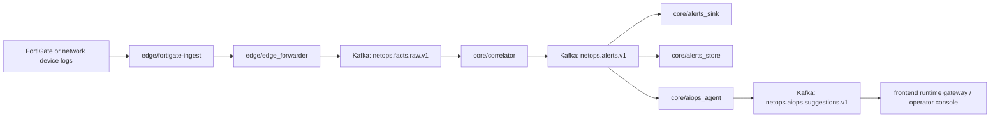

# Towards NetOps: Hybrid AIOps Platform for Network Awareness and Automated Remediation
[](./README.md)
[](./README_CN.md)

> Deterministic network data plane first. Bounded AIOps augmentation second.

Chinese counterpart: [README_CN.md](./README_CN.md)

## What This Repository Is

Towards NetOps is a hybrid AIOps platform for network awareness, evidence-backed alert interpretation, and operator-facing remediation guidance.

The repository is organized around one explicit operating rule:

- raw device traffic stays on a deterministic streaming path
- alerting, persistence, and replay stay structured and auditable
- AIOps starts only after an alert exists and enough evidence has been assembled
- the operator surface remains read-only until an explicit remediation control plane is introduced

This repository is not built around "LLM over every log line". It is built around a stable network data plane with a bounded intelligence layer on top of the alert contract.

## End-to-End Runtime Path



## Design Rules

- Edge modules own parsing, replay safety, and source-proximate state.
- Core modules consume structured facts rather than vendor-specific raw logs.
- Deterministic alerting remains the real-time decision point.
- JSONL and ClickHouse are both intentional: one for audit/replay, one for hot query and context lookup.
- AIOps is downstream of alerts, not upstream of detection.
- Alert-scope and cluster-scope suggestions coexist behind the same alert contract.
- The frontend is a process-first operator console, not a generic dashboard shell.

## Repository Layout

| Area | Main modules | Responsibility |
| --- | --- | --- |
| Edge ingest | `edge/fortigate-ingest`, `edge/edge_forwarder` | Parse device logs, preserve replay/checkpoint semantics, and forward structured facts into the core stream |
| Core streaming | `core/correlator` | Apply quality gates, rules, and sliding windows; emit deterministic alerts |
| Alert persistence | `core/alerts_sink`, `core/alerts_store` | Persist alert audit trails to JSONL and serve recent-history / analytics context from ClickHouse |
| AIOps augmentation | `core/aiops_agent` | Build evidence bundles, perform bounded inference/template logic, and emit structured suggestions |
| Operator surface | `frontend` | Present `raw -> alert -> suggestion -> remediation boundary` as an operator-readable runtime console |
| Validation | `tests`, `core/benchmark` | Support replay validation, runtime checks, and module-level verification |

## Current Scope

Implemented in the repository today:

- FortiGate-oriented edge ingest with replay-safe structured output
- deterministic correlation and alert emission on the core path
- alert audit persistence to hourly JSONL
- ClickHouse-backed hot alert store for context lookup
- minimal AIOps suggestion emission for alert-scope and cluster-scope paths
- frontend runtime console and gateway

Explicitly reserved, not yet presented as a live production capability:

- autonomous write-back to network devices
- direct execution against remediation channels
- approval workflows that mutate production state
- full multi-agent remediation orchestration

## Safety Boundary

The current runtime UI and gateway are observation-only.

- they read runtime artifacts, deployment parameters, and audit files
- they do not write to devices, Kubernetes workloads, core configuration, or remediation channels
- any future approval or execution path must remain explicitly separated from the current read surface

## Baseline Verification

Use the root README only for orientation. Use module-level READMEs and `documentation/` for deployment and validation detail.

Typical repository-level checks:

```bash
python3 -m pytest -q tests/core
python3 -m compileall -q core edge
cd frontend && npm run build
```

## Key Documents

- [Project state and runtime notes](./documentation/PROJECT_STATE.md)
- [FortiGate ingest field reference](./documentation/FORTIGATE_INGEST_FIELD_REFERENCE.md)
- [Frontend runtime architecture](./documentation/FRONTEND_RUNTIME_ARCHITECTURE_20260328.md)
- [Live demo packet: fault injection -> automatic localization](./documentation/LIVE_DEMO_FAULT_INJECTION_AUTO_LOCALIZATION.md)
- [Edge README](./edge/README.md)
- [Core README](./core/README.md)
- [Frontend README](./frontend/README.md)

## Why The Split Matters

The repository is intentionally opinionated:

- data-plane correctness comes before model sophistication
- explainable evidence comes before fluent narrative
- bounded augmentation comes before autonomous action

That split is the main engineering claim of the project.
