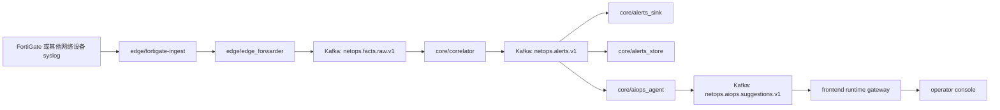
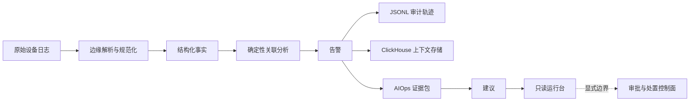

# Towards NetOps

## 项目定位

这个仓库不是展示页，也不是把几个概念堆在一起的 AIOps demo。
它要解决的是一个更具体、也更难伪装的问题：如何把真实网络设备日志变成可以稳定消费、可以追溯来源、可以审计回放、可以继续做告警解释的系统对象。

当前工程立场很明确。原始日志先在近源侧完成解析、规范化和回放语义固化；实时检测先保持确定性；AIOps 只在告警契约已经成立之后介入；前端只负责把证据链和控制边界表达清楚，而不是假装系统已经具备闭环自治能力。

仓库之所以拆成现在这样，不是为了好看，而是因为这些边界在当前阶段都是真问题。原始日志处理、确定性告警、审计存储、热查询、建议生成和运行台表达，必须各自独立，才能在资源受限、真实流量、持续迭代的条件下把主链路做稳。

## 系统主链路总览



边缘侧首先负责把“原始设备文本”收束成“结构化事实”。
`edge/fortigate-ingest` 处理文件发现、checkpoint 推进、回放恢复、syslog 解析和 JSONL 输出。到这一步，系统拿到的已经不再只是文本行，而是带有时间、设备标识、来源文件和解析结果的结构化事件。

`edge/edge_forwarder` 负责把这份结构化事实送进共享流式链路。
这一步很关键，因为它把“边缘侧文件语义”与“核心侧分析语义”明确切开。核心侧消费的是 `netops.facts.raw.v1` 上的统一事实流，而不是 FortiGate 文本本身。

`core/correlator` 是整个系统当前真正的实时判定点。
它消费结构化事实，执行质量门禁、规则判断和滑窗聚合，产出 `netops.alerts.v1`。从这里开始，系统面对的对象已经是告警，而不是原始日志。

同一条告警随后进入两类持久化面和一条增强面。
`core/alerts_sink` 把告警写成按小时分桶的 JSONL 审计轨迹；`core/alerts_store` 把告警写入 ClickHouse，供近历史查询和上下文检索；`core/aiops_agent` 在同一条告警契约之上继续生成建议，而不是参与第一轮检测。

前端不在热路径里承担判断责任。
`frontend/gateway/app/runtime_reader.py` 读取运行时产物和部署控制参数，投影成前端可消费的 `RuntimeSnapshot`。运行台的任务是解释链路、显示证据、暴露边界，而不是把执行能力偷偷包进一个 dashboard。

## 解析与处理全链路

### 1. 原始 syslog 到边缘结构化事实

第一层转换发生在 `edge/fortigate-ingest`。
这一段实现分散在 `bin/source_file.py`、`bin/parser_fgt_v1.py`、`bin/sink_jsonl.py` 和 `bin/checkpoint.py` 里。这样拆不是形式主义，因为 FortiGate 接入真正难的地方从来不只是“把字段切出来”，还包括文件轮转、回放恢复、偏移推进、失败恢复和输出契约稳定性。

这一层输出的不是“解析后的文本”，而是一份可复用的事实契约。
像 `event_id`、`event_ts`、`src_device_key`、`service`、`action`、`kv_subset`、`source.path`、`source.inode` 这样的字段，把单条设备日志变成了可传输、可回放、可追溯、可做后续分析的系统对象。

字段级说明见 [documentation/FORTIGATE_INGEST_FIELD_REFERENCE_CN.md](./documentation/FORTIGATE_INGEST_FIELD_REFERENCE_CN.md)。

### 2. 结构化事实进入共享流式链路

`edge/edge_forwarder` 把解析后的 JSONL 事实送到 `netops.facts.raw.v1`。
从这一步开始，系统不再把数据看成某台边缘机器上的文件，而是看成所有核心模块共享的运行时事件流。这样做的结果是：核心侧不需要理解厂商原始文本，也不需要接管边缘解析和文件语义。

### 3. 共享事实流进入确定性告警链路

`core/correlator` 消费 `netops.facts.raw.v1`，产出 `netops.alerts.v1`。
它的职责被刻意压缩在质量过滤、规则判断、滑窗聚合和告警生成上。这里的关键不是“规则是否永远不变”，而是第一轮系统级判断必须可解释、可重放、可定位到具体阈值或规则路径，而不能先依赖模型生成意见。

### 4. 告警进入审计面与查询面

同一条告警会被持久化两次，因为两类问题完全不同。
`core/alerts_sink` 负责按小时写出 JSONL，保留最接近运行时原貌的审计轨迹；`core/alerts_store` 负责写入 ClickHouse，用来做近历史查询、相似告警计数和下游上下文检索。

所以 JSONL 和 ClickHouse 不是冗余副本。
前者负责证据和回放，后者负责热查询和上下文装配。没有 JSONL，系统缺少审计抓手；没有 ClickHouse，AIOps 和运维查询又会退回到扫文件。

### 5. 告警进入有边界的 AIOps 增强

`core/aiops_agent` 从 `netops.alerts.v1` 出发，而不是直接消费原始日志。
它会基于告警和近期上下文组装证据包，再把建议写入 `netops.aiops.suggestions.v1`。这样做带来两个直接收益：其一，参与推理的输入规模被约束在“已经成立的告警”上；其二，输入内容已经带有结构化字段和近历史上下文，不需要再从原始文本重新猜测。

当前仓库已经同时支持告警级建议和告警簇级建议。
但这仍然只是增强层。检测主链路仍在 correlator 里，AIOps 负责补解释和下一步建议，而不是替代系统先判断“是否有问题”。

### 6. 运行时投影进入操作员控制台

前端网关会读取运行时 JSONL、建议输出和部署控制参数，再拼出前端消费的 `RuntimeSnapshot`。
这是一层投影，不是事实源。它的存在是为了让运行台把新鲜度、事件流、证据包和控制边界放在同一个语义平面上，而不是让 React 组件直接去拼底层运行时文件。

运行台之所以强调 `raw -> alert -> suggestion -> remediation boundary`，是因为当前最重要的不是把页面做成指标墙，而是让操作者看清这条链路如何一步一步收束成 incident，以及系统在哪一步停下、不越界。

## 架构边界与工程取舍



检测必须先保持确定性，因为当前系统首先要证明的是“原始日志如何稳定变成告警”，而不是“模型能不能讲出一段像样的话”。
在真实流量、资源受限和需要回放验证的条件下，把模型推到第一判定点，只会让吞吐、复现和故障定位都变得更差。

AIOps 放在告警下游，是因为告警契约才是成本、语义和上下文三者首次对齐的地方。
到这一步，系统已经拥有归一化设备字段、告警时间、规则结果和可索引的历史上下文。相比直接面对未经筛选的原始日志流，这是一种更便宜、更可控、也更容易审计的输入。

前端现在保持只读，不是因为“以后也许可以做执行”这种空话，而是因为执行和解释根本不是一个风险等级的问题。
当前网关只读取运行时产物和部署配置，不写设备、不改 Kubernetes、不触碰 remediation 通道。观察面和控制面必须显式分开，否则所谓“运维控制台”只会变成一个难以审计的执行入口。

自动审批、自动处置和闭环执行仍然放在边界之外，也不是为了掩饰能力缺口。
恰恰相反，这是当前阶段最合理的工程选择。只有当审批流、回滚策略、写路径审计和失败处理被单独设计清楚之后，处置平面才配得上进入主文档的“已交付能力”。

## 仓库结构与模块职责

| 区域 | 关键路径 | 责任 | 明确不负责的部分 |
| --- | --- | --- | --- |
| 边缘接入 | `edge/fortigate-ingest`、`edge/edge_forwarder` | 解析原始设备日志，维护 checkpoint 与 replay 语义，产出结构化事实并送入 Kafka | 核心关联分析、运行台表达、处置执行 |
| 核心流式处理 | `core/correlator`、`core/alerts_sink`、`core/alerts_store`、`core/aiops_agent` | 把事实流变成告警，完成审计落盘、热查询存储与有边界的建议生成 | 厂商原始日志解析、前端展现 |
| 操作员界面 | `frontend`、`frontend/gateway/app` | 把运行时状态投影成可读的控制台，展示新鲜度、证据链和控制边界 | 直接回写设备或自动触发 remediation |
| 验证能力 | `tests`、`core/benchmark` | 提供回放验证、运行时检查、吞吐探测和时间审计工具 | 生产执行控制逻辑 |
| 项目文档 | `documentation` | 记录架构说明、字段契约、运行态事实和验证结果 | 作为实时运行事实源 |

## 当前范围与未交付边界

当前已经落地并可运行的能力：

- 面向 FortiGate 的边缘接入与 checkpoint 驱动的 JSONL 输出
- 结构化事实进入 `netops.facts.raw.v1`
- 基于规则与滑窗的确定性告警产出
- 告警 JSONL 审计轨迹与 ClickHouse 热存储
- 告警级与告警簇级建议输出到 `netops.aiops.suggestions.v1`
- 只读运行时网关与操作员控制台

当前明确保留、但还没有作为生产能力交付的部分：

- 对网络设备的写回和闭环处置
- 会修改线上状态的审批流
- 针对 remediation 通道的自动执行
- 超出当前建议链路之外的完整推理执行平面
- 任何“前端已经是执行控制台”的表述

## 部署与验证入口

根 README 只负责建立整体架构认知。模块级部署步骤请看各自子文档。

仓库级常用检查命令：

```bash
python3 -m pytest -q tests/core
python3 -m compileall -q core edge
cd frontend && npm run build
python3 -m core.benchmark.live_runtime_check
```

更细的发布和部署说明，请直接看下面的模块文档。

## 文档导航

- [当前项目状态](./documentation/PROJECT_STATE_CN.md)
- [FortiGate 接入字段参考](./documentation/FORTIGATE_INGEST_FIELD_REFERENCE_CN.md)
- [前端运行时架构](./documentation/FRONTEND_RUNTIME_ARCHITECTURE_20260328_CN.md)
- [边缘模块 README](./edge/README_CN.md)
- [核心模块 README](./core/README_CN.md)
- [前端模块 README](./frontend/README_CN.md)
