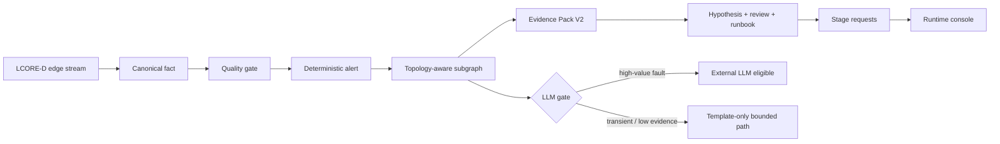

## NetOps Causality Remediation
 

当前分支实现的是一个面向 LCORE-D 核心网络遥测的 topology-aware NetOps 推理流水线。系统将确定性告警建立与模型辅助分析显式分离：模型不能决定告警是否成立，只能在规则路径已经确认告警之后，接收边界受控的证据。

当前研究重点已经不再是办公室 FortiGate 流量。办公室 runtime 只作为历史工程链路参考。当前 active scenario 是 LCORE-D 故障定位：系统需要利用拓扑结构减少噪声证据，区分 root-candidate 与 symptom 节点，并避免把低价值或可能自愈的切片全部送入 LLM。

## 系统定义

系统由五个平面组成：

- Edge fact plane：将 LCORE-D 行数据转换为稳定的 canonical facts，包含设备身份、故障标签与拓扑上下文。
- Deterministic alert plane：在任何模型参与之前，通过质量门控和规则确认告警。
- Topology evidence plane：围绕已确认告警提取局部子图，并给节点分配 root-candidate、symptom、noise 角色。
- Bounded reasoning plane：构造结构化 evidence pack、hypothesis、review verdict、runbook draft 和 stage request。
- Runtime projection plane：将告警、建议、拓扑 gate 和评测产物投影到 operator UI。

受控执行平面不属于当前分支交付范围。Remediation 仍然是人工确认的运维指导，并保留明确的 approval 与 rollback 边界。

主要对象链路为：

`canonical fact -> deterministic alert -> evidence bundle -> topology_subgraph -> Evidence Pack V2 -> HypothesisSet -> ReviewVerdict -> RunbookDraft -> ReasoningStageRequests -> runtime projection`

## LCORE Runtime Contract

edge 侧负责 fact identity 与 topology normalization。core 侧负责告警、证据组装与推理。当前 core 期望的 contract 如下：

| 字段 | 期望含义 |
| --- | --- |
| `src_device_key` | 稳定的 LCORE 设备身份，例如 `CORE-R1` 到 `CORE-R7` |
| `device_profile.device_name` | 与 `src_device_key` 一致的稳定设备身份 |
| `fault_context.scenario` | 归一化场景，例如 `healthy`、`induced_fault` 或 `transient_fault` |
| `topology_context.path_signature` | 不含本地文件路径的稳定拓扑签名 |
| `topology_context.hop_to_core` | 指向核心侧的距离类拓扑特征 |
| `topology_context.hop_to_server` | 指向服务器侧的距离类拓扑特征 |
| `topology_context.downstream_dependents` | 可用时表示局部下游依赖数量 |
| `topology_context.path_up` | 来自 LCORE 源数据的路径状态特征 |
| `topology_context.interface_type` | 存在时保留数值型接口类型特征 |
| `topology_context.srcintf` | 仅保留真实接口名；数值特征不应放入该字段 |

这个职责划分很重要：core 有 defensive guard 防止异常 fact 把链路打歪，但 identity 与 topology 的正确修复应该发生在 edge canonicalization 层。

## Topology-Aware Subgraph Extraction

topology-aware 层将 LLM-based production-network failure localization 的思想适配到本项目的 bounded NetOps 场景中。系统不会把每个告警及其全部邻近事实都送入 LLM，而是为每个已确认告警构造最小局部子图：

- Root-candidate nodes：具有直接故障证据、关键故障场景或高复发性的节点。
- Symptom nodes：拓扑上相邻或历史上相关，可能反映故障传播的节点。
- Noise nodes：弱相关节点，保留在 selected reasoning core 之外。
- LLM gate：根据场景严重度、拓扑证据、复发性和自愈可能性决定是否值得调用外部 LLM。

这使当前分支的贡献不再只是普通 post-alert summary：拓扑不仅是展示上下文，而是直接参与证据选择，并减少推理扩散。

## 实现摘要

当前已经实现的核心结构包括：

- `topology_subgraph`
- `llm_invocation_gate`
- `candidate_event_graph`
- `reasoning_runtime_seed`
- `Evidence Pack V2`
- `HypothesisSet`
- `ReviewVerdict`
- `RunbookDraft`
- `ReasoningStageRequests`

主要实现文件如下：

| 区域 | 路径 |
| --- | --- |
| 拓扑子图提取 | `core/aiops_agent/alert_reasoning_runtime/topology_subgraph.py` |
| 告警/集群 seed adapter | `core/aiops_agent/alert_reasoning_runtime/rule_based_seed_adapter.py` |
| Evidence bundle 投影 | `core/aiops_agent/evidence_bundle.py` |
| Evidence Pack V2 接入 | `core/aiops_agent/evidence_pack_v2.py` |
| Provider routing hint | `core/aiops_agent/provider_routing.py` |
| Review verdict checks | `core/aiops_agent/review_verdict.py` |
| LCORE adaptive fact conversion | `common/data_features/adaptive.py` |
| Ablation benchmark | `core/benchmark/topology_subgraph_ablation.py` |
| 前端 runtime 投影 | `frontend/gateway/app/runtime_reader.py` |

## 评测快照

当前 ablation 将 invoke-all baseline 与 topology-aware selective invocation 进行对比。baseline 假设每个已确认告警都会送入外部 LLM。topology-aware 路径只有在 subgraph gate 将告警标记为 high-value 时才调用外部 LLM。

| 数据切片 | 扫描告警数 | Invoke-all LLM 调用 | Topology-gated LLM 调用 | 调用减少 | High-value alerts | High-value recall |
| --- | ---: | ---: | ---: | ---: | ---: | ---: |
| Office legacy trace | `886` | `886` | `0` | `100.00%` | `0` | `0.00%` |
| LCORE-D 50k replay sample | `1302` | `1302` | `173` | `86.71%` | `173` | `100.00%` |

office trace 可以作为历史工程链路 sanity check，但在当前评测窗口中没有 high-value LCORE 故障定位标签。LCORE-D replay 才是当前研究相关的数据切片。

图：一次性 ablation 总结。Panel A 对比 invoke-all 与 topology-gated 的 LLM 请求量。Panel B 展示 efficiency-quality frontier：LCORE topology gate 从 invoke-all baseline 的 0% 调用减少，移动到 86.71% 调用减少，同时保留 100% high-value recall。虚线 evidence-size curve 表示 gate 变严格后，进入 LLM 的 selected evidence slice 仍保持紧凑。

当前数字还不是最终 root-cause top-1 accuracy。它是第一阶段系统结果：在 LCORE-D replay 上，topology gate 将 LLM 调用减少 `86.71%`，同时保留 `100%` high-value alert eligibility。下一步评测需要接入 incident-window root labels，并报告 root-candidate、symptom、noise 的分类准确率。

## GPU 推理服务回放

外部推理服务路径现在已经有硬拓扑门控。如果 `llm_invocation_gate.should_invoke_llm=false`，`gpu_http` provider 会直接返回本地模板兜底，并记录 `external_provider_skipped=true`；它不会访问 GPU endpoint。如果 gate 为 true，请求可以通过早稻田 GPU 隧道进入 NetOps LLM gateway。

当前 dry-run replay 用于在真实 GPU endpoint 接入前验证调度策略和响应契约：

当前 dry-run replay 扫描 `1302` 条 LCORE-D 告警，计划 `173` 次 topology-gated 外部调用，跳过 `1129` 条 template-only 告警，保留 `100%` high-value recall，并得到 `100%` schema-valid 兜底响应。真实 GPU 延迟和模型质量数字需要等早稻田 endpoint 跑起来后重新生成。

运行细节见 [`documentation/WASEDA_GPU_LLM_PROVIDER.md`](documentation/WASEDA_GPU_LLM_PROVIDER.md)。

## 模型执行计划

当前系统不应该把大模型 colocate 到 core pipeline 内部。core 节点应继续专注确定性告警、证据组装与 runtime projection。模型执行应该作为 provider，通过显式 stage request interface 接入。

推荐 provider 顺序：

- 短期：保留 template path 作为永远可用的 fallback。
- 近期：从早稻田 GPU 集群暴露 OpenAI-compatible endpoint，只将 topology-gated high-value alerts 路由过去。
- 实验层：通过 vLLM 或 SGLang 评估 GLM-4.5-Air 或其他 reasoning/coding 模型。
- 对照层：保留 hosted API model 作为质量对照、回归检查和本地模型失败时的兜底。

使用 GPU 集群的目的不是从头训练 foundation model，而是受控推理，以及可能的轻量 LoRA/SFT incident-local prompt 实验。CPU-only 或 memory-only inference 可以用于小模型，但本项目强调推理深度和长结构化上下文；对于论文级评测，GPU 集群是更现实的路径。

## 运行边界

- 告警建立必须是确定性、规则支撑的。
- LLM 推理只发生在 post-alert 且 evidence-bounded 的阶段。
- 拓扑选择发生在外部模型调用之前。
- 低价值 transient slices 可以保留在 template-only 路径。
- suggestion 不会自动写回设备。
- 未来任何执行路径都必须停在 approval 与 rollback 边界前。

## 当前状态

当前分支已经完成 topology-aware post-alert reasoning 的本地结构化链路，并且 active runtime scenario 已经从 office traffic 迁移到 LCORE-D telemetry。

已完成：

- LCORE canonical fact adaptation
- 确定性 `annotated_fault_v1` 告警
- topology-aware subgraph extraction
- LLM invocation gating
- evidence pack 与 stage request 接入
- 面向 LCORE/topology 语义的前端 runtime projection
- 用于 LLM 调用减少的 ablation benchmark

待完成：

- 面向论文级定位准确率的 root-cause label 对齐
- 真实本地或远端 LLM endpoint 的 provider execution wiring
- 响应校验与超时 fallback
- 可回放模型评测的 trace capture
- 基于完整 LCORE-D incident windows 的 rule-only 与 invoke-all baseline 对比

## Replay Identity 与循环发送

LCORE-D replay 现在有显式 `run_id`。edge streamer 会把它写入 `dataset_context.run_id`，存入 streamer checkpoint，并纳入 canonical `event_id` 的哈希。这样后续用同一份 LCORE 行数据再次 replay 时，可以被 core 识别为新的实验轮次，而不是被 duplicate gate 当作同一批历史 fact 丢弃。

循环发送是可行的，但它更适合作为系统健康检查流量，而不是直接混入论文级原始统计。它可以用于 LLM provider 接上之后验证全链路是否仍然可运行，例如 Kafka transport、core ingest、alerting、evidence assembly 和 UI freshness。用于论文评测时，每一轮 loop 都必须带独立 `run_id`，并在统计时显式分组或剔除重复 replay。

运行边界：

- 默认仍然是 one-shot replay，读到 EOF 后停止。
- edge forwarder 本身是循环扫描文件的 daemon，但只发送 byte checkpoint 之后新增的 JSONL 行。
- core consumer 持续消费 Kafka 新消息，但不会主动重放历史 offset，除非重置 consumer group。
- 如果启用 LCORE streamer loop mode，每一轮必须使用不同 `run_id`；否则重复 `event_id` 被 core 丢弃是预期行为。

## Runtime Feature 与流速记录

下表记录 r230 edge 到 r450 core 的 LCORE-D replay 活跃窗口实测流速。

| 阶段 | Runtime 对象 | 实测 feature 数量 | 实测数据量 | 实测流速 | 备注 |
| --- | --- | ---: | ---: | ---: | --- |
| LCORE-D raw CSV | 源数据行 | 每文件 `32-51` 列，7 个文件 union 后 `234` 列 | `169,712` 行，`26,670,593` bytes | offline source | 分文件列数：R1/R5/R7 为 `42`，R2 为 `32`，R3/R6 为 `51`，R4 为 `47` |
| Adaptive feature plan | `feature-plan.json` | 采样 `43` 列；`1` 个 label field，`4` 个 entity fields，`7` 个 topology fields，`3` 个 metric fields | 基于 `5,000` 行采样生成 | 每轮 replay 生成一次 | 当前 label field 是 `class`；topology fields 包括 `Hop_to_core`、`Hop_to_server`、`path_up` |
| Edge canonical fact JSONL | `events-lcore-d.jsonl` | `23` 个 top-level 字段；嵌套：topology `19`、device profile `12`、fault context `5`、本轮历史 dataset context `12` | `169,761` 行，`326,025,599` bytes | 最新完成 streamer 段 `17.12 EPS` | 新 replay 会增加 `dataset_context.run_id`，因此 dataset context 变为 `13` 个字段，top-level 仍为 `23` |
| Edge forwarder -> Kafka | Kafka topic `netops.facts.raw.v1` | 同 canonical fact payload：`23` 个 top-level 字段 | 累计发送 `169,886` 条，`326,276,448` bytes，`0` dropped | 活跃窗口 `17.06 EPS`，约 `0.268 Mbps` | 累计量包含早期 smoke/replay 发送 |
| Core correlator ingest | 质量门控后的 facts | 从 Kafka 消费的 canonical fact：`23` 个 top-level 字段 | 日志计数 `ingested=135,881`，`accepted=135,832`，`drop_duplicate_event_id=49` | 稳定窗口 `17.30 accepted facts/s` | 其他 drop 全为 `0`：缺字段、parse status、JSON error、DLQ |
| Deterministic alert | `annotated_fault_v1` alert | `12` 个 top-level 字段；嵌套：dimensions `2`、metrics `3`、event excerpt `31`、topology `19`、device profile `12`、change context `6` | 日志计数 `alerts_emitted=3,416` | 稳定窗口 `0.0396 alerts/s` | 告警路径是 deterministic post-quality-gate；LLM 不参与告警成立 |
| Runtime suggestion tail | `netops.aiops.suggestions.v1` | `24` 个 top-level 字段；嵌套：context `17`、evidence bundle `17`、inference `12`、runtime seed `7`、hypothesis set `6`、review verdict `9`、runbook draft `15`、stage requests `2` | topic latest offsets 跨历史合计 `293,458` 条 | 下游 AI 速率取决于告警产生速率与 LLM gate 策略 | 最新 tail sample 确认当前 suggestion schema 已是 24-field 版本 |
