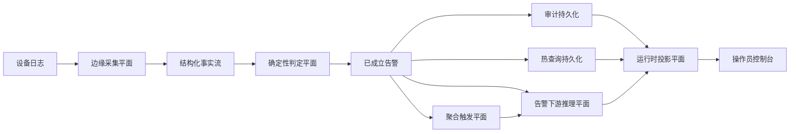

## NetOps Causality Remediation
 

本仓库实现了一条以确定性告警判定为锚点、以下游推理能力作为增强层的 NetOps 主链。基于规则的告警确认始终是系统的第一决策点，推理能力只会在告警已经成立之后介入。项目已经越过概念设计阶段，目前处于“本地结构化链路基本闭合、主要剩余工作是真实远端模型执行接线”的阶段。

## 系统架构

当前系统最适合从六个结构平面来理解：

- 边缘采集平面：接收真实设备日志，并把原始输入规整为稳定的事实流。
- 确定性判定平面：将事实流收束为已成立告警，确保首轮判定不被模型替代。
- 双持久化平面：同时维护审计级存储和热查询历史，分别服务合规与检索。
- 聚合触发平面：把同键重复模式收束为 cluster 级触发条件。
- 告警下游推理平面：负责证据组装、结构化假设、结构化审查、结构化 runbook 草案和阶段请求契约。
- 运行时投影平面：把运行时产物渲染为前端快照、时间线、对比视图和操作员可读界面。

设计中还预留了未来的受控执行平面，但它当前只体现为审批边界、回滚边界和接口占位，并不属于已交付能力。

## 主流程

当前主流程可以概括为以下链路：

仓库中的文档图片也展示了同一套架构关系：

如果从对象链角度理解，告警路径为：

`alert -> evidence bundle -> reasoning runtime seed -> Evidence Pack V2 -> HypothesisSet -> ReviewVerdict -> RunbookDraft -> ReasoningStageRequests -> runtime projection`

如果从 cluster 路径理解，唯一差异只在入口：触发源从单条告警变成同键重复模式。后续对象层、阶段矩阵和前端投影面保持共用，不会裂变成两套独立系统。

## 当前交付状态

仓库中已经稳定落地的核心结构包括：

- `reasoning_runtime_seed`
- `candidate_event_graph`
- `investigation_session`
- `reasoning_trace_seed`
- `runbook_plan_outline`
- `Evidence Pack V2`
- `HypothesisSet`
- `ReviewVerdict`
- `RunbookDraft`
- `ReasoningStageRequests`

这些结构说明，项目当前关注的重点已经不是“能不能把模型接进来”，而是“是否先把证据、假设、审查、计划和阶段契约沉淀为稳定的类型化对象”。前端也已经沿着这个方向演进：主操作视图、convergence field、node inspector 和 compare workbench 都把结构化对象视为主产物，而不是把自由文本摘要当成唯一语义来源。

当前前端运行时界面可参考以下图示：

## Feature 数量对照

下表把当前 `edge -> core` 链路上的 feature 数量口径统一收束到一处。这里以代码实际生成的对象结构为准，而不是仅复述概念层表述。对于已经挂载但仍停留在旧 schema 上的运行时产物，也会显式标注。

### Edge 平面

| 平面 | 阶段 / 对象 | 顶层 feature 数 | 关键嵌套或补充说明 | 备注 |
| --- | --- | ---: | --- | --- |
| edge | 原始厂商日志输入 | `47` | `4` 个 syslog header 字段 + `43` 个 FortiGate KV 字段 | parser 归一化之前的 vendor log 契约 |
| edge | ingest 结构化事件 | `66` | `source=3`，`device_profile<=9`，`kv_subset<=56` | `fortigate-ingest` 输出的 parsed JSONL |
| edge | forwarder -> Kafka fact | `66` | 顶层结构不变 | `edge_forwarder` 只做过滤与转发，不重写 payload schema |

### Core 平面

| 平面 | 阶段 / 对象 | 顶层 feature 数 | 关键嵌套或补充说明 | 备注 |
| --- | --- | ---: | --- | --- |
| core | correlator 输入 fact | `66` | 与 edge Kafka 输入转发过来的结构化 fact 保持一致 | 确定性判定平面的输入契约 |
| core | deterministic alert | `12` | `dimensions=1`，`metrics=3`，`event_excerpt=31`，`topology_context=13`，`device_profile=12`，`change_context=6` | 当前 alert JSONL 与代码路径一致 |
| core | alerts sink JSONL | `12` | 与 deterministic alert 同构 | 仅用于审计落盘，不改 schema |
| core | ClickHouse alert row | `17` 列 | 包含 `metrics_json`、`dimensions_json`、`event_excerpt_json`、`topology_context_json`、`device_profile_json`、`change_context_json` | 这是存储行契约，不是 payload 契约 |
| core | cluster trigger | `6` | `ClusterKey=4` | 仅在 repeated-pattern 聚合命中时存在 |
| core | evidence bundle | `16` | `alert_ref=3`，`historical_context=9`，`rule_context=5`，`path_context=6`，`policy_context=3`，`sample_context=1`，`window_context=3`，`topology_context=14`，`device_context=12`，`change_context=6` | alert-scope 与 cluster-scope 共用的对象层 |
| core | reasoning runtime seed | `6` | `candidate_event_graph=9`，`investigation_session=9`，`reasoning_trace_seed=6`，`runbook_plan_outline=10` | alert-scope 版本 |
| core | cluster reasoning runtime seed | `7` | 在 alert-scope 基础上增加 `cluster_context=6` | cluster-scope 版本 |
| core | candidate event graph | `9` | `node item=5`，`edge item=7` | runtime seed 内部对象 |
| core | investigation session | `9` | `working_memory_seed=5` | runtime seed 内部对象 |
| core | reasoning trace seed | `6` | 无额外固定嵌套对象 | runtime seed 内部对象 |
| core | runbook plan outline | `10` | `applicability=3`，`approval_boundary=3` | runtime seed 内部对象 |
| core | Evidence Pack V2 | `14` | `alert_ref=3`，`freshness=2`，`source_reliability=1`，`summary=4`，`evidence entry item=9` | hypothesis、review、runbook 阶段使用的类型化证据输入 |
| core | inference request | `12` | `expected_response_schema=6` | provider 调用前的强约束请求对象 |
| core | inference result | `12` | 无额外固定嵌套对象 | provider 返回的标准化结果 |
| core | HypothesisSet | `6` | `hypothesis item=10` | 结构化假设对象 |
| core | ReviewVerdict | `9` | `checks=6`，单个 check=`2` | 结构化审查对象 |
| core | RunbookDraft | `15` | `applicability=3`，`approval_boundary=3`，`change_summary=2` | 结构化 runbook 草案 |
| core | reasoning stage requests | `2` 个 stage | 每个 stage request=`10`，`input_contract=3`，`routing_hint=12` | 当前固定为 `hypothesis_critique` 与 `runbook_draft` |
| core | suggestion payload（最终 emitted schema） | `24` | `context=17`，`inference=12`，`reasoning_stage_requests=2` | 最终落盘 payload = 结构化 suggestion + stage requests |
| core | suggestion JSONL（当前最新运行时产物） | `24` | `context=17`，`evidence_bundle=16`，`reasoning_runtime_seed=6` | 当前最新 runtime 文件已对齐新 schema；较早历史文件可继续通过迁移工具补齐 |

## 运行边界

项目当前明确维持六条边界：

- 告警成立边界：模型不能反向决定告警是否成立。
- 执行边界：建议不会被自动写回设备。
- 审批边界：任何超出只读诊断范围的动作都必须停在人工审批之前。
- 回滚边界：没有回滚准备的计划不能提升为执行输出。
- 传输边界：边缘采集平面不参与模型推理或阶段编排。
- 数据契约边界：未来远端模型只能消费显式阶段请求，不能任意读取运行时文件或整个仓库上下文。

## 当前运行事实

当前挂载的运行时投影面显示：

- alert 产物包含 `691` 个小时文件，共 `201003` 条记录，时间范围为 `2026-03-04T15:09:11+00:00` 到 `2026-04-02T16:23:04+00:00`。
- suggestion 产物包含 `603` 个小时文件，共 `222023` 条记录，时间范围为 `2026-03-09T05:08:56.549849+00:00` 到 `2026-04-05T18:03:18.303384+00:00`。
- 最近 24 个 alert 分桶仍以 `deny_burst_v1|warning` 为主。
- 最近 24 个 suggestion 分桶仍主要集中在 `alert` scope，`cluster` scope 占比较小。

这组分布说明，当前负载形态属于低 QPS、强约束、强 fallback 的告警下游推理工作流。它足以支撑结构化证据、结构化假设、结构化审查、结构化 runbook 草案和基于回放的评测，但并不适合把大模型长期常驻在现有核心节点上。

## 资源规划结论

现阶段的资源规划结论比较明确：

- 边缘采集平面应继续聚焦日志接入和事实归一化。
- 核心节点应继续聚焦告警确认、证据组装、结构化对象生成和阶段请求装配。
- 模型执行应部署在外部 GPU 服务或受控 API 提供器上。
- `template` 路径必须长期保留为 fallback。
- 第一优先级是打通远端推理接线、响应校验、超时回退、trace capture 和 replay/eval。
- 之后才应考虑有限规模的领域适配。
- 当前没有从零训练基础模型的必要。

## 下一步

当前阶段的明确停止点是：本地结构化链路已经闭合，但真实远端模型执行尚未接入。因此，下一里程碑不是继续扩展本地 schema，也不是继续拉长文档叙述，而是完成以下闭环：

- 真实推理 provider 执行接线
- 响应校验
- 超时 / 回退
- 追踪采集
- 回放 / 评测

完成这一步之后，系统才会从“结构化推理对象已经就位”迈入下一阶段，即“真实远端 critique 与 planning 已经接入生产链路”。
