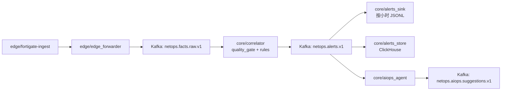
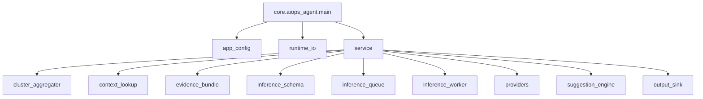

## Towards NetOps： Hybrid AIOps Driven 分布式深度根因追踪与智能自动化处置系统
[](./README.md) [](./README_CN.md)

> **Hybrid AIOps Platform: Deterministic Streaming Core + CPU Local LLM (On-Demand) + Multi-Agent Orchestration**

#### 项目概述（Project Overview）

本项目旨在构建一个面向复杂网络运维场景的 **分布式 AIOps 平台（Towards NetOps）**，以 **边缘事实接入（Edge Fact Ingestion）→ 核心流式分析（Core Streaming Analytics）→ 智能增强决策（LLM-Augmented Reasoning）→ 处置闭环（Remediation Loop）** 为主线，逐步实现从异常发现、证据链归因到处置建议与执行控制的工程化能力演进。平台并不以“全量日志实时 LLM 推理”为目标，而是以稳定的数据面与可解释的证据流为基础，在核心侧对满足门槛的告警与重复异常簇进行按需智能增强分析，从而在成本、实时性与可运维性之间取得可落地平衡。

#### 架构范式（Architecture Paradigm）

系统采用 **边缘接入（Edge）+ 核心分析（Core）** 的分层架构。边缘侧负责近源日志采集、结构化事实事件化、审计留痕与可回放落盘，将原始设备日志转换为可持续消费的事实事件流；核心侧负责流式数据平面承载、事件聚合与关联分析、证据链构建，并在此基础上引入 **LLM 增强分析层** 用于告警解释、态势摘要、归因辅助与 Runbook 草案生成。该增强层采用 **常驻服务 + 限流队列** 的运行模式：由规则/流式模块完成实时检测与高价值异常筛选，LLM 仅对告警级上下文进行低并发、按需推理，避免对主链路实时性与系统资源造成挤占。

> [!IMPORTANT]
> 平台目标不是“全量日志实时 LLM 推理”，而是以稳定数据面与可解释证据流为基础，对满足门槛的告警和重复告警簇进行按需智能增强分析。

- 当前资源约束下的技术路线（Current Technical Route Under Resource Constraints）

在当前资源约束下（核心侧无 GPU，CPU-only 推理），本项目的技术路线明确为 **“确定性流式分析主导 + LLM 按需增强”**：实时检测、基础聚合与关联计算由规则/流式处理模块承担；LLM 负责对已压缩的高价值证据上下文进行解释与规划生成。该设计使平台在不依赖本地训练与持续高成本 API 调用的前提下，仍可逐步演进至 Multiple Agent + LLM 协同分析与自动化处置闭环能力。

> [!NOTE]
> 当前阶段优先保证：数据平面稳定、证据流可解释、核心链路可运行；LLM 作为告警级增强模块按需接入。

本项目的建设顺序预计将按照如下阶段推进：
1. **第一阶段：边缘事实接入层工程化落地**  
   完成 FortiGate 日志（以及后续可能引入的多网络设备日志）接入，确保输入可审计、可恢复、可回放。

2. **第二阶段：核心侧数据平面与最小流式消费链路**  
   在核心侧建立数据平面，完成事件传输解耦与基础聚合分析。

3. **第三阶段：AIOps 增强分析能力引入**  
   基于 AIOps 思想，逐步引入 Multiple Agent + LLM 的关联分析、网络态势感知、证据链归因与自动化自愈 Runbook 生成能力。

4. **第四阶段：处置闭环扩展**  
   在可解释与可验证前提下，扩展至处置建议、人工审批执行与自动化低感知自愈。

## 设计边界（Design Boundary）

> [!WARNING]
> 本项目当前阶段不以“全量事件逐条 LLM 判定”为架构目标。
> 主链路由确定性流式模块承担实时检测与基础关联；LLM/Agent 用于满足门槛的告警、重复告警簇以及处置建议生成的按需增强分析。

## 当前进展快照（2026-03-22）

> [!TIP]
> 运行时边界已明确：`edge/*` 只放边缘节点组件，`core/*` 只放核心节点组件。

### 已落地的运行链路



### 已实现模块与技术栈

| 分层 | 模块 | 职责 | 技术 |
| --- | --- | --- | --- |
| 边缘接入 | `edge/fortigate-ingest` | FortiGate 日志解析、断点回放、DLQ/指标输出 | Python, JSONL |
| 边缘过滤转发 | `edge/edge_forwarder` | 边缘抑噪后转发到核心主题 | Python, Kafka |
| 核心关联 | `core/correlator` | 质量门禁、规则匹配、告警产出、手动提交 offset | Python, Kafka |
| 告警落盘 | `core/alerts_sink` | 告警按小时写入 JSONL | Python |
| 热查询存储 | `core/alerts_store` | 告警结构化入库 | ClickHouse, `clickhouse-connect` |
| AIOps 最小闭环 | `core/aiops_agent` | 构建告警级与簇级证据/推理主链，输出结构化建议消息与审计 JSONL | Python, Kafka, ClickHouse |
| 运维观测 | `core/benchmark/*` | 流程健康观测与 warning 噪声观测 | Python, `kubectl` |

> [!NOTE]
> 当前仓库状态更准确的表述是：**Core Phase-2 数据面最小闭环已打通，并在其上落地了最小 AIOps 告警级 + 告警簇建议闭环**。  
> 也就是说，确定性流式检测、告警落盘和热查询已经到位；真正的 LLM 推理、因果证据链归因和自动化处置控制仍属于下一阶段建设内容。

### 前端模块（Frontend Module）

- 模块定位
  - 面向 `raw -> alert -> suggestion -> remediation boundary` 主链的过程型运维控制台，不走通用 admin dashboard 形态。
- 核心技术栈
  - `React 19 + Vite + TypeScript`
  - 状态管理：以 React 本地状态和自定义 `useRuntimeSnapshot` hook 为主，当前不引入外部全局 store。
  - 路由：当前未单独引入路由框架，先以应用内双主视图切换（`Live Flow Console`、`Pipeline Topology`）承载核心界面。
  - UI 方案：自定义 CSS 体系，强调高信息密度、硬边界、非模板化布局。
  - 实时通信：`FastAPI` 薄网关 + `SSE`，先拉快照，再持续接收增量更新。
  - 可视化：`React Flow` 承担链路拓扑，`ECharts` 承担节奏与证据覆盖图。
  - 构建与部署：开发态使用 `Vite`，可部署态由 `FastAPI` 同源托管静态资源，支持 `Docker + k3s Deployment`。
- 模块职责
  - 把 runtime 文件与 deployment 控制参数转换成面向运维者可读的过程控制台。
  - 展示 freshness、backlog、cluster watch、evidence thickness、suggestion detail 等运行态信息，同时保持主链语义连续。
  - 把 remediation 明确为控制边界，而不是伪装成已经接通的实时执行阶段。
- 与后端对接方式
  - `GET /api/runtime/snapshot` 用于页面初始水合。
  - `GET /api/runtime/stream` 通过 SSE 推送事件信封（`snapshot`、`delta`、`heartbeat`），让前端只更新受影响的阶段和事件区块。
  - 网关直接读取 `/data/netops-runtime` 下的 JSONL sink，并从 `core/`、`edge/` deployment 中提取运行控制参数。
  - 本地开发由 Vite 代理 `/api` 到 `:8026`；部署态采用同源服务，默认路径不依赖 CORS。
- 关键交互链路
  - 实时快照进入前端 -> 选择当前 suggestion slice -> 中央视图保持链路主叙事 -> 右侧证据抽屉切换到对应 context / evidence / actions -> cluster pre-trigger watch 暴露是否需要回调后端策略。
- 核心页面 / 组件职责
  - `Live Flow Console`：全局运行概览、当天节奏、主链时间推进、实时 feed、预触发 cluster watch。
  - `Pipeline Topology`：模块 / topic / control graph，可用于联调后端策略与观察运行边界。
  - `Evidence Drawer`：承载选中 suggestion 的 context、evidence bundle、confidence、recommended actions 与策略控制点。
- 这样设计的原因
  - 当前后端语义本质上是事件生命周期推进，不适合被拆成无关联的指标面板墙。
  - 同源部署能显著降低前端演示面与网关接入面的运维复杂度。
  - 在前端产品面尚未扩成多产品壳层之前，不引入额外 store/router 复杂度，有利于快速迭代真实语义映射。

### 运行安全边界

- 当前前端控制台和 runtime 薄网关都是**只读观察面**。
- 它们读取 JSONL sink、deployment 环境变量和 live runtime audit 文件，但**不会**回写到：
  - FortiGate 路由器
  - edge/core 运行配置
  - Kubernetes deployment
  - remediation 执行通道
- `Remediation Loop` 现在被故意画成一个“保留的控制边界”，而不是一个真实会写回生产环境的执行阶段。后续如果接审批/执行，也必须与当前只读控制台明确隔离。

### Live Event Lifecycle（当前动作视图）

- 首页的 `Live Event Lifecycle` 不再先铺 10 个技术模块，而是先按“对操作员有意义的动作阶段”来组织；完整模块 / topic 图仍保留在 `Pipeline Topology`。
- `01 Source Signal`
  - 真实的 FortiGate 设备日志进入平台。这里强调的是“源头已经活着”，而不是把源设备伪装成一个带精确耗时的服务调用。
- `02 Edge Parse + Handoff`
  - 把 `fortigate-ingest`、`edge-forwarder`、`netops.facts.raw.v1` 收成一个动作阶段：解析、保留 replay/checkpoint 语义、再把 fact 送进 raw stream。
- `03 Deterministic Alert`
  - 对应 `core-correlator` 和 `netops.alerts.v1`。这是系统第一次真正做“这个事件是否跨过规则门槛”的判断。
- `04 Cluster Gate`
  - 对应 same-key 聚合窗口。它回答的是“这条路径离 cluster-scope 还差多远”，而不是先把用户扔进内部实现细节。
- `05 AIOps Suggestion`
  - 对应 `core-aiops-agent` 和 `netops.aiops.suggestions.v1`。在这里把证据装配好、执行 provider 逻辑，并形成结构化建议。
- `06 Remediation Boundary`
  - 审批 / 执行 / 反馈边界继续保持可见，但当前仍是只读保留面，没有接成真实生产回写通道。

为什么首页更适合动作视图：

- 第一次使用平台的人，不需要先理解每个内部 topic / service 名称，也能知道系统正在干什么。
- 计时条更诚实：只有真正有开始/结束边界的阶段显示耗时；门控阶段显示进度；源头和边界阶段只显示 live state，不伪造 latency。
- 技术上那 10 个模块依然存在，但它们更适合放在拓扑页，而不是作为首页第一视觉负担。

### 前端实时更新模型

- 当前实现
  - 网关先提供一次 `GET /api/runtime/snapshot`，然后保持 SSE 长连接，并发送 `snapshot`、按变化触发的 `delta`、低频 `heartbeat`。
  - 现在用于检测 runtime 文件变化的默认轮询间隔是 `NETOPS_CONSOLE_STREAM_INTERVAL_SEC=1`，但只有真正发生 feed/cluster 变化时才会向前端发 delta。
- 为什么公网代理路径看起来没那么“活”
  - 现在已经切到阶段 delta，但公网演示链路仍然叠加了 WAN + proxy + tailnet 多跳，以及本地文件轮询探测。
  - 所以公网体验会明显好于旧的 5 秒整包心跳，但仍然不会像本地/Tailscale 直连那样“贴着源站”。
- 阶段计时
  - 现在生命周期卡片下方已经统一预留了 action/timing band。
  - 只有真正有边界时间的阶段显示实际耗时；没有真实开始/结束语义的阶段，用同一块区域显示状态、门控语义或保留边界。
  - 这样可以保持风格一致，同时避免把 `FortiGate`、`Remediation Loop` 这类环节伪装成“有精确耗时”的服务调用。
- 资源影响
  - 如果只推送“阶段转移”和“对操作员有意义的事件”，资源消耗**不会明显上升**。
  - 相反，它通常会在保持带宽/I/O可控的同时，显著降低前端感知延迟，因为界面只重绘变化的区域。
  - 真正不建议的是把所有 raw facts 直接高频推给前端。
  - 更合理的目标是：高吞吐数据继续留在 Kafka/runtime files，前端只接收带时序元数据的阶段 delta。

### 当前资源边界与下一阶段规划

- 当前观测到的节点利用率（`2026-03-24` 样本）
  - `r230`：约 `2%` CPU、`36%` 内存（`kubectl top node`）
  - `r450`：约 `3%` CPU、`61%` 内存（`kubectl top node`）
- 资源解释
  - 现有两节点架构已经足以稳定承载当前 `edge -> core -> suggestion` 的确定性主链。
  - 近期真正的限制不是数据面 CPU，而是下一阶段 `LLM / Multiple Agent` 增强平面的常驻推理能力尚未接入。
  - 仓库当前默认仍是内置 provider，因此**当前生产态主链本身并不依赖 GPU 才能运行**。
- 当前流量/事件强度指标
  - 更可信的 live 基线来自正式观测窗口（`2026-03-22 18:54:10 UTC` -> `2026-03-23 08:34:08 UTC`，共 `13.67h`）：`raw ≈ 7.48 events/s`，`alerts ≈ 21.5/hour`，`suggestions ≈ 20.8/hour`。
  - 当前本地 sink 节奏（`2026-03-24 12:10 UTC` 样本）：`suggestions = 83 / 10m`（`≈0.14/s`）、`406 / 60m`（`≈0.11/s`）、`4055 / 6h`；`alerts = 0 / 60m`。
  - 同一采样点的最新本地时间戳：`latest_alert_ts = 2026-03-23T20:53:49+00:00`，`latest_suggestion_ts = 2026-03-24T12:10:13.943421+00:00`。
  - 解释：当前 suggestion cadence 不能直接等同于“实时新 alert 进入速率”。它更像处理时间 suggestion emission 叠加历史 alert context / replay 语义，因此更适合作为“操作负载上界”而不是“真实 live alert 速率”。
  - 对算力估算的含义：即使按当前偏高的 suggestion cadence 计算，也依然远低于 `1 inference request/sec`，所以现阶段更关键的是时延预算和队列设计，而不是一上来就追求多卡并行规模。
- 当前现实边界
  - `r450` 本地扩内存在中短期内仍应视为“不一定拿得到”的条件，不能作为下一阶段设计的默认前提。
  - 因此更现实的演进路径是：保留 `r450` 上的 Kafka / ClickHouse / correlator，本地继续承担数据面与控制面，把 GPU 推理能力通过 provider 边界外挂进来。
- 下一阶段 GPU 需求估算
  - 最低可用：`1 x 16GB VRAM`，配合入门级推理算力（`A2 16GB` 级别），用于单个量化 `7B/8B` 级常驻模型，支撑低并发、限流队列的 alert/cluster 推理。
  - 推荐配置：`1 x 24GB VRAM`，配合更强的推理算力（`L4 / A10 / 4090` 级别），用于单个常驻模型，同时为结构化输出、tool-calling、有限的 multi-agent 编排保留余量。
  - 更高档位仅在有实测依据时再申请：`48GB+ VRAM` 或多卡（`A40 / A6000` 级别及以上），仅当 `13B+` 本地模型、多常驻模型或明显更高的 agent 并发成为真实需求时再考虑。
  - 说明：显存决定“模型能不能放进去”，而具体算力等级决定时延。精确的 tokens/sec 与 p95 响应时间还取决于 `vLLM / TGI / llama.cpp` 这类 serving stack、量化方式、prompt 长度、输出长度以及 tool-calling 往返，因此不能只从显存容量反推出真实推理性能，后续仍需要按选定模型和服务栈做实测。
- 推理优化优先级
  - 第一优先级：异步队列、超时/重试、背压、prompt/prefix cache、证据压缩、模型路由（`template -> remote LLM -> fallback`）。
  - 第二优先级：continuous batching，以及 speculative decoding / draft-model acceleration。
  - 原因：当前目标工作负载仍是低并发、证据/工具调用占比较高，前期收益主要来自编排与队列设计，而不是 token 级解码技巧。

### 已落地与下一阶段模块规划

- 已落地
  - `edge/fortigate-ingest`
  - `edge/edge_forwarder`
  - `core/correlator`
  - `core/alerts_sink`
  - `core/alerts_store`
  - `core/aiops_agent`（告警级 + 簇级最小闭环）
  - `core/benchmark/*`
  - `frontend` 运维控制台 + runtime 薄网关
- 下一阶段待建设模块
  - provider 边界后的远端/本地常驻推理服务
  - 面向模型输入压缩与复用的 evidence retrieval / cache 层
  - 模型路由与策略门控（`template`、remote LLM、fallback）
  - 面向 triage、RCA、runbook drafting 的 multiple-agent orchestration
  - remediation planning / approval / feedback 控制面
  - 面向时延、成本、RCA 质量、Runbook 有效性的评测 harness

### 外部 GPU 资源接入路径

- 预期外部算力来源
  - 额外 GPU 推理资源预计来自**外部研究算力提供方**，而不是短期内直接加装到 `r450`。
- 推荐系统拆分方式
  - 继续保留 `r230` 与 `r450` 作为现有数据面和运维控制面。
  - 在靠近外部 GPU 资源的位置部署一个 inference gateway。
  - 通过现有 provider 抽象，让 `core-aiops-agent` 在不改动主链的前提下切到 HTTP/远端推理路径。
- 推荐跨地域数据契约
  - 原始日志、Kafka 状态、ClickHouse 热库、运维控制权仍留在本地环境。
  - 仅将压缩后的 alert/cluster evidence bundle、检索摘要和受限结构化 prompt 跨 WAN 发送。
  - 最终 suggestion、confidence 与审计元数据继续回写到本地 core 侧。
- 运维假设
  - “法国侧操作 / 中国侧推理”应被视为**异步增强平面**，而不是阻塞实时检测的同步依赖。
  - 远端链路必须具备严格的 timeout、request_id、retry budget、API key / TLS、防抖限流以及本地 template provider fallback。
  - 如果你的环境存在跨境数据约束，启用远端推理前应先审查哪些 evidence 字段允许离开本地 core。

### AIOps Agent 模块图



- `app_config`：统一加载和规范化环境变量，并执行严重级别门禁策略。
- `runtime_io`：统一初始化 Kafka/ClickHouse 客户端，避免连接逻辑分散。
- `cluster_aggregator`：按 `rule_id + severity + service + src_device_key` 做滑窗聚合。
- `evidence_bundle`：分别构建告警级和簇级证据包，把告警、规则、历史上下文以及变更/拓扑信息收成统一证据对象。
- `inference_schema`：定义 `alert_triage` / `cluster_triage` 两类 provider 请求以及统一结果 schema。
- `inference_queue` / `inference_worker`：把 slow path 明确成 queue + worker，即使当前先同步执行。
- `providers`：把内置模板推理和未来外部 API / 本地模型 provider 抽象开。
- `service`：完成告警消费、严重级别门禁，对每条合格告警先发出告警级建议，若簇聚合触发再追加簇级建议，并在成功后提交 offset。
- `context_lookup`：从 ClickHouse 查询近 1 小时相似告警计数用于上下文增强。
- `suggestion_engine`：把 provider 输出和证据对象映射回稳定可演进的建议消息 schema。
- `output_sink`：按小时落盘 JSONL，保留审计与回放证据。

### 已完成的可靠性治理

- `release_core_app.sh` 已避免在 core-only 发布中误更新 edge 运行镜像。
- 发布后新增“Pod 内模块可导入”校验，用于提前发现镜像内容与代码不一致问题。
- 核心消费者改为 `enable_auto_commit=False`，处理成功后再提交 offset。
- 规则阈值采用 profile 化配置（`core/correlator/rule_profile.py`），支持按环境调参。
- ClickHouse 上下文查询已兼容运行时返回 `dict` 形态的 `first_item`，避免 suggestion 生成过程中出现伪错误。

### 合并/发布前基线校验

```bash
python3 -m pytest -q tests/core
python3 -m compileall -q core
bash -n core/automatic_scripts/release_core_app.sh
```

> [!NOTE]
> 当前 `tests/core` 已覆盖 `rules`、`quality_gate`、`alerts_sink`、`alerts_store`、`aiops_agent`（含告警级 + 簇级建议主链）的最小行为。
> 最近一次本地基线校验已通过 `31` 个 core 测试，现有基线可支持继续迭代 AIOps 功能开发（在现有 core 流水线上增量扩展）。

### 双路径 AIOps 更新后的实时验证（2026-03-22）

当前 core 运行镜像已更新为：

- `netops-core-app:v20260322-aiopsdualfix-3a76ec4`

本次更新新增了：

- 每条合格告警都输出 `alert-scope` suggestion
- 保留原有 `cluster-scope` 路径，在簇聚合命中时额外输出
- 修复 ClickHouse `recent_similar_count()` 对运行时 `dict` 形态 `first_item` 的兼容问题

实时验证使用了真实 FortiGate 流量和一个极短的受控阈值窗口：

- 临时验证窗口：
  - `RULE_DENY_THRESHOLD=5`
  - `RULE_ALERT_COOLDOWN_SEC=60`
- 验证后已恢复：
  - `RULE_DENY_THRESHOLD=200`
  - `RULE_ALERT_COOLDOWN_SEC=300`

真实观察结果：

- `raw` 持续保持实时（最终 live check 中 `latest_raw_payload_age_sec=4`）。
- `alerts` 保持当前时间窗口（最终 live check 中 `latest_alert_event_age_sec=35`）。
- `suggestions` 已追上当前时间，不再停留在历史 `19:39 UTC`。
- 最新 suggestion payload 已明确带有 `suggestion_scope=\"alert\"`，例如：
  - `2026-03-22T21:55:17.943944+00:00`，service=`Dahua SDK`，src_device_key=`d4:43:0e:1a:c5:88`
  - `2026-03-22T21:55:28.139648+00:00`，service=`udp/48689`，src_device_key=`78:66:9d:a3:4f:51`
- `kubectl logs -n netops-core deploy/core-aiops-agent --since=3m` 已不再出现之前的 ClickHouse `TypeError`。

需要诚实说明的点：

- `cluster-scope` 路径在代码、测试和历史回放里都保留有效，但在这次很短的实时验证窗口里，没有自然观测到新的同 key `3/600s` 告警簇，因此没有再次看到新的 cluster suggestion。

### 基于真实告警历史的回放验证（2026-03-22）

本次对 AIOps slow path 的验证直接使用了 core 节点上已有的真实告警历史：

- 输入：`/data/netops-runtime/alerts/*.jsonl`
- 时间跨度：`337` 个小时文件、`44,733` 条告警，覆盖 `2026-03-04T15:09:11+00:00` 到 `2026-03-18T22:59:52+00:00`
- 工具：`python3 -m core.benchmark.aiops_replay_validation`

关键结论：

- 使用旧默认值 `AIOPS_CLUSTER_WINDOW_SEC=300` 回放时，簇触发数为 `0`，说明旧默认窗口与真实告警节奏不匹配。
- 对同一批数据做间隔分析后发现，同 key 告警中位间隔约为 `300-303s`，因此仓库和部署清单里的默认聚类窗口已上调为 `600s`。
- 在 `600s / min_alerts=3 / cooldown=300s` 下回放，同样的 `44,733` 条告警共产生 `12,751` 条 AIOps pipeline 输出。
- Template provider 在回放中的稳定率为 `1.0`，同一请求重复推理没有出现语义漂移。
- 对当前告警流本身已经携带的上下文字段，证据存在率较高：`service=1.0`、`src_device_key=1.0`、`srcip=1.0`、`dstip=1.0`、`recent_similar_nonzero=1.0`。
- 在那批历史回放语料中，`site`、`device_profile`、`change_context` 的证据存在率均为 `0.0`。这反映的是当时回放所用 alert 语料生成于后续 edge/core 富上下文修复之前，因此它更适合作为“历史基线”理解，而不是对当前实时链路状态的最终判断。
- confidence 输出目前是稳定的，但区分度不足：回放结果全部落在 `medium`，因此当前 confidence 只能被视为稳定启发式分数，不能视为已校准的 RCA 可信度。
- 本轮没有把 HTTP provider 计入验证结果，因为当前环境没有配置真实外部 endpoint；没有使用 mock 数据来冒充有效验证。

### Core 侧调查说明（2026-03-22）

本轮对 core 的进一步调查表明，下面这个现象：

- `alerts/*.jsonl` 的文件名仍停留在 `alerts-20260318-*`
- `aiops/*.jsonl` 的文件名已经推进到 `suggestions-20260322-*`

本身并不等价于 `alerts-sink` 故障。

调查事实：
- `core-correlator`、`core-alerts-sink`、`core-alerts-store`、`core-aiops-agent` 在 `r450` 上都处于运行态。
- 调查时 `core-alerts-sink-v1`、`core-aiops-agent-v1`、`core-alerts-store-v1`、`core-correlator-v2` 的 Kafka lag 都为 `0`。
- `core-alerts-sink` 落盘分桶依据是 `alert.alert_ts`。
- `core-aiops-agent` 落盘分桶依据是当前处理时间。

因此更合理的解释是：
- 这更像 replay/backfill 语义差异，而不是 `alerts-sink` 停止工作。
- 如果当前处理时间已经到 3 月 22 日，但 alert payload 里的 `alert_ts` 仍是 3 月 18 日，那么 `alerts-sink` 会继续写入 `alerts-20260318-*`，而 `aiops-agent` 会写入 `suggestions-20260322-*`。
- 所以后续真正需要回答的 upstream 问题不是“alerts-sink 有没有停”，而是“为什么 3 月 22 日还在处理带有 3 月 18 日时间戳的源事件流”。


<!-- 本项目旨在构建一个面向复杂网络运维场景的 **分布式 AIOps 平台（Towards NetOps）**，以 **边缘事实接入（Edge Fact Ingestion）→ 核心流式分析（Core Streaming Analytics）→ 智能增强决策（LLM-Augmented Reasoning）→ 处置闭环（Remediation Loop）** 为主线，逐步实现从异常发现、证据链归因到处置建议与执行控制的工程化能力演进。平台并不以“全量日志实时 LLM 推理”为目标，而是以稳定的数据面与可解释的证据流为基础，在核心侧对高价值异常簇进行按需智能增强分析，从而在成本、实时性与可运维性之间取得可落地平衡。

系统采用 **边缘接入（Edge）+ 核心分析（Core）** 的分层架构。边缘侧负责近源日志采集、结构化事实事件化、审计留痕与可回放落盘，将原始设备日志转换为可持续消费的事实事件流；核心侧负责流式数据平面承载、事件聚合与关联分析、证据链构建，并在此基础上引入 **LLM 增强分析层** 用于告警解释、态势摘要、归因辅助与 Runbook 草案生成。该增强层采用 **常驻服务 + 限流队列** 的运行模式：由规则/流式模块完成实时检测与高价值异常筛选，LLM 仅对告警级上下文进行低并发、按需推理，避免对主链路实时性与系统资源造成挤占。

在当前资源约束下（核心侧无 GPU，CPU-only 推理），本项目的技术路线明确为 **“确定性流式分析主导 + LLM 按需增强”**：实时检测、基础聚合与关联计算由规则/流式处理模块承担；LLM 负责对已压缩的高价值证据上下文进行解释与规划生成。该设计使平台在不依赖本地训练与持续高成本 API 调用的前提下，仍可逐步演进至 Multiple Agent + LLM 协同分析与自动化处置闭环能力。

本项目的建设顺序预计将按照如下阶段推进：
**第一阶段**完成边缘事实接入层（FortiGate 日志以及后续可能引入的多网络设备日志）工程化落地，确保输入可审计、可恢复、可回放；
**第二阶段**在核心侧建立数据平面与最小流式消费链路，完成事件传输解耦与基础聚合分析；
**第三阶段**基于AIOps思想，逐步引入Mutiple Agent + LLM的关联分析、网络态势感知、证据链归因与生成自动化自愈操作Runbook；
**第四阶段**在可解释与可验证前提下扩展至处置建议、人工审批执行与自动化低感知自愈 -->

## 项目定位与当前架构边界
项目当架构围绕 **r230（边缘采集）→ r450（核心数据平面与分析处理）** 展开，即在边缘侧完成近源采集与事实化，在核心侧承载后续流式处理、关联分析、证据链归因与自动化处置能力的实现。意味着本项目已完成平台建设中最关键的输入面落地工作，并进入面向核心能力扩展的架构推进阶段。

当前处于 **边缘事实接入层（Edge Fact Ingestion Layer）已部署并稳定运行**、**核心分析与处置层（Core Analytics / Causality / Remediation）持续建设中** 的阶段。系统运行于 **k3s** 集群；其中 `edge` 边缘侧 `fortigate-ingest` 组件 已完成容器化部署并持续运行，承担 FortiGate 日志的边缘侧接入与事实化处理任务。当前节点角色划分为：**netops-node2（r230）负责边缘接入**，**netops-node1（r450）作为核心数据平面与分析侧承载节点**。已进入集群运行态的 AIOps 平台基础组件阶段。

> [!IMPORTANT]
> 当前阶段的架构重点是以已运行的边缘接入组件为基础，向核心侧数据平面与分析能力扩展

节点角色划分如下：
- **netops-node2（r230）**：边缘接入侧（Edge Ingestion，已完成Ingest Pod开发与部署，并稳定运行）
- **netops-node1（r450）**：核心侧（Data Plane / Core Analytics，正在持续建设中）

## 当前已开发组件与协作关系
当前仓库已经不只是一个 edge ingest 原型，而是已经落下了一条可运行的端到端主链，当前已实现的能力包括：

- 边缘侧 FortiGate syslog 接入、回放控制、结构化事实事件生成与审计落盘
- 从 parsed JSONL 到 core raw topic 的无损边缘转发
- 核心侧从 raw facts 到 alert 的确定性分析链路（`quality_gate + rules + window correlation`）
- 告警流的双持久化面：按小时 JSONL 审计面 + ClickHouse 热查询面
- 建立在 alert contract 之上的最小 AIOps 增强，包括告警级建议、簇级建议、证据包构建与建议审计输出

也就是说，当前项目已经具备了从 **设备日志 -> 结构化事实 -> 确定性告警 -> 持久化上下文 -> 运维建议** 的完整主链，这正是当前阶段最有价值的技术边界。

### 按数据流方向理解当前模块协作

当前仓库已经不是“若干单点组件拼在一起”，而是形成了一条职责边界清晰的 NSM/AIOps 数据流主链：

1. **源头接入**
   - FortiGate 将 syslog 发往 edge 节点。
2. **边缘事实化**
   - `edge/fortigate-ingest` 将原始文本日志转换为可回放、可审计、可聚合的结构化 JSONL 事实事件。
3. **边缘传输**
   - `edge/edge_forwarder` 读取 parsed JSONL，并把事实事件无损转发到 `netops.facts.raw.v1`。
4. **核心确定性分析**
   - `core/correlator` 消费 raw topic，执行质量门禁、滑窗规则和基础关联，输出 `netops.alerts.v1`。
5. **持久化与上下文**
   - `core/alerts_sink` 提供按小时 JSONL 审计/回放面。
   - `core/alerts_store` 提供 ClickHouse 热查询与 AIOps 近历史上下文查询面。
6. **AIOps 慢路径增强**
   - `core/aiops_agent` 基于 alert 构建证据包、查询历史上下文，并输出结构化 suggestion 到 `netops.aiops.suggestions.v1`。

当前最值得强调的技术亮点：

- **可回放 edge ingest**：`checkpoint + inode/offset + completed ledger` 保证了重启恢复、补历史和定点 reset 的可控性。
- **确定性 core 主链优先**：质量门禁、规则滑窗、手动提交 offset 让实时主链可解释、可控、可诊断。
- **双持久化面**：JSONL 负责审计与回放，ClickHouse 负责热查询与 AIOps 上下文检索。
- **富上下文字段已打通**：`topology_context / device_profile / change_context` 已能从 edge 派生事实进入 core alert。
- **双路径 AIOps 输出**：AIOps 层不再只依赖告警簇；现在既能输出 `alert-scope` suggestion，也保留 `cluster-scope` suggestion。


---
### Edge 边缘侧组件
#### Ingest 组件
这一部分说明当前 FortiGate 边缘接入链路的真实输入/输出契约，包括原始 syslog 文件集合、单行结构、字段语义、解析结果以及 edge 侧已经落实的运行保障。

##### 原始 FortiGate 日志格式（输入）
`edge/fortigate-ingest` 的输入不是单一文件，而是 **同一目录下的一组 FortiGate 日志文件集合**：当前持续追加写入的 active 文件 `fortigate.log`，以及由外部轮转机制生成的历史文件 `fortigate.log-YYYYMMDD-HHMMSS` 和 `fortigate.log-YYYYMMDD-HHMMSS.gz`。ingest 在启动与主循环中会先扫描并按文件名时间戳顺序处理所有匹配命名规则的 rotated 文件（用于补齐历史日志），随后再基于 checkpoint 中记录的 `active.inode + active.offset` 对 `fortigate.log` 执行增量 tail（用于准实时接入新日志）。rotated 文件采用整文件读取（`.gz` 通过 gzip 解压后逐行读取，`source.offset=null`；非 `.gz` rotated 记录逐行 offset），active 文件采用按字节 offset 的持续跟读；在运行过程中，主循环会周期性重新扫描 rotated 列表并结合 `completed(path|inode|size|mtime)` 去重账本避免重复补历史，同时对 active 文件通过 `inode` 变化与文件大小/offset 状态处理轮转切换与截断恢复。该处理模型的职责边界是：**ingest 负责识别并消费 active/rotated 输入集合，外部组件负责产生日志轮转文件**。

- **当前活跃日志**
  - `/data/fortigate-runtime/input/fortigate.log`
- **历史轮转日志**
  - `/data/fortigate-runtime/input/fortigate.log-YYYYMMDD-HHMMSS`
  - `/data/fortigate-runtime/input/fortigate.log-YYYYMMDD-HHMMSS.gz`

##### 每行日志结构

每行日志由两部分组成。原始样本本身已经携带了可直接抽取的网络语义与资产画像语义，包括接口、策略、动作、设备厂商、设备类型、操作系统以及 MAC 身份线索：
1. **Syslog header** - 4 tokens 维度
2. **FortiGate key-value payload** - 43 维度

##### 原始输入字段清单（43 个 FortiGate KV 字段 + 4 个 syslog header 子字段）

**示例（真实样本）:**
```text
Feb 21 15:45:27 _gateway date=2026-02-21 time=15:45:26 devname="DAHUA_FORTIGATE" devid="FG100ETK20014183" logid="0001000014" type="traffic" subtype="local" level="notice" vd="root" eventtime=1771685127249713472 tz="+0100" srcip=192.168.16.41 srcname="es-73847E56DA65" srcport=48689 srcintf="LACP" srcintfrole="lan" dstip=255.255.255.255 dstport=48689 dstintf="unknown0" dstintfrole="undefined" sessionid=1211202700 proto=17 action="deny" policyid=0 policytype="local-in-policy" service="udp/48689" dstcountry="Reserved" srccountry="Reserved" trandisp="noop" app="udp/48689" duration=0 sentbyte=0 rcvdbyte=0 sentpkt=0 appcat="unscanned" srchwvendor="Samsung" devtype="Phone" srcfamily="Galaxy" osname="Android" srcswversion="16" mastersrcmac="78:66:9d:a3:4f:51" srcmac="78:66:9d:a3:4f:51" srcserver=0
```

输入字段分析
| 字段名            | 样本值                   | 作用                   |
| -------------- | --------------------- | -------------------- |
| `syslog_month` | `Feb`      | syslog 头时间（月份）  |
| `syslog_day`   | `21`       | syslog 头时间（日期）  |
| `syslog_time`  | `15:45:27` | syslog 接收时间（秒级） |
| `host`         | `_gateway` | syslog 发送主机名    |
| `date`         | `2026-02-21`          | FortiGate 事件日期（业务时间） |
| `time`         | `15:45:26`            | FortiGate 事件时间（业务时间） |
| `devname`      | `DAHUA_FORTIGATE`     | 防火墙设备名               |
| `devid`        | `FG100ETK20014183`    | 防火墙设备唯一 ID           |
| `logid`        | `0001000014`          | FortiGate 日志类型 ID    |
| `type`         | `traffic`             | 日志主类（流量类）            |
| `subtype`      | `local`               | 日志子类（本机面 traffic）    |
| `level`        | `notice`              | 事件等级                 |
| `vd`           | `root`                | VDOM 名称              |
| `eventtime`    | `1771685127249713472` | 高精度原生事件时间戳           |
| `tz`           | `+0100`               | 时区                   |
| `srcip`        | `192.168.16.41`       | 源 IP                 |
| `srcname`      | `es-73847E56DA65`     | 源端名称/终端标识            |
| `srcport`      | `48689`               | 源端口                  |
| `srcintf`      | `LACP`                | 源接口                  |
| `srcintfrole`  | `lan`                 | 源接口角色                |
| `dstip`        | `255.255.255.255`     | 目的 IP（广播地址）          |
| `dstport`      | `48689`               | 目的端口                 |
| `dstintf`      | `unknown0`            | 目的接口（本机面/特殊目标线索）     |
| `dstintfrole`  | `undefined`           | 目的接口角色               |
| `sessionid`    | `1211202700`          | 会话 ID（关联键）           |
| `proto`        | `17`                  | 协议号（UDP）             |
| `action`       | `deny`                | 动作结果（拒绝）             |
| `policyid`     | `0`                   | 策略 ID                |
| `policytype`   | `local-in-policy`     | 命中策略类型（本机面）          |
| `service`      | `udp/48689`           | 服务/端口标签              |
| `dstcountry`   | `Reserved`            | 目的国家（保留地址）           |
| `srccountry`   | `Reserved`            | 源国家（保留地址）            |
| `trandisp`     | `noop`                | 传输/处理状态信息            |
| `app`          | `udp/48689`           | 应用识别结果（端口级）          |
| `duration`     | `0`                   | 会话持续时长               |
| `sentbyte`     | `0`                   | 发送字节数                |
| `rcvdbyte`     | `0`                   | 接收字节数                |
| `sentpkt`      | `0`                   | 发送包数                 |
| `appcat`       | `unscanned`           | 应用分类状态               |
| `srchwvendor`  | `Samsung`             | 源端硬件厂商（资产画像）         |
| `devtype`      | `Phone`               | 设备类型（资产画像）           |
| `srcfamily`    | `Galaxy`              | 设备家族（资产画像）           |
| `osname`       | `Android`             | OS 名称（资产画像）          |
| `srcswversion` | `16`                  | OS/软件版本（资产画像）        |
| `mastersrcmac` | `78:66:9d:a3:4f:51`   | 主源 MAC（设备归一线索）       |
| `srcmac`       | `78:66:9d:a3:4f:51`   | 源 MAC（设备归一线索）        |
| `srcserver`    | `0`                   | 设备角色提示（终端/非服务器）      |


##### Ingest Pod 处理链路（`edge/fortigate-ingest`）

`edge/fortigate-ingest` 的职责不是“简单转存日志”，而是将 FortiGate 原始 syslog 文本（`/data/fortigate-runtime/input/fortigate.log` 及轮转文件 `fortigate.log-YYYYMMDD-HHMMSS[.gz]`）转换为可审计、可回放、可直接做聚合分析的结构化事实事件流（JSONL）。主循环处理顺序固定为 **先 rotated（补历史）→ 再 active（准实时 tail）**：轮转文件通过文件名时间戳排序后依次扫描，避免启动/重启后漏补历史；active 文件则基于 byte offset 持续跟读，兼顾实时性与可恢复性。输出按小时切分写入 `events-YYYYMMDD-HH.jsonl`（另有 DLQ/metrics JSONL），便于下游批流统一消费。

处理单行日志时，pipeline 会先拆分 **syslog header** 与 **FortiGate key=value payload**，再执行字段解析与类型标准化（数值类字段转 `int`，缺失字段保留为 `null`），并生成结构化事件：包括标准化 `event_ts`（优先 `date+time+tz`）、保留原始时间语义字段（如 `eventtime`/`tz`）、派生统计字段（如 `bytes_total` / `pkts_total`）、设备归一化键（`src_device_key`，用于资产级聚合/异常关联），以及用于回溯与 schema 扩展的 `kv_subset`。成功解析的事件写入 `events-*.jsonl`，失败行进入 DLQ（附带 `reason/raw/source`），从而保证“原始文本 → 结构化事件”的转换链路具备容错与排障能力。

该组件的关键可靠性设计在于 **checkpoint + inode/offset + completed 去重机制**。`checkpoint.json` 保存三类状态：`active`（当前 active 文件的 `path/inode/offset/last_event_ts_seen`）、`completed`（已完整处理的轮转文件记录，使用 `path|inode|size|mtime` 组成唯一 key，防止重复补历史）、`counters`（lines/bytes/events/dlq/parse_fail/write_fail/checkpoint_fail 等累计计数）。rotated 文件完成后调用 `mark_completed()` 落账；active 文件 tail 时使用 checkpoint 中的 `inode+offset` 从断点续读，并在检测到 **inode 变化（轮转切换）** 或 **文件截断（`size < offset`）** 时执行 offset 重置与重新扫描，避免越界/重复/漏读。checkpoint 通过临时文件写入 + `fsync` + `os.replace` 原子落盘，事件侧统一附加 `ingest_ts`（UTC）与 `source.path/inode/offset`（`.gz` 通常 `offset=null`），从而支持精确审计、回放定位与幂等重处理。


##### Output Sample（parsed JSONL）字段清单（62 个顶层字段+3个source 子字段）
**Output sample（parsed）**：证明 ingest 已把文本日志稳定转换为可分析 schema（时间标准化、派生字段、设备键、source审计元数据

```text
{"schema_version":1,"event_id":"d811b6b7c362dd6367f3736a19bc9ade","host":"_gateway","event_ts":"2026-01-15T16:49:21+01:00","type":"traffic","subtype":"forward","level":"notice","devname":"DAHUA_FORTIGATE","devid":"FG100ETK20014183","vd":"root","action":"deny","policyid":0,"policytype":"policy","sessionid":1066028432,"proto":17,"service":"udp/3702","srcip":"192.168.1.133","srcport":3702,"srcintf":"fortilink","srcintfrole":"lan","dstip":"192.168.2.108","dstport":3702,"dstintf":"LAN2","dstintfrole":"lan","sentbyte":0,"rcvdbyte":0,"sentpkt":0,"rcvdpkt":null,"bytes_total":0,"pkts_total":0,"parse_status":"ok","logid":"0000000013","eventtime":"1768492161732986577","tz":"+0100","logdesc":null,"user":null,"ui":null,"method":null,"status":null,"reason":null,"msg":null,"trandisp":"noop","app":null,"appcat":"unscanned","duration":0,"srcname":null,"srccountry":"Reserved","dstcountry":"Reserved","osname":null,"srcswversion":null,"srcmac":"b4:4c:3b:c1:29:c1","mastersrcmac":"b4:4c:3b:c1:29:c1","srcserver":0,"srchwvendor":"Dahua","devtype":"IP Camera","srcfamily":"IP Camera","srchwversion":"DHI-VTO4202FB-P","srchwmodel":null,"src_device_key":"b4:4c:3b:c1:29:c1","kv_subset":{"date":"2026-01-15","time":"16:49:21","tz":"+0100","eventtime":"1768492161732986577","logid":"0000000013","type":"traffic","subtype":"forward","level":"notice","vd":"root","action":"deny","policyid":"0","policytype":"policy","devname":"DAHUA_FORTIGATE","devid":"FG100ETK20014183","sessionid":"1066028432","proto":"17","service":"udp/3702","srcip":"192.168.1.133","srcport":"3702","srcintf":"fortilink","srcintfrole":"lan","dstip":"192.168.2.108","dstport":"3702","dstintf":"LAN2","dstintfrole":"lan","trandisp":"noop","duration":"0","sentbyte":"0","rcvdbyte":"0","sentpkt":"0","appcat":"unscanned","dstcountry":"Reserved","srccountry":"Reserved","srcmac":"b4:4c:3b:c1:29:c1","mastersrcmac":"b4:4c:3b:c1:29:c1","srcserver":"0","srchwvendor":"Dahua","devtype":"IP Camera","srcfamily":"IP Camera","srchwversion":"DHI-VTO4202FB-P"},"ingest_ts":"2026-02-16T19:59:59.808411+00:00","source":{"path":"/data/fortigate-runtime/input/fortigate.log-20260130-000004.gz","inode":6160578,"offset":null}}
```
| 字段名              | 样本值                                            | 作用                         |
| ---------------- | ---------------------------------------------- | -------------------------- |
| `source.path`   | `/data/fortigate-runtime/input/fortigate.log-20260130-000004.gz` | 来源文件路径（轮转文件定位） |
| `source.inode`  | `6160578`                                                        | 文件 inode（文件身份） |
| `source.offset` | `null`                                                           | 偏移量（压缩文件常为空）   |
| `schema_version` | `1`                                            | 输出 schema 版本               |
| `event_id`       | `d811b6b7c362dd6367f3736a19bc9ade`             | 事件唯一 ID（去重/幂等）             |
| `host`           | `_gateway`                                     | 保留 syslog host             |
| `event_ts`       | `2026-01-15T16:49:21+01:00`                    | 标准化事件时间（下游窗口/排序主字段）        |
| `type`           | `traffic`                                      | 日志主类                       |
| `subtype`        | `forward`                                      | 日志子类（转发流量）                 |
| `level`          | `notice`                                       | 事件等级                       |
| `devname`        | `DAHUA_FORTIGATE`                              | 防火墙设备名                     |
| `devid`          | `FG100ETK20014183`                             | 防火墙设备 ID                   |
| `vd`             | `root`                                         | VDOM                       |
| `action`         | `deny`                                         | 动作结果                       |
| `policyid`       | `0`                                            | 策略 ID                      |
| `policytype`     | `policy`                                       | 策略类型（普通转发策略）               |
| `sessionid`      | `1066028432`                                   | 会话关联键                      |
| `proto`          | `17`                                           | 协议号（UDP）                   |
| `service`        | `udp/3702`                                     | 服务/端口标签                    |
| `srcip`          | `192.168.1.133`                                | 源 IP                       |
| `srcport`        | `3702`                                         | 源端口                        |
| `srcintf`        | `fortilink`                                    | 源接口                        |
| `srcintfrole`    | `lan`                                          | 源接口角色                      |
| `dstip`          | `192.168.2.108`                                | 目的 IP                      |
| `dstport`        | `3702`                                         | 目的端口                       |
| `dstintf`        | `LAN2`                                         | 目的接口                       |
| `dstintfrole`    | `lan`                                          | 目的接口角色                     |
| `sentbyte`       | `0`                                            | 发送字节数                      |
| `rcvdbyte`       | `0`                                            | 接收字节数                      |
| `sentpkt`        | `0`                                            | 发送包数                       |
| `rcvdpkt`        | `null`                                         | 接收包数（可空）                   |
| `bytes_total`    | `0`                                            | 派生总字节数（便于聚合）               |
| `pkts_total`     | `0`                                            | 派生总包数（便于聚合）                |
| `parse_status`   | `ok`                                           | 解析状态                       |
| `logid`          | `0000000013`                                   | FortiGate 日志 ID            |
| `eventtime`      | `1768492161732986577`                          | 原生高精度事件时间                  |
| `tz`             | `+0100`                                        | 时区                         |
| `logdesc`        | `null`                                         | 原生日志描述（可空）                 |
| `user`           | `null`                                         | 用户字段（可空）                   |
| `ui`             | `null`                                         | UI/入口字段（可空）                |
| `method`         | `null`                                         | 方法/动作字段（可空）                |
| `status`         | `null`                                         | 状态字段（可空）                   |
| `reason`         | `null`                                         | 原因字段（可空）                   |
| `msg`            | `null`                                         | 文本消息字段（可空）                 |
| `trandisp`       | `noop`                                         | 传输/处理状态信息                  |
| `app`            | `null`                                         | 应用识别（可空）                   |
| `appcat`         | `unscanned`                                    | 应用分类状态                     |
| `duration`       | `0`                                            | 会话时长                       |
| `srcname`        | `null`                                         | 源端名称（可空）                   |
| `srccountry`     | `Reserved`                                     | 源国家/地址空间分类                 |
| `dstcountry`     | `Reserved`                                     | 目的国家/地址空间分类                |
| `osname`         | `null`                                         | OS 名称（可空）                  |
| `srcswversion`   | `null`                                         | 软件/OS 版本（可空）               |
| `srcmac`         | `b4:4c:3b:c1:29:c1`                            | 源 MAC                      |
| `mastersrcmac`   | `b4:4c:3b:c1:29:c1`                            | 主源 MAC                     |
| `srcserver`      | `0`                                            | 设备角色提示                     |
| `srchwvendor`    | `Dahua`                                        | 硬件厂商（资产画像）                 |
| `devtype`        | `IP Camera`                                    | 设备类型（资产画像）                 |
| `srcfamily`      | `IP Camera`                                    | 设备家族（资产画像）                 |
| `srchwversion`   | `DHI-VTO4202FB-P`                              | 硬件型号/版本（资产画像）              |
| `srchwmodel`     | `null`                                         | 硬件型号字段（可空）                 |
| `src_device_key` | `b4:4c:3b:c1:29:c1`                            | 归一化设备键（资产基线核心）             |
| `kv_subset`      | `{...}`                                        | 原始 KV 子集快照（回溯/校验/schema扩展） |
| `ingest_ts`      | `2026-02-16T19:59:59.808411+00:00`             | ingest 输出时间                |
| `source`         | `{"path":"...","inode":6160578,"offset":null}` | 输入来源元数据（审计/回放定位）           |

### Core 核心侧组件（当前范围与已落地边界）

核心侧（`netops-node1 / r450`）定位为 **Data Plane + Core Analytics** 承载节点，负责接收边缘侧 `edge/fortigate-ingest` 输出的结构化事实事件流，并在此基础上完成事件解耦、基础聚合、关联分析、告警簇生成与后续智能增强推理（LLM/Agent）的执行入口。当前架构目标先建立 **可稳定运行、可观测、可扩展** 的最小闭环：`ingest output -> broker/queue -> consumer/correlator -> alert context -> (optional) LLM inference queue`。

如果按一条真实数据在 core 内部的流动路径来看，模块协作已经很清晰：`core/correlator` 先把 raw facts 转成确定性 alert，`core/alerts_sink` 与 `core/alerts_store` 再把同一条 alert 分别固化为审计文件面和热查询分析面，最后 `core/aiops_agent` 继续消费这份 alert contract，补历史上下文、构建证据包并生成面向运维者的 suggestion。这样的拆分意味着检测、持久化、增强三类能力可以独立演进，但不会破坏同一条主链的数据语义。

#### 当前阶段的核心侧建设目标
- **数据平面接入**：承接 `r230` 输出的事实事件流，建立稳定的传输与消费入口（解耦边缘生产与核心消费）。
- **最小流式消费链路**：实现基础 consumer / correlator，对事件进行窗口聚合、规则触发、告警上下文构建。
- **最小 AIOps 增强已落地**：已具备告警级建议、告警簇级建议、证据包构建、近似上下文查询、建议 Topic/JSONL 输出能力。
- **智能增强入口预留**：核心侧保留 `LLM inference queue` 与限流机制，用于后续更丰富的告警级推理（解释/归因辅助/Runbook 草案），不阻塞主链路。
- **分层边界明确**：实时检测与基础关联由确定性流式模块负责；LLM/Agent 只处理满足门槛的告警和重复告警簇，不参与全量事件逐条判定。

#### 已评估但暂不采用的路线（Flink 方向）
项目早期曾尝试过 **字节系 Flink 相关方案**（已做过验证），但结合当前环境约束（`k3s`、单核心节点 `r450`、内存有限、无 GPU、优先追求快速闭环与低运维成本），结论为：**现阶段不适合作为核心侧主线**。主要原因是其对运行时资源、组件编排与运维复杂度要求较高，与当前阶段“先打通数据面与最小分析闭环”的目标不匹配。后续仅在事件规模、状态计算复杂度与吞吐要求显著提升时，再评估引入 Flink 类框架的必要性。

#### Core 核心侧技术栈与部署方案（当前主线）
核心侧（`netops-node1 / r450`）采用 **Kafka（KRaft, 单节点）+ Python Consumer/Correlator +（Pending）LLM 推理服务** 的技术栈，并运行于 `k3s`。当前阶段目标为优先打通 `r230 -> r450` 数据平面与最小关联分析闭环，在资源受限条件下保持部署复杂度可控、链路可观测、后续扩展路径清晰。

**技术栈（当前阶段）**
- **Core Broker**：`Apache Kafka (KRaft mode, single-node)`（事件接入、生产消费解耦、Topic/Consumer Group 扩展）
- **Core Consumer / Correlator**：`Python 3.11 + Kafka Client + 窗口聚合/规则关联模块`（事件消费、聚合、异常簇构建、告警上下文生成）
- **最小 AIOps 闭环（已实现）**：`告警/告警簇证据包 + provider 请求/结果 schema + 建议 topic/jsonl 输出`（面向满足门槛的告警和重复告警簇的低成本增强）
- **Inference Entry（下一阶段）**：`Inference Queue + 常驻推理服务（限流）`（处理富证据告警的解释/归因辅助/Runbook 草案）

#### Core Phase-2 / 最小 AIOps 闭环（当前仓库已落地）

当前仓库已形成模块化实现，职责拆分如下：

- `edge/edge_forwarder`：运行在 `r230`，将 edge 侧 JSONL 事件推送到 Kafka Raw Topic
- `common/infra`：edge/core 共用基础设施能力（配置读取、日志封装、checkpoint 落盘）
- `core/correlator`：运行在 `r450`，消费 Raw Topic，执行窗口规则并输出 Alert Topic
- `core/alerts_sink`：运行在 `r450`，将告警按小时落盘到 `/data/netops-runtime/alerts`
- `core/alerts_store`：运行在 `r450`，将告警结构化写入 ClickHouse
- `core/aiops_agent`：运行在 `r450`，对告警流进行告警级建议输出，并在簇聚合命中时追加簇级建议
- `core/benchmark`：压测、吞吐探测、告警质量观测、长时链路观测工具
- `core/deployments`：k3s 资源清单（namespace、kafka、topic-init、correlator、alerts_sink、clickhouse、alerts_store、aiops_agent）
- `core/docker`：core-correlator 镜像构建入口
- `edge/edge_forwarder/deployments`：edge-forwarder 清单
- `edge/edge_forwarder/docker`：edge-forwarder 镜像构建入口

当前最小链路的数据流为：

`fortigate-ingest(output/parsed JSONL) -> edge-forwarder -> netops.facts.raw.v1 -> core-correlator -> netops.alerts.v1 -> (alerts_sink / alerts_store / aiops_agent) -> netops.aiops.suggestions.v1`

其中，`core-aiops-agent` 同时会把建议消息按小时落盘到 `/data/netops-runtime/aiops/*.jsonl` 作为审计与回放证据。

`netops.dlq.v1` 已用于承接 correlator / sink 路径中的异常记录与重放失败记录。

从模块协作视角看，当前 core 实际上已经分成三层协同平面：

- **决策平面**：`core/correlator` 负责把 raw facts 变成确定性 alert。
- **持久化平面**：`core/alerts_sink` 与 `core/alerts_store` 对同一 alert 流分别提供文件审计面和分析查询面。
- **增强平面**：`core/aiops_agent` 复用 alert contract 与 ClickHouse 历史上下文，生成面向运维者的 suggestion，但不接管实时主判定。

#### 部署顺序（k3s）

1. 创建命名空间：

```bash
kubectl apply -f core/deployments/00-namespace.yaml
```

2. 部署 Kafka(KRaft, 单节点)：

```bash
kubectl apply -f core/deployments/10-kafka-kraft.yaml
```

3. 初始化 Topic：

```bash
kubectl delete job -n netops-core netops-kafka-topic-init --ignore-not-found
kubectl apply -f core/deployments/20-topic-init-job.yaml
kubectl logs -n netops-core job/netops-kafka-topic-init --tail=200
```

4. 部署 Correlator：

```bash
kubectl apply -f core/deployments/40-core-correlator.yaml
```

5. 部署 Alerts Sink / ClickHouse / Alerts Store / AIOps Agent：

```bash
kubectl apply -f core/deployments/50-core-alerts-sink.yaml
kubectl apply -f core/deployments/60-clickhouse.yaml
kubectl apply -f core/deployments/70-core-alerts-store.yaml
kubectl apply -f core/deployments/80-core-aiops-agent.yaml
```

6. 在 edge 侧创建命名空间：

```bash
kubectl apply -f edge/deployments/00-edge-namespace.yaml
```

7. 在 edge 侧部署 Forwarder：

```bash
kubectl apply -f edge/edge_forwarder/deployments/30-edge-forwarder.yaml
```

建议运维方式：core 节点窗口只执行 `core/*` 发布，edge 节点窗口只执行 `edge/*` 发布，避免跨节点脚本耦合。

edge 侧一键发布入口：

```bash
./edge/fortigate-ingest/scripts/deploy_ingest.sh
./edge/edge_forwarder/scripts/deploy_edge_forwarder.sh
```

#### 镜像分发说明（重点）

`netops-core-app:0.1` 与 `netops-edge-forwarder:0.1` 为两条独立镜像线，分别用于 core 与 edge 组件。两者都使用 `imagePullPolicy: IfNotPresent` 时，需分别在对应节点本地 containerd 可见。

推荐流程：

```bash
# 1) 构建 core-correlator 镜像并导入 core 节点（r450）
docker build -t netops-core-app:0.1 -f core/docker/Dockerfile.app .
docker save netops-core-app:0.1 -o /tmp/netops-core-app_0.1.tar
k3s ctr images import /tmp/netops-core-app_0.1.tar

# 2) 构建 edge-forwarder 镜像并导入 edge 节点（r230）
docker build -t netops-edge-forwarder:0.1 -f edge/edge_forwarder/docker/Dockerfile.app .
docker save netops-edge-forwarder:0.1 -o /tmp/netops-edge-forwarder_0.1.tar
k3s ctr images import /tmp/netops-edge-forwarder_0.1.tar
```

> 注意：edge 与 core 独立发布时，避免在同一个发布脚本里跨节点导入镜像，减少环境耦合与变更污染。

#### 运行验证

```bash
kubectl get pods -n edge -o wide
kubectl get pods -n netops-core -o wide
kubectl logs -n edge deploy/edge-forwarder --tail=100 -f
kubectl logs -n netops-core deploy/core-correlator --tail=100 -f
```

当前 Kafka 镜像使用：

- `bitnamilegacy/kafka:3.7`

## X.0 可能需要的资源和支持
本节用于说明项目从当前阶段（`r230 -> r450` 数据平面与核心分析能力建设）继续推进至 **核心流式分析 + 告警级 LLM 增强推理（CPU/GPU）** 所需的资源与支持。当前更现实的优先级是 **先获得 GPU 推理接入能力**，本地 **内存扩容仅在未来要把模型直接驻留到 `r450` 时再作为硬性前提**。

### X.1 当前硬件基础（已具备）

- **netops-node2 / r230（边缘侧）**
  - CPU: `Intel Xeon E3-1220 v5`（4C/4T）
  - Memory: `~8 GB`
  - Role: `Edge Ingestion`（已部署并运行 `edge/fortigate-ingest`）
  - Disk: `1TB SSD`（可满足当前 ingest 输入/输出与回放文件落盘）

- **netops-node1 / r450（核心侧）**
  - CPU: `Intel Xeon Silver 4310`（12C/24T）
  - Memory: `~16 GB` （HMA82GR7DJR8N-XN | DDR4 ECC RDIMM）
  - GPU: 无（仅管理显示用 Matrox 控制器，不用于 AI 推理）
  - Role: `Core Data Plane / Core Analytics`（后续承载 broker、correlator、告警级 LLM 增强推理）
  - Disk: `2TB SSD`（可满足 broker 数据、事件缓存、分析产物落盘）

> 当前确定性数据面已经够用；下一阶段真正的瓶颈不是 CPU 饱和，而是缺少常驻推理 GPU 路径，以及 `r450` 在本地驻留模型场景下可用内存余量不足。
### X.2 P0（最高优先级）资源申请：GPU 推理接入能力

面向下一阶段 `LLM / Multiple Agent` 增强分析能力，近期最实际的需求是 **获得 1 路可用于推理的 GPU 服务入口**，以便在不扰动 `r450` 现有数据面的前提下，把当前最小 suggestion loop 升级到常驻推理平面。由于 `r450` 本地扩内存在短期内不宜作为默认前提，更推荐先保留 `broker + correlator + ClickHouse + alert persistence` 在本地 `r450`，再通过 provider 边界接入远端推理服务。

GPU 需求估算：

- 最低可用：**`1 x 16GB`**（`A2 16GB` 级别），用于单个量化 `7B/8B` 模型的低并发限流推理。
- 推荐配置：**`1 x 24GB`**（`L4 24GB` 级别或等效），用于单个常驻模型，并为结构化输出、有限 tool-calling 和 modest multi-agent 编排保留余量。
- 目前不建议默认申请：**`48GB+` 或多卡**，只有在未来验证表明确实需要多常驻模型、`13B+` 本地模型或明显更高的 agent 并发时再考虑。

### X.2a 近期最可行部署路径：远端 GPU 推理服务

如果额外 GPU 算力是以外部资源而不是 `r450` 本机升级的形式提供，推荐路径为：

- 保持 `r230` 负责边缘接入，`r450` 负责本地 core 数据面 / 控制面
- 在外部 GPU 资源附近部署 inference gateway
- 让 `core-aiops-agent` 通过 provider 路径切换到远端推理
- 仅跨 WAN 发送压缩后的 evidence bundle 与检索摘要
- timeout、retry、审计与 fallback 控制继续保留在本地 core 侧

这种方式尤其适合“操作面与推理面不在同一地域”的场景，因为它可以把远端推理明确为增强平面，而不是实时主链的同步依赖。

### X.3 P1 资源申请：边缘侧 r230 内存扩容（稳定性）

`r230`（`netops-node2`）当前约 8GB 内存，可支撑现阶段 `fortigate-ingest`；若后续引入多设备日志接入、历史补偿增量与前置转发组件，建议补充内存以提升边缘侧稳定性与缓冲余量。该节点内存规格应申请 **DDR4 ECC UDIMM（R230 / Xeon E3-1220 v5 兼容）**，推荐组合为 **2×16GB（32GB）**，至少可扩至 **2×8GB（16GB）**。
> [!IMPORTANT]
> 注意其规格与 `r450` 使用的 **DDR4 ECC RDIMM** 不兼容，不能混用。

### X.4 P1 资源申请：核心侧本地内存扩容（仅在准备 on-box serving 时）

如果未来要把常驻本地模型直接部署到 `r450`，那么本地内存扩容仍然有必要。此时建议把 `r450` 从当前约 `16GB` 提升到 **总计约 `48GB`**，为 `Kafka + ClickHouse + correlator + queue + inference service` 同机运行预留足够余量。在真正准备做 on-box serving 之前，这一项更适合作为次级请求，而不是当前最硬的阻塞点。

### X.5 P1 资源申请：研发与训练支持（AI / Agent / AIOps）

除硬件之外，也建议争取学校/导师侧的研发支持，用于推进 `Core Analytics + Multiple Agent + LLM` 阶段的实现，包括：**本地/远端 LLM 推理与部署（CPU/GPU、量化模型、限流队列）**、**LLM 应用工程（Prompting、结构化输出、Tool Calling、RAG）**、**Multiple Agent 编排与边界设计（职责拆分、fallback、可观测性）**，以及 **AIOps 方法与评测（证据链、告警归并、Runbook 质量评估）**。如果能以阶段性方式获得外部学术/研究 GPU 平台接入，会比单纯申请更大规格本地硬件更贴合当前路线。
