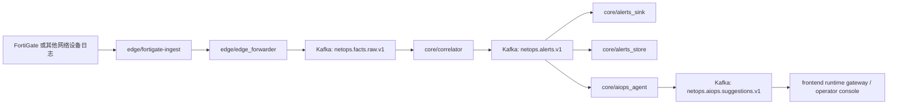

# Towards NetOps：面向网络感知与自动化处置的混合式 AIOps 平台
[](./README.md)
[](./README_CN.md)

> 先保证确定性网络数据面，再在告警契约之上做有边界的 AIOps 增强。

英文版本： [README.md](./README.md)

## 这个仓库是什么

Towards NetOps 是一个面向网络感知、证据驱动告警解释以及操作员可读处置建议的混合式 AIOps 平台。

整个仓库围绕一条明确的工程规则组织：

- 原始设备流量必须留在确定性流式主链上
- 告警、落盘和回放必须保持结构化、可审计
- AIOps 只能在告警已经成立且证据已组装完成之后介入
- 在显式处置控制面落地之前，操作员界面必须保持只读

这个仓库的目标不是“给每一行日志都跑一次 LLM”，而是在稳定网络数据面之上，给告警契约叠加一个有边界、可解释的智能增强层。

## 端到端运行主链



## 设计规则

- 边缘模块负责解析、回放安全和近源状态管理。
- 核心模块只消费结构化事实，不直接承接厂商原始日志。
- 实时决策点仍然是确定性告警链路。
- JSONL 和 ClickHouse 同时保留是有意为之：前者负责审计与回放，后者负责热查询与上下文检索。
- AIOps 位于告警下游，而不是检测上游。
- 告警级建议和簇级建议共享同一条告警契约。
- 前端是过程型运维控制台，不是通用型指标面板壳层。

## 仓库结构

| 区域 | 主要模块 | 责任 |
| --- | --- | --- |
| 边缘接入 | `edge/fortigate-ingest`、`edge/edge_forwarder` | 解析设备日志，保证回放与检查点语义，把结构化事实送入核心数据流 |
| 核心流式分析 | `core/correlator` | 执行质量门禁、规则匹配和滑窗判断，产出确定性告警 |
| 告警持久化 | `core/alerts_sink`、`core/alerts_store` | 将告警落到 JSONL 审计轨迹，同时在 ClickHouse 提供近历史和上下文检索能力 |
| AIOps 增强 | `core/aiops_agent` | 组装证据包，执行有边界的推理/模板逻辑，并输出结构化建议 |
| 操作员界面 | `frontend` | 把 `raw -> alert -> suggestion -> remediation boundary` 主链转换成可读的运维运行台 |
| 验证能力 | `tests`、`core/benchmark` | 支持回放验证、运行时检查和模块级校验 |

## 当前范围

目前仓库已经落地的能力：

- 面向 FortiGate 的边缘接入与可回放结构化输出
- 核心侧确定性关联与告警产出
- 按小时 JSONL 的告警审计落盘
- 基于 ClickHouse 的热告警存储与上下文查询
- 告警级与簇级的最小 AIOps 建议输出链路
- 前端运行时控制台与轻量网关

当前明确保留、尚未作为真实生产能力交付的部分：

- 对网络设备的自动写回
- 面向 remediation 通道的直接执行
- 会改变生产状态的审批流
- 完整的多 Agent 处置编排

## 安全边界

当前运行时界面和运行时网关都只是只读观察面。

- 它们会读取运行时产物、部署参数和审计文件
- 它们不会写入设备、Kubernetes 工作负载、核心配置或 remediation 通道
- 未来如果接入审批或执行链路，必须与当前只读界面显式隔离

## 基线校验

根 README 只负责建立整体认知。部署细节和验证细节请分别看子模块 README 与 `documentation/`。

常见的仓库级检查命令：

```bash
python3 -m pytest -q tests/core
python3 -m compileall -q core edge
cd frontend && npm run build
```

## 关键文档

- [项目状态与运行时说明](./documentation/PROJECT_STATE.md)
- [FortiGate 接入字段参考](./documentation/FORTIGATE_INGEST_FIELD_REFERENCE.md)
- [前端运行时架构说明](./documentation/FRONTEND_RUNTIME_ARCHITECTURE_20260328.md)
- [现场演示包：故障注入到自动定位](./documentation/LIVE_DEMO_FAULT_INJECTION_AUTO_LOCALIZATION.md)
- [边缘模块 README](./edge/README.md)
- [核心模块 README](./core/README.md)
- [前端模块 README](./frontend/README.md)

## 为什么要这样拆分

这个仓库的工程立场非常明确：

- 先保证数据面正确，再谈模型能力
- 先保证证据可解释，再谈叙事表达
- 先做有边界的增强，再谈自动化执行

这也是整个项目最核心的工程主张。
