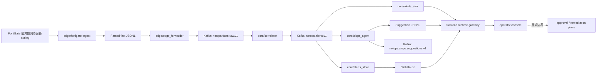
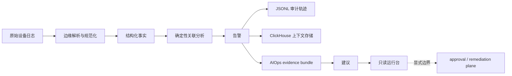

## Towards NetOps：Hybrid AIOps 驱动的网络感知与运维辅助平台
[](./README.md) [](./README_CN.md)

> Hybrid AIOps Platform: Deterministic Streaming Core + CPU Local LLM (On-Demand) + Multi-Agent Orchestration

这个仓库实现的是一条完整的 NetOps / AIOps 系统主链。真实网络设备 syslog 先在边缘侧完成解析、规范化、checkpoint 推进和 replay 语义固化，再进入共享流式链路，之后由确定性规则和滑窗聚合生成 alert，继续写入审计面与热查询面，最后在 alert contract 已经成立的前提下叠加有边界的 AIOps suggestion，并通过只读运行时网关投影成操作员控制台。系统的工程顺序是固定的：先把原始日志变成可信事实对象，再建立可重放、可审计、可解释的告警主链，然后才允许模型增强进入下游建议层。前端表达的是运行时证据、上下文与控制边界，不承担设备写回和自动处置职责。

## 系统目标与设计约束

这个系统要解决的是把真实网络流量和设备日志收束成可持续运行的运维数据面，并让后续的告警解释、上下文检索和辅助决策建立在稳定契约之上。因此系统设计从一开始就围绕四类约束展开。首先，原始输入来自真实 FortiGate 运行时日志，输入面天然存在轮转文件、偏移推进、失败恢复和源文件追溯问题，边缘侧必须先把这些问题解决掉。其次，第一层系统级判断需要在真实流量下保持确定性，规则命中、窗口大小、阈值和聚合逻辑都必须可复盘，模型增强放在下游建议层。再次，持久化同时服务运行时原貌保留和下游热查询装配，所以 JSONL 审计轨迹和 ClickHouse 查询面分开建设。最后，操作员界面需要清楚表达解释边界与控制边界，系统在当前阶段交付 incident explanation、evidence organization 和 next-step guidance，执行控制仍然留在 remediation boundary 之外。

## 系统总览



主链路从设备日志开始，在 `edge/fortigate-ingest` 完成原始 syslog 到结构化 fact 的第一次语义升级。此时每条事件都被赋予稳定的 `event_id`、标准化时间戳 `event_ts`、设备聚合键 `src_device_key`、服务与动作等关键字段，同时保留 `source.path`、`source.inode` 等 provenance 信息，保证后续链路可以追溯来源、定位故障并支撑 replay。`edge/edge_forwarder` 把这些结构化 facts 发布到 `netops.facts.raw.v1`，从这一刻开始，系统处理的是核心侧共享消费的事实流。`core/correlator` 作为当前系统真正的实时判定点，消费该事实流，执行 quality gate、规则匹配和滑窗聚合，输出 `netops.alerts.v1`。一旦 alert contract 成立，系统就获得了第一份可被审计、可被检索、可被继续增强的 incident object。

告警流随后被拆成三条下游路径。`core/alerts_sink` 按小时写出 JSONL，保留最接近运行时原貌的 emitted records，承担审计、证据保留和回放抓手。`core/alerts_store` 把同一条告警写入 ClickHouse，支持近历史查询、相似告警计数和上下文检索，为 suggestion 和控制台提供热查询面。`core/aiops_agent` 以 alert 为起点，基于 alert payload、topology context、device context、recent history 和 cluster context 组装 evidence bundle，再输出 alert-scope 或 cluster-scope suggestion，写入 `netops.aiops.suggestions.v1` 和 suggestion JSONL。`frontend/gateway` 读取 alerts、suggestions 与 deployment controls，组装统一的 `RuntimeSnapshot`，再通过 `SSE` 推送给前端控制台。前端最终呈现的是一条从 raw event 到 alert、从 alert 到 suggestion、再到 control boundary 的过程化 incident view。

## 端到端数据对象与语义升级

同一条网络事件在系统中会依次变成六种不同语义层级的对象，每一层对象都服务于不同的系统目标。

| 阶段 | 数据对象 | 生产者 | 关键字段 | 语义与作用 |
| --- | --- | --- | --- | --- |
| Source | raw syslog line | 设备 / 网关 | 原始文本、厂商键值 | 保留设备原始运行时语义，是最底层证据来源 |
| Edge fact | structured JSONL fact | `edge/fortigate-ingest` | `event_id`、`event_ts`、`src_device_key`、`kv_subset`、`source.*` | 把原始日志收束成可传输、可回放、可追溯的事实对象 |
| Shared fact | Kafka fact record | `edge/edge_forwarder` | 与 fact schema 对齐 | 让核心侧统一消费结构化事件流，而不接触原始文件语义 |
| Alert | deterministic alert contract | `core/correlator` | `rule_id`、`severity`、`metrics`、`event_excerpt`、`topology_context` | 形成系统级 incident judgment，是后续审计和增强的中心对象 |
| Persistence | JSONL alert record + ClickHouse row | `core/alerts_sink`、`core/alerts_store` | alert 全量字段及索引字段 | 同时支撑证据留存、回放和历史检索 |
| Suggestion | structured suggestion record | `core/aiops_agent` | `suggestion_scope`、`priority`、`summary`、`context` | 生成面向操作员的有边界建议，始终绑定 alert 或 alert cluster |
| Runtime view | `RuntimeSnapshot` | `frontend/gateway` | freshness、volumes、timeline、stageTelemetry、suggestion state | 把离散运行时对象投影成统一的控制台状态模型 |

这条对象链的价值在于，每一层都只承担一类清楚的职责。边缘 fact 负责把日志从文本升级为系统对象；alert 负责把事件升级为 incident judgment；JSONL 与 ClickHouse 负责把 incident judgment 变成可保留、可检索的运行时资产；suggestion 负责把 incident judgment 和上下文收束成有边界的 operator guidance；RuntimeSnapshot 负责把多源运行时状态投影成操作员可直接阅读和比较的过程视图。

字段级输入分析和大样例文档保留在：
[FortiGate 输入字段分析](./documentation/FORTIGATE_INPUT_FIELD_ANALYSIS.md)、
[FortiGate parsed JSONL 输出样例](./documentation/FORTIGATE_PARSED_OUTPUT_SAMPLE.md)。

## 分层系统设计

### 1. Edge ingestion：原始设备日志的规范化与回放语义固化

`edge/fortigate-ingest` 是系统的第一层边界。它处理的对象仍然是厂商文本日志，输出已经满足系统契约要求。实际工作包括源文件发现、轮转文件识别、checkpoint 推进、失败恢复、syslog 解析、FortiGate key-value 抽取以及 JSONL sink 落盘。这个阶段的难点在于同时处理字段抽取、rotated logs、断点续读、partial failure 和回放恢复，并在长期运行里稳定生成同一类事实对象。边缘层完成之后，后续任何模块都不需要再理解 FortiGate 原始文本结构，也不需要再处理边缘本地文件生命周期。

### 2. Shared transport：事实流的共享与解耦

`edge/edge_forwarder` 的作用是把边缘本地文件处理语义和核心侧事实流消费语义彻底切开。它读取 parsed fact JSONL，按事实对象发送到 `netops.facts.raw.v1`。这种切分让核心侧可以围绕稳定 schema 设计自己的处理逻辑，同时避免继承边缘文件发现、轮转处理和 checkpoint 复杂度。系统的实时数据面从这里开始具有清晰的共享事实流属性。

### 3. Deterministic correlation：第一层系统级判断

`core/correlator` 是当前系统设计最关键的模块。它消费 `netops.facts.raw.v1`，执行 quality gate、规则匹配、滑窗聚合和 alert emission。第一判定点之所以保持确定性，是因为这一层承担的是从“事件发生”到“告警成立”的第一次系统级判断，必须能够直接回答三个问题：为什么触发、在什么窗口下触发、由哪条规则或阈值触发。当前这种设计在真实流量、有限资源和需要回放验证的环境下更稳妥，也为后续论文里的可解释性、复现实验和性能评测保留了稳定基础。

### 4. Persistence surfaces：审计面与热查询面分离

`core/alerts_sink` 与 `core/alerts_store` 共同组成 alert persistence layer，两者承担不同任务。前者按小时写出 alert JSONL，保留运行时真实 emitted record，适合做 evidence retention、时间审计和 replay；后者把 alert 写入 ClickHouse，适合 recent-similar lookup、history window aggregation 和下游上下文装配。系统在这里采用双持久化，是为了把保存原貌和支持查询这两类任务分开，避免热查询污染审计语义，也避免审计保真拖垮检索能力。

### 5. Bounded AIOps layer：基于 alert contract 的辅助决策

`core/aiops_agent` 不直接消费 raw logs，也不参与第一轮是否触发告警的判断。它从 alert contract 出发，把 alert payload、topology context、device profile、recent history 和 cluster context 收束成 evidence bundle，再输出结构化 suggestion。这样设计的收益很明确。第一，输入规模被 alert contract 限制住了，模型不需要面对未经筛选的大流量原始事件。第二，输入语义已经比原始日志更完整，alert 本身已经带有规则结果、时间、局部 incident 形状和拓扑定位。第三，建议输出天然可以指回 alert 或 alert cluster，而不会漂成无源文本。当前 suggestion 路径已经支持 alert-scope 与 cluster-scope 两种粒度，并保留了结构化输出和审计轨迹，为后续测量 suggestion latency、coverage、consistency 和 operator usefulness 提供了可量化基础。

### 6. Runtime projection：面向操作员的过程视图

`frontend/gateway` 读取 alert JSONL、suggestion JSONL 与 deployment controls，组装统一的 `RuntimeSnapshot`。前端控制台消费这个统一快照和 `SSE` delta，不直接读取底层运行时文件。这样做之后，页面可以围绕 freshness、incident volume、evidence coverage、lifecycle telemetry、suggestion scope 和 control boundary 构造统一的过程视图。控制台展示的是一条 incident 如何被发现、如何被持久化、如何被解释以及系统在什么地方显式停止的运行时叙事。

## 组件输入输出与职责

| 组件 | 主要输入 | 主要输出 | 核心职责 |
| --- | --- | --- | --- |
| `edge/fortigate-ingest` | FortiGate syslog、轮转文件、checkpoint | parsed fact JSONL | 解析日志、推进 checkpoint、保留 replay 语义与 provenance |
| `edge/edge_forwarder` | parsed fact JSONL | `netops.facts.raw.v1` | 把边缘事实对象送入共享流式链路 |
| `core/correlator` | `netops.facts.raw.v1` | `netops.alerts.v1` | 执行 quality gate、规则判断、滑窗聚合与 alert emission |
| `core/alerts_sink` | `netops.alerts.v1` | hourly alert JSONL | 留存运行时原貌，形成审计与回放抓手 |
| `core/alerts_store` | `netops.alerts.v1` | ClickHouse alert rows | 提供近历史查询、相似告警检索和上下文装配 |
| `core/aiops_agent` | alerts、history、topology、device context | `netops.aiops.suggestions.v1`、suggestion JSONL | 组装 evidence bundle，输出 bounded suggestion |
| `frontend/gateway` | alerts、suggestions、deployment controls | `RuntimeSnapshot`、SSE stream | 统一投影多源运行时产物 |
| `frontend` | snapshot、stream delta | runtime console | 呈现 incident process、evidence、lifecycle 与 control boundary |

## 代表性运行时记录

当前挂载 runtime 中的一条 alert 样例如下：

```json
{
  "alert_id": "2081f46a5146d642d4110253926698c1b8b6fced",
  "alert_ts": "2026-03-26T18:56:04+00:00",
  "rule_id": "deny_burst_v1",
  "severity": "warning",
  "metrics": {
    "deny_count": 321,
    "window_sec": 60,
    "threshold": 200
  },
  "event_excerpt": {
    "action": "deny",
    "srcip": "5.188.206.46",
    "dstip": "77.236.99.125",
    "service": "tcp/3472"
  },
  "topology_context": {
    "service": "tcp/3472",
    "srcintf": "wan1",
    "dstintf": "unknown0",
    "zone": "wan"
  }
}
```

这条 alert 已经具备了规则命中解释、局部 incident 形状和网络位置三层语义。`metrics` 对应规则成立的量化条件，`event_excerpt` 保留了局部事件轮廓，`topology_context` 让事件重新回到网络结构里。当前挂载 runtime 中的一条 suggestion 样例如下：

```json
{
  "suggestion_id": "598b2edba0f164f9a0048e8d6021974123d1927c",
  "suggestion_ts": "2026-03-31T15:35:49.119215+00:00",
  "suggestion_scope": "alert",
  "alert_id": "2081f46a5146d642d4110253926698c1b8b6fced",
  "rule_id": "deny_burst_v1",
  "priority": "P2",
  "summary": "deny_burst_v1 triggered for service=tcp/3472 device=5.188.206.46",
  "context": {
    "service": "tcp/3472",
    "src_device_key": "5.188.206.46",
    "recent_similar_1h": 0,
    "provider": "template"
  }
}
```

这条 suggestion 明确指回 alert，并且保留了 scope、priority、summary 和 compact context。当前系统交付的是一份可以被控制台、日志归档和后续实验统计共同消费的结构化建议对象。

## 部署拓扑与运行平面

系统当前分成三个运行平面。第一平面是 edge ingestion plane，负责近源解析、checkpoint 和 fact 生成。第二平面是 core streaming plane，负责 Kafka 中的事实流、确定性告警、审计落盘、ClickHouse 热查询与 AIOps suggestion。第三平面是 runtime projection plane，负责把挂载运行时产物和 deployment controls 组装成统一的控制台状态。三个平面的职责切分让系统在部署上既可以分主机或分容器运行，也可以在单机演示环境下以相同的数据契约完成联调。对论文来说，这种切分也有直接好处：可以把 ingestion robustness、correlation latency、storage queryability 和 frontend observability 分开描述，而不用混成一个单块系统。

## 架构边界与工程取舍



系统把第一判定点保留为确定性规则层，因为当前阶段首先需要把 raw-to-alert 主链做稳，真实流量、回放验证、规则调优和性能统计都依赖这条链路保持可解释。AIOps 被放在 alert 下游，是因为 alert contract 才是成本、上下文和语义首次对齐的位置。到这个阶段，设备字段、告警时间、规则结果和历史上下文已经收束成更适合 bounded reasoning 的输入。前端保持只读，是因为观察、解释和执行属于不同风险等级的系统职责。当前交付范围覆盖 investigation support、incident explanation、context retrieval 和 structured guidance。审批驱动执行、设备写回、自动 remediation、rollback-aware write path 和闭环 control plane 仍然留在显式边界之外。

## 当前进展

当前工作区直接挂载的是 `/data/netops-runtime` 下的 alert 和 suggestion 产物，以及当前仓库代码。现有挂载数据中，alert sink 覆盖 `554` 个小时文件，共 `152,481` 条 alert，时间范围从 `2026-03-04T15:09:11+00:00` 到 `2026-03-27T23:00:17+00:00`；suggestion sink 覆盖 `480` 个小时文件，时间范围从 `2026-03-09T05:08:56.549849+00:00` 到 `2026-03-31T15:36:55.895982+00:00`。最近 24 个已挂载 alert 分桶里，`deny_burst_v1` warning 为 `2067` 条，`bytes_spike_v1` critical 为 `2` 条；最近 24 个已挂载 suggestion 分桶里，alert-scope 为 `9058` 条，cluster-scope 为 `1353` 条，provider 为当前 `template` 路径。当前工作区没有暴露 live `/data/fortigate-runtime`，因此 raw-edge freshness 和全链路严格时间同步不能仅凭这份挂载数据认定。当前测试采集基线为 `33` 个测试，覆盖 `tests/core` 以及两个 frontend runtime snapshot / stream 测试。

## 评测入口

论文后续如果从 system design 往 evaluation 继续推进，当前仓库已经具备几个天然评测面：边缘解析层可以测 field coverage、parse success rate、checkpoint correctness 和 replay correctness；确定性告警层可以测 end-to-end alert latency、rule hit distribution、window aggregation correctness 和 freshness；持久化层可以测 emitted-record retention、query latency 和 recent-similar lookup effectiveness；suggestion 层可以测 suggestion latency、scope distribution、provider stability 和 context completeness；前端运行台可以测 snapshot completeness、SSE freshness、timeline coverage 和 operator-visible lifecycle consistency。

## 验证

```bash
python3 -m pytest -q tests/core
pytest -q tests/frontend/test_runtime_reader_snapshot.py tests/frontend/test_runtime_stream_delta.py
python3 -m compileall -q core edge frontend/gateway
python3 -m core.benchmark.live_runtime_check
cd frontend && npm run build
```
