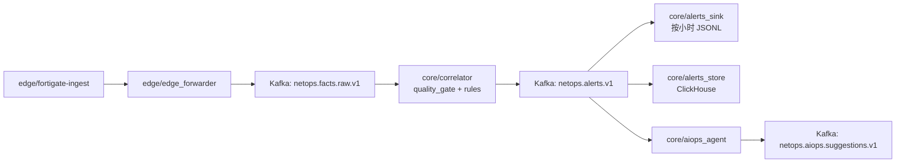
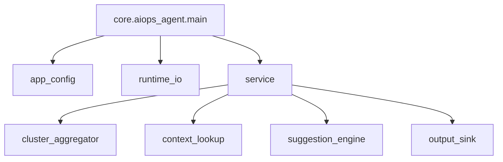

## Towards NetOps： Hybrid AIOps Driven 分布式深度根因追踪与智能自动化处置系统
[](./README.md) [](./README_CN.md)

> **Hybrid AIOps Platform: Deterministic Streaming Core + CPU Local LLM (On-Demand) + Multi-Agent Orchestration**

#### 项目概述（Project Overview）

本项目旨在构建一个面向复杂网络运维场景的 **分布式 AIOps 平台（Towards NetOps）**，以 **边缘事实接入（Edge Fact Ingestion）→ 核心流式分析（Core Streaming Analytics）→ 智能增强决策（LLM-Augmented Reasoning）→ 处置闭环（Remediation Loop）** 为主线，逐步实现从异常发现、证据链归因到处置建议与执行控制的工程化能力演进。平台并不以“全量日志实时 LLM 推理”为目标，而是以稳定的数据面与可解释的证据流为基础，在核心侧对高价值异常簇进行按需智能增强分析，从而在成本、实时性与可运维性之间取得可落地平衡。

#### 架构范式（Architecture Paradigm）

系统采用 **边缘接入（Edge）+ 核心分析（Core）** 的分层架构。边缘侧负责近源日志采集、结构化事实事件化、审计留痕与可回放落盘，将原始设备日志转换为可持续消费的事实事件流；核心侧负责流式数据平面承载、事件聚合与关联分析、证据链构建，并在此基础上引入 **LLM 增强分析层** 用于告警解释、态势摘要、归因辅助与 Runbook 草案生成。该增强层采用 **常驻服务 + 限流队列** 的运行模式：由规则/流式模块完成实时检测与高价值异常筛选，LLM 仅对告警级上下文进行低并发、按需推理，避免对主链路实时性与系统资源造成挤占。

> [!IMPORTANT]
> 平台目标不是“全量日志实时 LLM 推理”，而是以稳定数据面与可解释证据流为基础，对高价值异常簇进行按需智能增强分析。

- 当前资源约束下的技术路线（Current Technical Route Under Resource Constraints）

在当前资源约束下（核心侧无 GPU，CPU-only 推理），本项目的技术路线明确为 **“确定性流式分析主导 + LLM 按需增强”**：实时检测、基础聚合与关联计算由规则/流式处理模块承担；LLM 负责对已压缩的高价值证据上下文进行解释与规划生成。该设计使平台在不依赖本地训练与持续高成本 API 调用的前提下，仍可逐步演进至 Multiple Agent + LLM 协同分析与自动化处置闭环能力。

> [!NOTE]
> 当前阶段优先保证：数据平面稳定、证据流可解释、核心链路可运行；LLM 作为告警级增强模块按需接入。

本项目的建设顺序预计将按照如下阶段推进：
1. **第一阶段：边缘事实接入层工程化落地**  
   完成 FortiGate 日志（以及后续可能引入的多网络设备日志）接入，确保输入可审计、可恢复、可回放。

2. **第二阶段：核心侧数据平面与最小流式消费链路**  
   在核心侧建立数据平面，完成事件传输解耦与基础聚合分析。

3. **第三阶段：AIOps 增强分析能力引入**  
   基于 AIOps 思想，逐步引入 Multiple Agent + LLM 的关联分析、网络态势感知、证据链归因与自动化自愈 Runbook 生成能力。

4. **第四阶段：处置闭环扩展**  
   在可解释与可验证前提下，扩展至处置建议、人工审批执行与自动化低感知自愈。

## 设计边界（Design Boundary）

> [!WARNING]
> 本项目当前阶段不以“全量事件逐条 LLM 判定”为架构目标。
> 主链路由确定性流式模块承担实时检测与基础关联；LLM/Agent 用于高价值告警簇的按需增强分析与处置建议生成。

## 当前进展快照（2026-03-18）

> [!TIP]
> 运行时边界已明确：`edge/*` 只放边缘节点组件，`core/*` 只放核心节点组件。

### 已落地的运行链路



### 已实现模块与技术栈

| 分层 | 模块 | 职责 | 技术 |
| --- | --- | --- | --- |
| 边缘接入 | `edge/fortigate-ingest` | FortiGate 日志解析、断点回放、DLQ/指标输出 | Python, JSONL |
| 边缘过滤转发 | `edge/edge_forwarder` | 边缘抑噪后转发到核心主题 | Python, Kafka |
| 核心关联 | `core/correlator` | 质量门禁、规则匹配、告警产出、手动提交 offset | Python, Kafka |
| 告警落盘 | `core/alerts_sink` | 告警按小时写入 JSONL | Python |
| 热查询存储 | `core/alerts_store` | 告警结构化入库 | ClickHouse, `clickhouse-connect` |
| AIOps 最小闭环 | `core/aiops_agent` | 对高价值告警簇做聚合，结合 ClickHouse 近似上下文生成建议消息并按小时落盘 | Python, Kafka, ClickHouse |
| 运维观测 | `core/benchmark/*` | 流程健康观测与 warning 噪声观测 | Python, `kubectl` |

> [!NOTE]
> 当前仓库状态更准确的表述是：**Core Phase-2 数据面最小闭环已打通，并在其上落地了最小 AIOps 告警簇建议闭环**。  
> 也就是说，确定性流式检测、告警落盘和热查询已经到位；真正的 LLM 推理、因果证据链归因和自动化处置控制仍属于下一阶段建设内容。

### AIOps Agent 模块图



- `app_config`：统一加载和规范化环境变量，并执行严重级别门禁策略。
- `runtime_io`：统一初始化 Kafka/ClickHouse 客户端，避免连接逻辑分散。
- `cluster_aggregator`：按 `rule_id + severity + service + src_device_key` 做滑窗聚合。
- `service`：完成告警消费、严重级别门禁、簇触发建议发布、成功后提交 offset 的主流程。
- `context_lookup`：从 ClickHouse 查询近 1 小时相似告警计数用于上下文增强。
- `suggestion_engine`：生成稳定可演进的建议消息 schema。
- `output_sink`：按小时落盘 JSONL，保留审计与回放证据。

### 已完成的可靠性治理

- `release_core_app.sh` 已避免在 core-only 发布中误更新 edge 运行镜像。
- 发布后新增“Pod 内模块可导入”校验，用于提前发现镜像内容与代码不一致问题。
- 核心消费者改为 `enable_auto_commit=False`，处理成功后再提交 offset。
- 规则阈值采用 profile 化配置（`core/correlator/rule_profile.py`），支持按环境调参。

### 合并/发布前基线校验

```bash
python3 -m pytest -q tests/core
python3 -m compileall -q core
bash -n core/automatic_scripts/release_core_app.sh
```

> [!NOTE]
> 当前 `tests/core` 已覆盖 `rules`、`quality_gate`、`alerts_sink`、`alerts_store`、`aiops_agent`（含簇聚合）的最小行为。
> 最近一次本地基线校验已通过 `22` 个 core 测试，现有基线可支持你继续迭代 AIOps 功能开发（在现有 core 流水线上增量扩展）。


<!-- 本项目旨在构建一个面向复杂网络运维场景的 **分布式 AIOps 平台（Towards NetOps）**，以 **边缘事实接入（Edge Fact Ingestion）→ 核心流式分析（Core Streaming Analytics）→ 智能增强决策（LLM-Augmented Reasoning）→ 处置闭环（Remediation Loop）** 为主线，逐步实现从异常发现、证据链归因到处置建议与执行控制的工程化能力演进。平台并不以“全量日志实时 LLM 推理”为目标，而是以稳定的数据面与可解释的证据流为基础，在核心侧对高价值异常簇进行按需智能增强分析，从而在成本、实时性与可运维性之间取得可落地平衡。

系统采用 **边缘接入（Edge）+ 核心分析（Core）** 的分层架构。边缘侧负责近源日志采集、结构化事实事件化、审计留痕与可回放落盘，将原始设备日志转换为可持续消费的事实事件流；核心侧负责流式数据平面承载、事件聚合与关联分析、证据链构建，并在此基础上引入 **LLM 增强分析层** 用于告警解释、态势摘要、归因辅助与 Runbook 草案生成。该增强层采用 **常驻服务 + 限流队列** 的运行模式：由规则/流式模块完成实时检测与高价值异常筛选，LLM 仅对告警级上下文进行低并发、按需推理，避免对主链路实时性与系统资源造成挤占。

在当前资源约束下（核心侧无 GPU，CPU-only 推理），本项目的技术路线明确为 **“确定性流式分析主导 + LLM 按需增强”**：实时检测、基础聚合与关联计算由规则/流式处理模块承担；LLM 负责对已压缩的高价值证据上下文进行解释与规划生成。该设计使平台在不依赖本地训练与持续高成本 API 调用的前提下，仍可逐步演进至 Multiple Agent + LLM 协同分析与自动化处置闭环能力。

本项目的建设顺序预计将按照如下阶段推进：
**第一阶段**完成边缘事实接入层（FortiGate 日志以及后续可能引入的多网络设备日志）工程化落地，确保输入可审计、可恢复、可回放；
**第二阶段**在核心侧建立数据平面与最小流式消费链路，完成事件传输解耦与基础聚合分析；
**第三阶段**基于AIOps思想，逐步引入Mutiple Agent + LLM的关联分析、网络态势感知、证据链归因与生成自动化自愈操作Runbook；
**第四阶段**在可解释与可验证前提下扩展至处置建议、人工审批执行与自动化低感知自愈 -->

## 1.1 项目定位与当前架构边界
项目当架构围绕 **r230（边缘采集）→ r450（核心数据平面与分析处理）** 展开，即在边缘侧完成近源采集与事实化，在核心侧承载后续流式处理、关联分析、证据链归因与自动化处置能力的实现。意味着本项目已完成平台建设中最关键的输入面落地工作，并进入面向核心能力扩展的架构推进阶段。

当前处于 **边缘事实接入层（Edge Fact Ingestion Layer）已部署并稳定运行**、**核心分析与处置层（Core Analytics / Causality / Remediation）持续建设中** 的阶段。系统运行于 **k3s** 集群；其中 `edge` 边缘侧 `fortigate-ingest` 组件 已完成容器化部署并持续运行，承担 FortiGate 日志的边缘侧接入与事实化处理任务。当前节点角色划分为：**netops-node2（r230）负责边缘接入**，**netops-node1（r450）作为核心数据平面与分析侧承载节点**。已进入集群运行态的 AIOps 平台基础组件阶段。

> [!IMPORTANT]
> 当前阶段的架构重点是以已运行的边缘接入组件为基础，向核心侧数据平面与分析能力扩展

节点角色划分如下：
- **netops-node2（r230）**：边缘接入侧（Edge Ingestion，已完成Ingest Pod开发与部署，并稳定运行）
- **netops-node1（r450）**：核心侧（Data Plane / Core Analytics，正在持续建设中）

## 1.2 当前已开发组件（Edge / FortiGate Ingestion）
`edge/fortigate-ingest` 已在 k3s 集群中完成容器化部署并持续运行，当前承担以下职责：

- 接入 FortiGate syslog 输入（active log + rotated log，含 `.gz`）
- 按既定顺序处理历史补偿与准实时跟读（rotated → active）
- 解析 syslog header 与 FortiGate `key=value` payload
- 完成字段类型标准化与结构化事件生成
- 输出可直接消费的事实事件流（JSONL）
- 输出 DLQ 与 ingest metrics（用于异常样本隔离与运行状态观测）
- 持久化 checkpoint（含 `inode/offset` 与 completed 去重账本），支持重启恢复、轮转处理与可追溯回放定位

当前边缘侧已经基于总体环境路由器形成稳定的 **事实事件生产链路**，为后续核心侧流式消费、关联分析与根因推理提供统一输入


---
## 2. Edge 边缘侧 组件
### 2.1 Ingest 组件  
> ## FortiGate Log Input / Ingest / Parsed Output Specification
原始日志（`/data/fortigate-runtime/input/fortigate.log`）格式分析
FortiGate 日志输入格式、结构化事件输出格式（JSONL）、字段语义及 ingest 处理链路，用于数据接入、分析开发、排障审计与后续流式处理对接。

### 2.1.1 Raw FortiGate Log Format (Input)
`edge/fortigate-ingest` 的输入不是单一文件，而是 **同一目录下的一组 FortiGate 日志文件集合**：当前持续追加写入的 active 文件 `fortigate.log`，以及由外部轮转机制生成的历史文件 `fortigate.log-YYYYMMDD-HHMMSS` 和 `fortigate.log-YYYYMMDD-HHMMSS.gz`。ingest 在启动与主循环中会先扫描并按文件名时间戳顺序处理所有匹配命名规则的 rotated 文件（用于补齐历史日志），随后再基于 checkpoint 中记录的 `active.inode + active.offset` 对 `fortigate.log` 执行增量 tail（用于准实时接入新日志）。rotated 文件采用整文件读取（`.gz` 通过 gzip 解压后逐行读取，`source.offset=null`；非 `.gz` rotated 记录逐行 offset），active 文件采用按字节 offset 的持续跟读；在运行过程中，主循环会周期性重新扫描 rotated 列表并结合 `completed(path|inode|size|mtime)` 去重账本避免重复补历史，同时对 active 文件通过 `inode` 变化与文件大小/offset 状态处理轮转切换与截断恢复。该处理模型的职责边界是：**ingest 负责识别并消费 active/rotated 输入集合，外部组件负责产生日志轮转文件**。

- **Active log**
  - `/data/fortigate-runtime/input/fortigate.log`
- **Rotated logs**
  - `/data/fortigate-runtime/input/fortigate.log-YYYYMMDD-HHMMSS`
  - `/data/fortigate-runtime/input/fortigate.log-YYYYMMDD-HHMMSS.gz`

### Line Format

每行日志由两部分组成：
*Input sample（raw）**：证明原始日志具备可直接抽取的网络语义 + 资产画像语义（接口、策略、动作、设备厂商/类型/OS/MAC）
1. **Syslog header** - 4 tokens 维度
2. **FortiGate key-value payload** - 43 维度
### Input log raw 字段清单（43 个FortiGate KV字段 + 4 个 syslog header 子字段）

**Example (real sample):**
```text
Feb 21 15:45:27 _gateway date=2026-02-21 time=15:45:26 devname="DAHUA_FORTIGATE" devid="FG100ETK20014183" logid="0001000014" type="traffic" subtype="local" level="notice" vd="root" eventtime=1771685127249713472 tz="+0100" srcip=192.168.16.41 srcname="es-73847E56DA65" srcport=48689 srcintf="LACP" srcintfrole="lan" dstip=255.255.255.255 dstport=48689 dstintf="unknown0" dstintfrole="undefined" sessionid=1211202700 proto=17 action="deny" policyid=0 policytype="local-in-policy" service="udp/48689" dstcountry="Reserved" srccountry="Reserved" trandisp="noop" app="udp/48689" duration=0 sentbyte=0 rcvdbyte=0 sentpkt=0 appcat="unscanned" srchwvendor="Samsung" devtype="Phone" srcfamily="Galaxy" osname="Android" srcswversion="16" mastersrcmac="78:66:9d:a3:4f:51" srcmac="78:66:9d:a3:4f:51" srcserver=0
```

Input 字段分析
| 字段名            | 样本值                   | 作用                   |
| -------------- | --------------------- | -------------------- |
| `syslog_month` | `Feb`      | syslog 头时间（月份）  |
| `syslog_day`   | `21`       | syslog 头时间（日期）  |
| `syslog_time`  | `15:45:27` | syslog 接收时间（秒级） |
| `host`         | `_gateway` | syslog 发送主机名    |
| `date`         | `2026-02-21`          | FortiGate 事件日期（业务时间） |
| `time`         | `15:45:26`            | FortiGate 事件时间（业务时间） |
| `devname`      | `DAHUA_FORTIGATE`     | 防火墙设备名               |
| `devid`        | `FG100ETK20014183`    | 防火墙设备唯一 ID           |
| `logid`        | `0001000014`          | FortiGate 日志类型 ID    |
| `type`         | `traffic`             | 日志主类（流量类）            |
| `subtype`      | `local`               | 日志子类（本机面 traffic）    |
| `level`        | `notice`              | 事件等级                 |
| `vd`           | `root`                | VDOM 名称              |
| `eventtime`    | `1771685127249713472` | 高精度原生事件时间戳           |
| `tz`           | `+0100`               | 时区                   |
| `srcip`        | `192.168.16.41`       | 源 IP                 |
| `srcname`      | `es-73847E56DA65`     | 源端名称/终端标识            |
| `srcport`      | `48689`               | 源端口                  |
| `srcintf`      | `LACP`                | 源接口                  |
| `srcintfrole`  | `lan`                 | 源接口角色                |
| `dstip`        | `255.255.255.255`     | 目的 IP（广播地址）          |
| `dstport`      | `48689`               | 目的端口                 |
| `dstintf`      | `unknown0`            | 目的接口（本机面/特殊目标线索）     |
| `dstintfrole`  | `undefined`           | 目的接口角色               |
| `sessionid`    | `1211202700`          | 会话 ID（关联键）           |
| `proto`        | `17`                  | 协议号（UDP）             |
| `action`       | `deny`                | 动作结果（拒绝）             |
| `policyid`     | `0`                   | 策略 ID                |
| `policytype`   | `local-in-policy`     | 命中策略类型（本机面）          |
| `service`      | `udp/48689`           | 服务/端口标签              |
| `dstcountry`   | `Reserved`            | 目的国家（保留地址）           |
| `srccountry`   | `Reserved`            | 源国家（保留地址）            |
| `trandisp`     | `noop`                | 传输/处理状态信息            |
| `app`          | `udp/48689`           | 应用识别结果（端口级）          |
| `duration`     | `0`                   | 会话持续时长               |
| `sentbyte`     | `0`                   | 发送字节数                |
| `rcvdbyte`     | `0`                   | 接收字节数                |
| `sentpkt`      | `0`                   | 发送包数                 |
| `appcat`       | `unscanned`           | 应用分类状态               |
| `srchwvendor`  | `Samsung`             | 源端硬件厂商（资产画像）         |
| `devtype`      | `Phone`               | 设备类型（资产画像）           |
| `srcfamily`    | `Galaxy`              | 设备家族（资产画像）           |
| `osname`       | `Android`             | OS 名称（资产画像）          |
| `srcswversion` | `16`                  | OS/软件版本（资产画像）        |
| `mastersrcmac` | `78:66:9d:a3:4f:51`   | 主源 MAC（设备归一线索）       |
| `srcmac`       | `78:66:9d:a3:4f:51`   | 源 MAC（设备归一线索）        |
| `srcserver`    | `0`                   | 设备角色提示（终端/非服务器）      |


### 2.1.2 Ingest Pod 处理链路（`edge/fortigate-ingest`）

`edge/fortigate-ingest` 的职责不是“简单转存日志”，而是将 FortiGate 原始 syslog 文本（`/data/fortigate-runtime/input/fortigate.log` 及轮转文件 `fortigate.log-YYYYMMDD-HHMMSS[.gz]`）转换为可审计、可回放、可直接做聚合分析的结构化事实事件流（JSONL）。主循环处理顺序固定为 **先 rotated（补历史）→ 再 active（准实时 tail）**：轮转文件通过文件名时间戳排序后依次扫描，避免启动/重启后漏补历史；active 文件则基于 byte offset 持续跟读，兼顾实时性与可恢复性。输出按小时切分写入 `events-YYYYMMDD-HH.jsonl`（另有 DLQ/metrics JSONL），便于下游批流统一消费。:contentReference[oaicite:0]{index=0} :contentReference[oaicite:1]{index=1}

处理单行日志时，pipeline 会先拆分 **syslog header** 与 **FortiGate key=value payload**，再执行字段解析与类型标准化（数值类字段转 `int`，缺失字段保留为 `null`），并生成结构化事件：包括标准化 `event_ts`（优先 `date+time+tz`）、保留原始时间语义字段（如 `eventtime`/`tz`）、派生统计字段（如 `bytes_total` / `pkts_total`）、设备归一化键（`src_device_key`，用于资产级聚合/异常关联），以及用于回溯与 schema 扩展的 `kv_subset`。成功解析的事件写入 `events-*.jsonl`，失败行进入 DLQ（附带 `reason/raw/source`），从而保证“原始文本 → 结构化事件”的转换链路具备容错与排障能力。:contentReference[oaicite:2]{index=2} :contentReference[oaicite:3]{index=3}

该组件的关键可靠性设计在于 **checkpoint + inode/offset + completed 去重机制**。`checkpoint.json` 保存三类状态：`active`（当前 active 文件的 `path/inode/offset/last_event_ts_seen`）、`completed`（已完整处理的轮转文件记录，使用 `path|inode|size|mtime` 组成唯一 key，防止重复补历史）、`counters`（lines/bytes/events/dlq/parse_fail/write_fail/checkpoint_fail 等累计计数）。rotated 文件完成后调用 `mark_completed()` 落账；active 文件 tail 时使用 checkpoint 中的 `inode+offset` 从断点续读，并在检测到 **inode 变化（轮转切换）** 或 **文件截断（`size < offset`）** 时执行 offset 重置与重新扫描，避免越界/重复/漏读。checkpoint 通过临时文件写入 + `fsync` + `os.replace` 原子落盘，事件侧统一附加 `ingest_ts`（UTC）与 `source.path/inode/offset`（`.gz` 通常 `offset=null`），从而支持精确审计、回放定位与幂等重处理。:contentReference[oaicite:4]{index=4} :contentReference[oaicite:5]{index=5} :contentReference[oaicite:6]{index=6}


### 2.1.3 Output Sample（parsed JSONL）字段清单（62 个顶层字段+3个source 子字段）
**Output sample（parsed）**：证明 ingest 已把文本日志稳定转换为可分析 schema（时间标准化、派生字段、设备键、source审计元数据

```text
{"schema_version":1,"event_id":"d811b6b7c362dd6367f3736a19bc9ade","host":"_gateway","event_ts":"2026-01-15T16:49:21+01:00","type":"traffic","subtype":"forward","level":"notice","devname":"DAHUA_FORTIGATE","devid":"FG100ETK20014183","vd":"root","action":"deny","policyid":0,"policytype":"policy","sessionid":1066028432,"proto":17,"service":"udp/3702","srcip":"192.168.1.133","srcport":3702,"srcintf":"fortilink","srcintfrole":"lan","dstip":"192.168.2.108","dstport":3702,"dstintf":"LAN2","dstintfrole":"lan","sentbyte":0,"rcvdbyte":0,"sentpkt":0,"rcvdpkt":null,"bytes_total":0,"pkts_total":0,"parse_status":"ok","logid":"0000000013","eventtime":"1768492161732986577","tz":"+0100","logdesc":null,"user":null,"ui":null,"method":null,"status":null,"reason":null,"msg":null,"trandisp":"noop","app":null,"appcat":"unscanned","duration":0,"srcname":null,"srccountry":"Reserved","dstcountry":"Reserved","osname":null,"srcswversion":null,"srcmac":"b4:4c:3b:c1:29:c1","mastersrcmac":"b4:4c:3b:c1:29:c1","srcserver":0,"srchwvendor":"Dahua","devtype":"IP Camera","srcfamily":"IP Camera","srchwversion":"DHI-VTO4202FB-P","srchwmodel":null,"src_device_key":"b4:4c:3b:c1:29:c1","kv_subset":{"date":"2026-01-15","time":"16:49:21","tz":"+0100","eventtime":"1768492161732986577","logid":"0000000013","type":"traffic","subtype":"forward","level":"notice","vd":"root","action":"deny","policyid":"0","policytype":"policy","devname":"DAHUA_FORTIGATE","devid":"FG100ETK20014183","sessionid":"1066028432","proto":"17","service":"udp/3702","srcip":"192.168.1.133","srcport":"3702","srcintf":"fortilink","srcintfrole":"lan","dstip":"192.168.2.108","dstport":"3702","dstintf":"LAN2","dstintfrole":"lan","trandisp":"noop","duration":"0","sentbyte":"0","rcvdbyte":"0","sentpkt":"0","appcat":"unscanned","dstcountry":"Reserved","srccountry":"Reserved","srcmac":"b4:4c:3b:c1:29:c1","mastersrcmac":"b4:4c:3b:c1:29:c1","srcserver":"0","srchwvendor":"Dahua","devtype":"IP Camera","srcfamily":"IP Camera","srchwversion":"DHI-VTO4202FB-P"},"ingest_ts":"2026-02-16T19:59:59.808411+00:00","source":{"path":"/data/fortigate-runtime/input/fortigate.log-20260130-000004.gz","inode":6160578,"offset":null}}
```
| 字段名              | 样本值                                            | 作用                         |
| ---------------- | ---------------------------------------------- | -------------------------- |
| `source.path`   | `/data/fortigate-runtime/input/fortigate.log-20260130-000004.gz` | 来源文件路径（轮转文件定位） |
| `source.inode`  | `6160578`                                                        | 文件 inode（文件身份） |
| `source.offset` | `null`                                                           | 偏移量（压缩文件常为空）   |
| `schema_version` | `1`                                            | 输出 schema 版本               |
| `event_id`       | `d811b6b7c362dd6367f3736a19bc9ade`             | 事件唯一 ID（去重/幂等）             |
| `host`           | `_gateway`                                     | 保留 syslog host             |
| `event_ts`       | `2026-01-15T16:49:21+01:00`                    | 标准化事件时间（下游窗口/排序主字段）        |
| `type`           | `traffic`                                      | 日志主类                       |
| `subtype`        | `forward`                                      | 日志子类（转发流量）                 |
| `level`          | `notice`                                       | 事件等级                       |
| `devname`        | `DAHUA_FORTIGATE`                              | 防火墙设备名                     |
| `devid`          | `FG100ETK20014183`                             | 防火墙设备 ID                   |
| `vd`             | `root`                                         | VDOM                       |
| `action`         | `deny`                                         | 动作结果                       |
| `policyid`       | `0`                                            | 策略 ID                      |
| `policytype`     | `policy`                                       | 策略类型（普通转发策略）               |
| `sessionid`      | `1066028432`                                   | 会话关联键                      |
| `proto`          | `17`                                           | 协议号（UDP）                   |
| `service`        | `udp/3702`                                     | 服务/端口标签                    |
| `srcip`          | `192.168.1.133`                                | 源 IP                       |
| `srcport`        | `3702`                                         | 源端口                        |
| `srcintf`        | `fortilink`                                    | 源接口                        |
| `srcintfrole`    | `lan`                                          | 源接口角色                      |
| `dstip`          | `192.168.2.108`                                | 目的 IP                      |
| `dstport`        | `3702`                                         | 目的端口                       |
| `dstintf`        | `LAN2`                                         | 目的接口                       |
| `dstintfrole`    | `lan`                                          | 目的接口角色                     |
| `sentbyte`       | `0`                                            | 发送字节数                      |
| `rcvdbyte`       | `0`                                            | 接收字节数                      |
| `sentpkt`        | `0`                                            | 发送包数                       |
| `rcvdpkt`        | `null`                                         | 接收包数（可空）                   |
| `bytes_total`    | `0`                                            | 派生总字节数（便于聚合）               |
| `pkts_total`     | `0`                                            | 派生总包数（便于聚合）                |
| `parse_status`   | `ok`                                           | 解析状态                       |
| `logid`          | `0000000013`                                   | FortiGate 日志 ID            |
| `eventtime`      | `1768492161732986577`                          | 原生高精度事件时间                  |
| `tz`             | `+0100`                                        | 时区                         |
| `logdesc`        | `null`                                         | 原生日志描述（可空）                 |
| `user`           | `null`                                         | 用户字段（可空）                   |
| `ui`             | `null`                                         | UI/入口字段（可空）                |
| `method`         | `null`                                         | 方法/动作字段（可空）                |
| `status`         | `null`                                         | 状态字段（可空）                   |
| `reason`         | `null`                                         | 原因字段（可空）                   |
| `msg`            | `null`                                         | 文本消息字段（可空）                 |
| `trandisp`       | `noop`                                         | 传输/处理状态信息                  |
| `app`            | `null`                                         | 应用识别（可空）                   |
| `appcat`         | `unscanned`                                    | 应用分类状态                     |
| `duration`       | `0`                                            | 会话时长                       |
| `srcname`        | `null`                                         | 源端名称（可空）                   |
| `srccountry`     | `Reserved`                                     | 源国家/地址空间分类                 |
| `dstcountry`     | `Reserved`                                     | 目的国家/地址空间分类                |
| `osname`         | `null`                                         | OS 名称（可空）                  |
| `srcswversion`   | `null`                                         | 软件/OS 版本（可空）               |
| `srcmac`         | `b4:4c:3b:c1:29:c1`                            | 源 MAC                      |
| `mastersrcmac`   | `b4:4c:3b:c1:29:c1`                            | 主源 MAC                     |
| `srcserver`      | `0`                                            | 设备角色提示                     |
| `srchwvendor`    | `Dahua`                                        | 硬件厂商（资产画像）                 |
| `devtype`        | `IP Camera`                                    | 设备类型（资产画像）                 |
| `srcfamily`      | `IP Camera`                                    | 设备家族（资产画像）                 |
| `srchwversion`   | `DHI-VTO4202FB-P`                              | 硬件型号/版本（资产画像）              |
| `srchwmodel`     | `null`                                         | 硬件型号字段（可空）                 |
| `src_device_key` | `b4:4c:3b:c1:29:c1`                            | 归一化设备键（资产基线核心）             |
| `kv_subset`      | `{...}`                                        | 原始 KV 子集快照（回溯/校验/schema扩展） |
| `ingest_ts`      | `2026-02-16T19:59:59.808411+00:00`             | ingest 输出时间                |
| `source`         | `{"path":"...","inode":6160578,"offset":null}` | 输入来源元数据（审计/回放定位）           |

## 3. Core 核心侧组件（规划与当前落地边界）

核心侧（`netops-node1 / r450`）定位为 **Data Plane + Core Analytics** 承载节点，负责接收边缘侧 `edge/fortigate-ingest` 输出的结构化事实事件流，并在此基础上完成事件解耦、基础聚合、关联分析、告警簇生成与后续智能增强推理（LLM/Agent）的执行入口。当前架构目标先建立 **可稳定运行、可观测、可扩展** 的最小闭环：`ingest output -> broker/queue -> consumer/correlator -> alert context -> (optional) LLM inference queue`。

### 3.1 当前阶段的核心侧建设目标（可直接写入 README）
- **数据平面接入**：承接 `r230` 输出的事实事件流，建立稳定的传输与消费入口（解耦边缘生产与核心消费）。
- **最小流式消费链路**：实现基础 consumer / correlator，对事件进行窗口聚合、规则触发、告警上下文构建。
- **最小 AIOps 增强已落地**：已具备告警簇级建议生成、近似上下文查询、建议 Topic/JSONL 输出能力。
- **智能增强入口预留**：核心侧保留 `LLM inference queue` 与限流机制，用于后续告警级推理（解释/归因辅助/Runbook 草案），不阻塞主链路。
- **分层边界明确**：实时检测与基础关联由确定性流式模块负责；LLM/Agent 仅处理高价值告警簇，不参与全量事件逐条判定。

### 3.2 已评估但暂不采用的路线（Flink 方向）
项目早期曾尝试过 **字节系 Flink 相关方案**（已做过验证），但结合当前环境约束（`k3s`、单核心节点 `r450`、内存有限、无 GPU、优先追求快速闭环与低运维成本），结论为：**现阶段不适合作为核心侧主线**。主要原因是其对运行时资源、组件编排与运维复杂度要求较高，与当前阶段“先打通数据面与最小分析闭环”的目标不匹配。后续仅在事件规模、状态计算复杂度与吞吐要求显著提升时，再评估引入 Flink 类框架的必要性。

### 3.3 Core 核心侧技术栈与部署方案（当前主线）
核心侧（`netops-node1 / r450`）采用 **Kafka（KRaft, 单节点）+ Python Consumer/Correlator +（可选）LLM 推理服务** 的技术栈，并运行于 `k3s`。当前阶段目标为优先打通 `r230 -> r450` 数据平面与最小关联分析闭环，在资源受限条件下保持部署复杂度可控、链路可观测、后续扩展路径清晰。

**技术栈（当前阶段）**
- **Core Broker**：`Apache Kafka (KRaft mode, single-node)`（事件接入、生产消费解耦、Topic/Consumer Group 扩展）
- **Core Consumer / Correlator**：`Python 3.11 + Kafka Client + 窗口聚合/规则关联模块`（事件消费、聚合、异常簇构建、告警上下文生成）
- **最小 AIOps 闭环（已实现）**：`告警簇聚合 + ClickHouse 上下文查询 + 建议 topic/jsonl 输出`（面向高价值告警簇的低成本增强）
- **Inference Entry（下一阶段）**：`Inference Queue + 常驻推理服务（限流）`（处理高价值告警簇的解释/归因辅助/Runbook 草案）

### 3.4 Core Phase-2 / 最小 AIOps 闭环（当前仓库已落地）

当前仓库已形成模块化实现，职责拆分如下：

- `edge/edge_forwarder`：运行在 `r230`，将 edge 侧 JSONL 事件推送到 Kafka Raw Topic
- `edge/edge_forwarder/infra`：edge-forwarder 基础设施能力（配置读取、日志封装、checkpoint 落盘）
- `core/correlator`：运行在 `r450`，消费 Raw Topic，执行窗口规则并输出 Alert Topic
- `core/alerts_sink`：运行在 `r450`，将告警按小时落盘到 `/data/netops-runtime/alerts`
- `core/alerts_store`：运行在 `r450`，将告警结构化写入 ClickHouse
- `core/aiops_agent`：运行在 `r450`，对告警流进行簇级聚合和建议消息输出
- `core/infra`：core-correlator 共享基础能力
- `core/benchmark`：压测、吞吐探测、告警质量观测、长时链路观测工具
- `core/deployments`：k3s 资源清单（namespace、kafka、topic-init、correlator、alerts_sink、clickhouse、alerts_store、aiops_agent）
- `core/docker`：core-correlator 镜像构建入口
- `edge/edge_forwarder/deployments`：edge-forwarder 清单
- `edge/edge_forwarder/docker`：edge-forwarder 镜像构建入口

当前最小链路的数据流为：

`fortigate-ingest(output/parsed JSONL) -> edge-forwarder -> netops.facts.raw.v1 -> core-correlator -> netops.alerts.v1 -> (alerts_sink / alerts_store / aiops_agent) -> netops.aiops.suggestions.v1`

其中，`core-aiops-agent` 同时会把建议消息按小时落盘到 `/data/netops-runtime/aiops/*.jsonl` 作为审计与回放证据。

`netops.dlq.v1` 已用于承接 correlator / sink 路径中的异常记录与重放失败记录。

### 3.5 部署顺序（k3s）

1. 创建命名空间：

```bash
kubectl apply -f core/deployments/00-namespace.yaml
```

2. 部署 Kafka(KRaft, 单节点)：

```bash
kubectl apply -f core/deployments/10-kafka-kraft.yaml
```

3. 初始化 Topic：

```bash
kubectl delete job -n netops-core netops-kafka-topic-init --ignore-not-found
kubectl apply -f core/deployments/20-topic-init-job.yaml
kubectl logs -n netops-core job/netops-kafka-topic-init --tail=200
```

4. 部署 Correlator：

```bash
kubectl apply -f core/deployments/40-core-correlator.yaml
```

5. 部署 Alerts Sink / ClickHouse / Alerts Store / AIOps Agent：

```bash
kubectl apply -f core/deployments/50-core-alerts-sink.yaml
kubectl apply -f core/deployments/60-clickhouse.yaml
kubectl apply -f core/deployments/70-core-alerts-store.yaml
kubectl apply -f core/deployments/80-core-aiops-agent.yaml
```

6. 在 edge 侧创建命名空间：

```bash
kubectl apply -f edge/deployments/00-edge-namespace.yaml
```

7. 在 edge 侧部署 Forwarder：

```bash
kubectl apply -f edge/edge_forwarder/deployments/30-edge-forwarder.yaml
```

建议运维方式：core 节点窗口只执行 `core/*` 发布，edge 节点窗口只执行 `edge/*` 发布，避免跨节点脚本耦合。

edge 侧一键发布入口：

```bash
./edge/fortigate-ingest/scripts/deploy_ingest.sh
./edge/edge_forwarder/scripts/deploy_edge_forwarder.sh
```

### 3.6 镜像分发说明（重点）

`netops-core-app:0.1` 与 `netops-edge-forwarder:0.1` 为两条独立镜像线，分别用于 core 与 edge 组件。两者都使用 `imagePullPolicy: IfNotPresent` 时，需分别在对应节点本地 containerd 可见。

推荐流程：

```bash
# 1) 构建 core-correlator 镜像并导入 core 节点（r450）
docker build -t netops-core-app:0.1 -f core/docker/Dockerfile.app .
docker save netops-core-app:0.1 -o /tmp/netops-core-app_0.1.tar
k3s ctr images import /tmp/netops-core-app_0.1.tar

# 2) 构建 edge-forwarder 镜像并导入 edge 节点（r230）
docker build -t netops-edge-forwarder:0.1 -f edge/edge_forwarder/docker/Dockerfile.app .
docker save netops-edge-forwarder:0.1 -o /tmp/netops-edge-forwarder_0.1.tar
k3s ctr images import /tmp/netops-edge-forwarder_0.1.tar
```

> 注意：edge 与 core 独立发布时，避免在同一个发布脚本里跨节点导入镜像，减少环境耦合与变更污染。

### 3.7 运行验证

```bash
kubectl get pods -n edge -o wide
kubectl get pods -n netops-core -o wide
kubectl logs -n edge deploy/edge-forwarder --tail=100 -f
kubectl logs -n netops-core deploy/core-correlator --tail=100 -f
```

当前 Kafka 镜像使用：

- `bitnamilegacy/kafka:3.7`

## X.0 可能需要的资源和支持
本节用于说明项目从当前阶段（`r230 -> r450` 数据平面与核心分析能力建设）继续推进至 **核心流式分析 + 告警级 LLM 增强推理（CPU/GPU）** 所需的资源与支持。；资源申请优先级集中在 **内存扩容** 与 **GPU（核心侧 AI 推理加速）** , 如果能申请下来的话 XD -- (个人不报有过大期望)

### X.1 当前硬件基础（已具备）

- **netops-node2 / r230（边缘侧）**
  - CPU: `Intel Xeon E3-1220 v5`（4C/4T）
  - Memory: `~8 GB`
  - Role: `Edge Ingestion`（已部署并运行 `edge/fortigate-ingest`）
  - Disk: `1TB SSD`（可满足当前 ingest 输入/输出与回放文件落盘）

- **netops-node1 / r450（核心侧）**
  - CPU: `Intel Xeon Silver 4310`（12C/24T）
  - Memory: `~16 GB` （HMA82GR7DJR8N-XN | DDR4 ECC RDIMM）
  - GPU: 无（仅管理显示用 Matrox 控制器，不用于 AI 推理）
  - Role: `Core Data Plane / Core Analytics`（后续承载 broker、correlator、告警级 LLM 增强推理）
  - Disk: `2TB SSD`（可满足 broker 数据、事件缓存、分析产物落盘）

> 当前核心侧主要瓶颈不是 CPU，而是 **内存容量不足（约 16GB）** 与 **缺少可用于推理的 GPU**。
### X.2 P0（最高优先级）资源申请：核心侧内存扩容 + GPU

面向 `r450`（`netops-node1`）后续承载 `broker + correlator + queue + 常驻 LLM 服务（限流队列模式）`，P0 资源申请优先级为 **内存扩容 + 推理 GPU**。当前核心侧约 16GB 内存，不足以稳定支撑核心数据平面与告警级 LLM 增强推理并行运行。希望申请同规格额外内存 **3×16GB（48GB）**。

GPU 资源希望获得 **1 张可用于本地推理的 GPU或者带有GPU的服务器**（支撑单模型常驻 + 限流队列），建议NVIDIA A2 16GB 或者NVIDIA L4 24GB 类似；后续是否升级更高显存或多卡，需要按实际 Agent 并发与推理负载验证结果再决定。

### X.3 P1 资源申请：边缘侧 r230 内存扩容（稳定性）

`r230`（`netops-node2`）当前约 8GB 内存，可支撑现阶段 `fortigate-ingest`；若后续引入多设备日志接入、历史补偿增量与前置转发组件，建议补充内存以提升边缘侧稳定性与缓冲余量。该节点内存规格应申请 **DDR4 ECC UDIMM（R230 / Xeon E3-1220 v5 兼容）**，推荐组合为 **2×16GB（32GB）**，至少可扩至 **2×8GB（16GB）**。
> [!IMPORTANT]
> 注意其规格与 `r450` 使用的 **DDR4 ECC RDIMM** 不兼容，不能混用。

### X.4 P1 资源申请：研发与培训支持（AI / Agent / AIOps）

除硬件外，我建议同步申请学校侧研发教师支持资源，用于推进 `Core Analytics + Multiple Agent + LLM` 阶段落地：包括 **本地 LLM 推理与部署（CPU/GPU、量化模型、限流队列）**、**LLM 应用工程（Prompt、结构化输出、Tool Calling、RAG）**、**Multiple Agent 编排与边界设计（职责拆分、故障回退、可观测性）**、以及 **AIOps 分析方法与评估（证据链、告警归并、Runbook 质量评估）**。我同时也建议争取校内 GPU 服务器或私有模型平台的阶段性使用权限。
