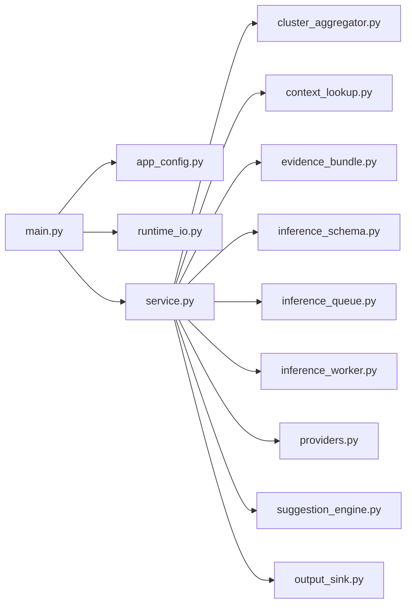

# Core Phase-2 Minimal Implementation

This directory contains the minimal, deployable phase-2 stack for the core node.
Edge components and release scripts are intentionally separated under `edge/`.

## Module Layout

- `core/infra`: shared config, logging, checkpoint helpers
- `core/correlator`: consumes raw topic and emits alert topic using deterministic rules
- `core/alerts_sink`: consumes alert topic and persists hourly JSONL in runtime volume
- `core/alerts_store`: consumes alert topic and writes structured records to ClickHouse
- `core/aiops_agent`: minimal AIOps loop (alert -> suggestion topic/jsonl)
- `core/benchmark`: load test and throughput probe scripts for Kafka pipeline sizing
- `core/deployments`: k3s manifests for namespace, KRaft Kafka, topic init, correlator, clickhouse, aiops
- `core/docker`: container build file for core-correlator

## Data Plane Topics

- `netops.facts.raw.v1`: edge fact events
- `netops.alerts.v1`: correlator alerts
- `netops.dlq.v1`: reserved for malformed records / replay failures
- `netops.aiops.suggestions.v1`: aiops suggestions generated from alert stream

## AIOps Agent Internal Design



| File | Purpose | Typical change scenarios |
| --- | --- | --- |
| `core/aiops_agent/app_config.py` | load env and apply severity gate policy | rollout policy defaults, env naming, threshold behavior |
| `core/aiops_agent/cluster_aggregator.py` | aggregate alerts by key in sliding window and trigger cluster suggestions | tuning window/min-count/cooldown, key strategy evolution |
| `core/aiops_agent/runtime_io.py` | build Kafka/ClickHouse clients | auth/timeout/retry tuning, endpoint migrations |
| `core/aiops_agent/context_lookup.py` | fetch recent similar alert counts from ClickHouse | context features, query window, query dimensions |
| `core/aiops_agent/evidence_bundle.py` | build structured evidence bundles from alert/cluster context | topology/device/change context expansion, evidence normalization |
| `core/aiops_agent/inference_schema.py` | define request/result schema for provider-facing inference | schema evolution, confidence conventions, request metadata |
| `core/aiops_agent/inference_queue.py` | provide queue interface for slow-path inference requests | async queue swaps, batching, retry scheduling |
| `core/aiops_agent/inference_worker.py` | pull requests from queue and invoke provider | worker concurrency, retry/backoff, observability |
| `core/aiops_agent/providers.py` | provider abstraction with template and external HTTP provider entry | API migration, local-model provider, auth handling |
| `core/aiops_agent/suggestion_engine.py` | generate final suggestion payload and confidence-bearing output | payload schema evolution, inference/evidence mapping |
| `core/aiops_agent/output_sink.py` | persist suggestion JSONL by hour | retention policy, sink path layout |
| `core/aiops_agent/service.py` | process loop, publish/commit semantics | retry policy, DLQ integration, idempotency hardening |
| `core/aiops_agent/main.py` | startup wiring only | runtime composition and dependency injection |

Cluster tuning envs (in `80-core-aiops-agent.yaml`):
- `AIOPS_CLUSTER_WINDOW_SEC` (default `600`)
- `AIOPS_CLUSTER_MIN_ALERTS` (default `3`)
- `AIOPS_CLUSTER_COOLDOWN_SEC` (default `300`)
- `AIOPS_PROVIDER` (default `template`)
- `AIOPS_PROVIDER_ENDPOINT_URL` (used when `AIOPS_PROVIDER=http`)
- `AIOPS_PROVIDER_MODEL` (default `generic-aiops`)

## Build

```bash
docker build -t netops-core-app:0.1 -f core/docker/Dockerfile.app .
```

## Deploy Order

```bash
kubectl apply -f core/deployments/00-namespace.yaml
kubectl apply -f core/deployments/10-kafka-kraft.yaml
kubectl apply -f core/deployments/20-topic-init-job.yaml
kubectl apply -f core/deployments/40-core-correlator.yaml
kubectl apply -f core/deployments/50-core-alerts-sink.yaml
kubectl apply -f core/deployments/60-clickhouse.yaml
kubectl apply -f core/deployments/70-core-alerts-store.yaml
kubectl apply -f core/deployments/80-core-aiops-agent.yaml
```

## Benchmark

### 1) Kafka producer load test (core side)

```bash
python -m core.benchmark.kafka_load_producer \
  --bootstrap-servers netops-kafka.netops-core.svc.cluster.local:9092 \
  --topic netops.facts.raw.v1 \
  --messages 200000 \
  --payload-bytes 1024 \
  --batch-size 1000 \
  --workers 4
```

### 2) Topic throughput / lag probe

```bash
python -m core.benchmark.kafka_topic_probe \
  --bootstrap-servers netops-kafka.netops-core.svc.cluster.local:9092 \
  --topic netops.facts.raw.v1 \
  --group-id benchmark-probe-v1 \
  --duration-sec 60
```

### 3) Alert quality observer (recent 3h window)

```bash
python -m core.benchmark.alerts_quality_observer \
  --bootstrap-servers localhost:19092 \
  --topic netops.alerts.v1 \
  --lookback-hours 3
```

### 4) Long-run pipeline watch (recommended 8h)

```bash
python -m core.benchmark.pipeline_watch \
  --duration-hours 8 \
  --interval-sec 300 \
  --window-min 30 \
  --output-jsonl /data/netops-runtime/observability/pipeline-watch-8h.jsonl \
  --summary-json /data/netops-runtime/observability/pipeline-watch-8h-summary.json
```

### 5) Runtime timestamp audit

Use this when `alerts/*.jsonl` and `aiops/*.jsonl` appear to have inconsistent dates:

```bash
python -m core.benchmark.runtime_timestamp_audit \
  --alerts-dir /data/netops-runtime/alerts \
  --aiops-dir /data/netops-runtime/aiops
```

This compares:
- alert file mtime vs payload `alert_ts`
- suggestion file mtime vs payload `suggestion_ts`

The purpose is to distinguish a true sink failure from a replay/backfill case where:
- alert files are bucketed by historical `alert_ts`
- aiops files are bucketed by current processing time

## Release Automation

To avoid manual build/save/import/set-image steps for core deployments, use:

```bash
./core/automatic_scripts/release_core_app.sh
```

Optional arguments:

```bash
# release with explicit tag
./core/automatic_scripts/release_core_app.sh <tag>
```

Notes:
- script builds image from `core/docker/Dockerfile.app`
- imports image to local `r450` runtime
- updates `core-correlator` and `core-alerts-sink` image tags and waits for rollout

## Reliability Notes

- `core-correlator` and `core-alerts-sink` use manual offset commit (commit after successful handling).
- malformed JSON / publish-write failures are pushed into `netops.dlq.v1` for replay and diagnostics.
- runtime observability remains log-first (stats logs) to keep the phase-2 stack lightweight.
- rule thresholds are versioned via `core/correlator/profiles/*.json` and selected by `CORRELATOR_RULE_PROFILE`.
- env variables (`RULE_*`) can still override profile values for emergency tuning.
- clickhouse is used as hot query storage for alert analytics and aiops context lookup.
