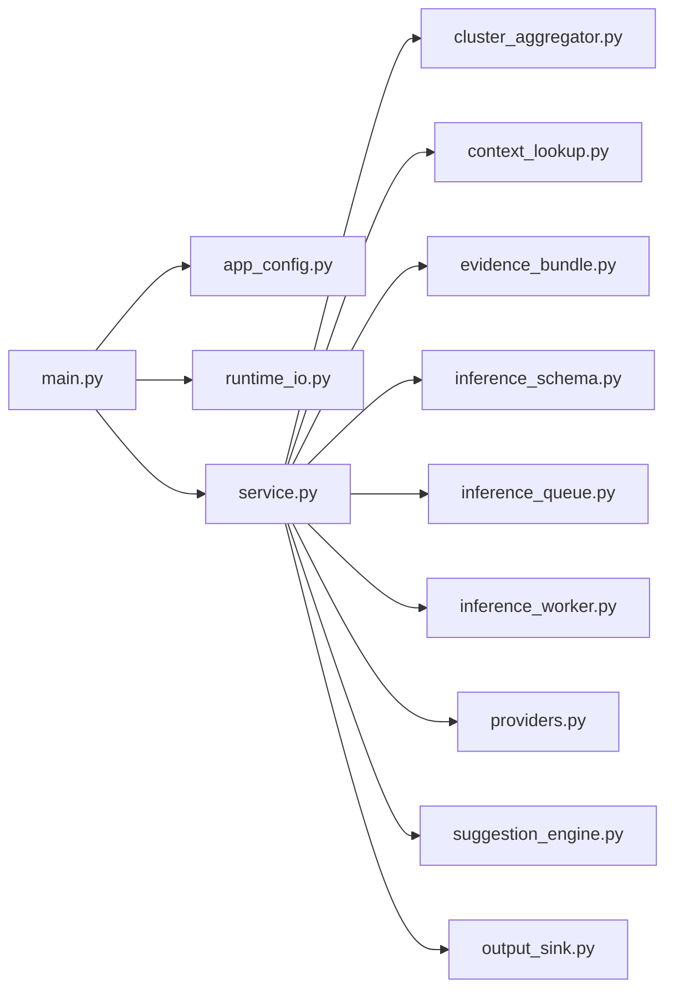

# Core Phase-2 最小可运行实现

这个目录承载当前核心节点上的最小可部署分析栈。
边缘组件和对应发布脚本被有意拆在 `edge/` 下，不和核心侧逻辑混在一起。

## 模块结构

- `common/infra`：edge/core 共用的配置、日志和 checkpoint 能力
- `core/correlator`：消费原始事实 Topic，执行确定性规则并产出告警
- `core/alerts_sink`：消费告警 Topic，按小时落盘 JSONL
- `core/alerts_store`：消费告警 Topic，写入 ClickHouse
- `core/aiops_agent`：最小 AIOps 增强链路，完成 `alert -> suggestion`
- `core/benchmark`：压测、吞吐探测、运行时验证和时间审计脚本
- `core/deployments`：k3s 清单，包括 namespace、KRaft Kafka、topic 初始化、correlator、ClickHouse、aiops 等
- `core/docker`：core 应用镜像构建入口

## 数据平面 Topic

- `netops.facts.raw.v1`：来自边缘侧的结构化事实事件
- `netops.alerts.v1`：correlator 产出的确定性告警
- `netops.dlq.v1`：异常记录和重放失败保留位
- `netops.aiops.suggestions.v1`：AIOps 建议输出流

## AIOps Agent 内部拆分



| 文件 | 作用 | 典型改动场景 |
| --- | --- | --- |
| `core/aiops_agent/app_config.py` | 读取环境变量并应用严重级别、聚合门槛等运行策略 | 调整默认策略、环境变量命名、门槛行为 |
| `core/aiops_agent/cluster_aggregator.py` | 按 key 做滑窗聚合，并触发簇级建议 | 调整聚合窗口、最小告警数、冷却时间、聚合键 |
| `core/aiops_agent/runtime_io.py` | 构造 Kafka / ClickHouse 客户端 | 超时、认证、重试、端点迁移 |
| `core/aiops_agent/context_lookup.py` | 从 ClickHouse 读取近期相似告警上下文 | 扩展上下文字段、调整查询维度和时间窗 |
| `core/aiops_agent/evidence_bundle.py` | 从 alert 和 cluster 上下文构造证据包 | 增强 topology/device/change context |
| `core/aiops_agent/inference_schema.py` | 定义 provider 侧请求和结果 schema | 结构化输出协议演进、置信度约定调整 |
| `core/aiops_agent/inference_queue.py` | 管理慢路径推理请求队列 | 队列实现替换、批处理、重试调度 |
| `core/aiops_agent/inference_worker.py` | 执行 provider 调用 | 并发控制、退避重试、可观测性增强 |
| `core/aiops_agent/providers.py` | provider 抽象层，承接模板模式和外部 HTTP provider | API 切换、本地模型接入、认证处理 |
| `core/aiops_agent/suggestion_engine.py` | 生成最终建议载荷和置信度结果 | 建议 schema 演进、证据到建议的映射调整 |
| `core/aiops_agent/output_sink.py` | 按小时写出 suggestion JSONL | 保留策略、输出路径布局调整 |
| `core/aiops_agent/service.py` | 主处理循环、发布和提交语义 | 重试策略、DLQ 接入、幂等性加固 |
| `core/aiops_agent/main.py` | 启动装配入口 | 运行时依赖拼装 |

当前聚合相关环境变量定义在 `80-core-aiops-agent.yaml`：

- `AIOPS_CLUSTER_WINDOW_SEC`，默认 `600`
- `AIOPS_CLUSTER_MIN_ALERTS`，默认 `3`
- `AIOPS_CLUSTER_COOLDOWN_SEC`，默认 `300`
- `AIOPS_PROVIDER`，默认 `template`
- `AIOPS_PROVIDER_ENDPOINT_URL`，当 `AIOPS_PROVIDER=http` 时使用
- `AIOPS_PROVIDER_MODEL`，默认 `generic-aiops`

## 构建

```bash
docker build -t netops-core-app:0.1 -f core/docker/Dockerfile.app .
```

## 部署顺序

```bash
kubectl apply -f core/deployments/00-namespace.yaml
kubectl apply -f core/deployments/10-kafka-kraft.yaml
kubectl apply -f core/deployments/20-topic-init-job.yaml
kubectl apply -f core/deployments/40-core-correlator.yaml
kubectl apply -f core/deployments/50-core-alerts-sink.yaml
kubectl apply -f core/deployments/60-clickhouse.yaml
kubectl apply -f core/deployments/70-core-alerts-store.yaml
kubectl apply -f core/deployments/80-core-aiops-agent.yaml
```

## 验证与观测入口

```bash
python -m core.benchmark.kafka_load_producer --help
python -m core.benchmark.kafka_topic_probe --help
python -m core.benchmark.alerts_quality_observer --help
python -m core.benchmark.pipeline_watch --help
python -m core.benchmark.runtime_timestamp_audit --help
```

如果需要做 core 侧一键发布，使用：

```bash
./core/automatic_scripts/release_core_app.sh
```

## 可靠性说明

- `core-correlator` 与 `core-alerts-sink` 采用手动 offset commit，只在成功处理后提交
- 结构损坏或处理失败的记录会进入 `netops.dlq.v1`
- 当前阶段的运行时观测仍以日志和审计文件为主，避免过早引入更重的基础设施
- 规则门槛既可以通过 `core/correlator/profiles/*.json` 版本化，也可以通过 `RULE_*` 环境变量做紧急覆盖
- ClickHouse 当前承担的是热查询和上下文检索，不是 raw 主存储
