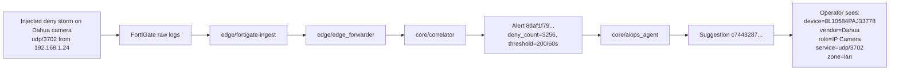

# Live Demo: Fault Injection -> Automatic Localization / 现场演示：故障注入到自动定位

This packet is meant for temporary walkthroughs, screen recordings, or in-person demos.
It is not a fictional marketing storyboard. The incident shape is derived from real runtime artifacts already present under `/data/netops-runtime`.

这份演示包面向临时讲解、录屏和现场展示，不是虚构出来的营销故事板。
其中的 incident 形态来自 `/data/netops-runtime` 下已经存在的真实运行时产物。

## Demo Goal / 演示目标

Show one compact story:

1. a device starts producing abnormal deny traffic
2. the deterministic pipeline catches it without any model in the hot path
3. the AIOps layer turns the alert into a localized, operator-readable explanation
4. the operator immediately sees which device, which service, which path, and what to check next

中文速览：

1. 某个设备开始产生异常 deny 流量
2. 确定性流水线先在热路径上捕获异常，不依赖模型判定
3. AIOps 层把 alert 还原成可读、可定位的说明
4. 操作员能立刻看到受影响设备、服务、路径以及下一步检查方向

## Runtime-Derived Source Artifacts / 基于运行时的源数据

This demo packet is built from these concrete artifacts:

- Alert sample:
  - `/data/netops-runtime/alerts/alerts-20260325-11.jsonl`
  - `alert_id=8daf1f7935555d30ec5b5de23cbd15ad467dccde`
- Suggestion sample:
  - `/data/netops-runtime/aiops/suggestions-20260329-11.jsonl`
  - `suggestion_id=c7443287ce5d6881d6f34b86a100ee2e0d352fa9`
- Replay / cluster validation:
  - `/data/netops-runtime/observability/aiops-replay-validation-20260322-window600.json`

The presentation timeline below is compressed for demo clarity.
The alert fields, device profile, topology context, change context, and recommendation content all come from real repository runtime history.

下面的演示时间线为了现场展示做了压缩，但 alert 字段、设备画像、拓扑上下文、变更上下文和推荐动作都来自真实仓库运行历史。

## Demo Incident / 演示事件

| Item | Value |
| --- | --- |
| Rule | `deny_burst_v1` |
| Service | `udp/3702` |
| Device key | `3c:e3:6b:77:82:89` |
| Device name | `8L10584PAJ33778` |
| Vendor / role | `Dahua / IP Camera` |
| Source IP | `192.168.1.24` |
| Destination IP | `192.168.2.108` |
| Zone | `lan` |
| Deterministic threshold | `200 denies / 60s` |
| Observed deny count | `3256` |
| Recent similar alerts | `284 in 1h` |
| Change signal | `suspected_change=true`, `score=30`, `level=high` |
| Confidence | `0.78 / medium` |

## One-Page Flow / 一页式流程图

## Presenter Script / 讲解稿

### 30-second version / 30 秒版本

"We intentionally trigger a short deny burst from a Dahua IP camera. The model does not sit in front of the stream. First, the deterministic correlator proves the rule was crossed: 3256 denies in 60 seconds against a 200 threshold. Then the AIOps layer assembles context that already exists in the system: source IP, destination IP, device profile, recent recurrence, and change markers. The operator does not just get `deny_burst_v1`; they get the actual affected device, service, path, and next actions."

“我们故意从一台 Dahua 摄像头触发一次短时 deny burst。模型并不在数据热路径前面。第一步由确定性 correlator 证明规则已被越过：60 秒内出现 3256 次 deny，阈值是 200。随后 AIOps 层把系统里已经存在的上下文拼起来，包括源 IP、目标 IP、设备画像、近期复发情况以及变更信号。操作员最终看到的不是一个抽象的 `deny_burst_v1`，而是具体受影响的设备、服务、路径和下一步建议。” 

### 90-second version / 90 秒版本

1. "The injected fault is simple: the camera starts generating repeated denied `udp/3702` traffic."
2. "The first important point is that the hot path stays deterministic. `core/correlator` emits the alert because the rule crossed `200 / 60s`; no model is needed to prove the anomaly exists."
3. "The second point is localization. The evidence bundle ties the alert to `3c:e3:6b:77:82:89`, resolves it to device `8L10584PAJ33778`, identifies it as a `Dahua IP Camera`, and keeps the exact network path `192.168.1.24 -> 192.168.2.108` in the same record."
4. "The third point is operator usability. The suggestion is no longer a raw rule string. It tells the responder what to inspect next: session trace, recent deny history, and whether this service is expected for this device profile and path."
5. "If the same pattern repeats across the cluster gate, the exact same pipeline can escalate from alert-scope explanation to cluster-scope meaning without moving the model into the raw stream."

1. “注入的故障非常简单：这台摄像头开始持续产生被拒绝的 `udp/3702` 流量。”
2. “第一个重点是热路径保持确定性。`core/correlator` 之所以发出 alert，是因为规则越过了 `200 / 60s` 的阈值；并不需要模型来证明异常成立。”
3. “第二个重点是定位能力。evidence bundle 会把 alert 关联到 `3c:e3:6b:77:82:89`，解析为设备 `8L10584PAJ33778`，识别为 `Dahua IP Camera`，并保留完整网络路径 `192.168.1.24 -> 192.168.2.108`。”
4. “第三个重点是操作可用性。最终 suggestion 不再只是一个规则名，而是告诉响应者下一步该检查什么：session trace、近期 deny 历史，以及该服务在这个设备画像和路径上是否合理。”
5. “如果相同模式跨过 cluster gate，同一条流水线还能从 alert-scope 解释升级到 cluster-scope 含义，而不需要把模型挪进原始流处理链路里。” 

## Demo Sequence / 演示顺序

| Demo beat / 演示环节 | What to say / 讲解重点 | What the audience should see / 观众应看到什么 |
| --- | --- | --- |
| Fault injected | "We force a short deny storm from one camera." | One active incident appears for `udp/3702` on a single device |
| Deterministic alert | "The rule crosses `200 / 60s` and emits an alert." | `deny_count=3256`, severity `warning`, rule `deny_burst_v1` |
| Automatic localization | "The system now tells us which device and path are involved." | `Dahua / IP Camera / 8L10584PAJ33778 / 192.168.1.24 -> 192.168.2.108 / lan` |
| Context enrichment | "This is not a naked alert. It already knows recent recurrence and change risk." | `recent_similar_1h=284`, `suspected_change=true`, `level=high` |
| Next action | "The output is already operator-readable." | Recommended actions appear in natural language |

## What Makes This Demo Strong / 这个演示为什么有说服力

- The anomaly proof is deterministic.
- The localization is evidence-backed.
- The explanation is short enough for a live audience.
- The same story can be shown in the UI, in JSON, or in logs.
- It demonstrates why the project is not "LLM over every log line."

- 异常证明来自确定性规则，而不是“模型先猜”。
- 定位结论有 evidence bundle 支撑，不是拍脑袋解释。
- 故事足够短，适合现场演示。
- 同一套内容可以在 UI、JSON 和日志三种媒介里复用。
- 它能清楚解释这个项目为什么不是“给每一行日志都跑一次 LLM”。 

## Optional Escalation Beat / 可选的升级段落

If you want a second scene after the single-incident story, add a cluster replay beat:

- Source artifact:
  - `/data/netops-runtime/observability/aiops-replay-validation-20260322-window600.json`
- Useful talking point:
  - `deny_burst_v1` produced `12751` cluster triggers in the replay window
  - the top repeated service was `udp/3702`

That gives you a clean transition:

- scene 1: "one injected fault is localized to one device"
- scene 2: "repeated similar faults become cluster-legible without redesigning the pipeline"

这能形成一个很顺的转场：

- 第一幕：一次注入故障如何被定位到单个设备
- 第二幕：重复相似故障如何在不重构流水线的前提下变成 cluster-legible 的系统模式

## Companion Fixture / 配套演示数据

The companion front-end ready fixture lives at:

- `frontend/fixtures/demo/fault-injection-auto-localization.json`

Use that file if you want the UI to render this exact story without depending on live data freshness.

如果你希望前端稳定渲染这条故事，而不是依赖实时数据刷新时机，就直接使用这个 fixture。
